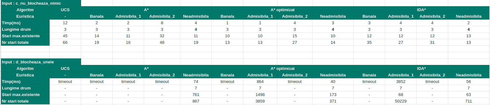

# Tema 1 IA

## Cerinta

[Problema unui lacat, de aici](http://irinaciocan.ro/inteligenta_artificiala/exemple-teme-a-star.php)

## Rulare

### Recomandare
In `Makefile`, modifica parametrii, apoi `make run`.

### Sintaxa
`
python main.py -i path_to_input_folder -o path_to_output_folder -n NSOL -t TIMEOUT
`

Unde NSOL = numarul de solutii, TIMEOUT = in secunde.

### Exemple
```python
python main.py -i input -o output -n 2 -t 4
```


## Format fisier intrare:
```
n siruri de caractere, fiecare cu k caractere din {d,g,i}, reprezentand cate o cheie
```
### Exemplu:
```
dgi
gid
gdi
```

# Validari si Optimizari

## Reprezentarea cat mai eficienta a starii

Reprezint starea ca o lista de obiecte tip `Incuietoare`.
`Incuietoare` este defapt doar un wrapper peste int-ul `nr_incuieri` in care retin de cate ori a fost incuiat (sau 0 = descuiat) caruia i-am pus o afisare mai frumoasa si getter/setter.

Verificarea starii se face insumand valorile incuietorilor. Daca suma = 0, suntem pe o stare scop.

## Verificarea corectitudinii datelor de intrare

Ma asigur ca toate cheile au aceeasi lungime si ca contin doar caracterele admise `i,d,g`:
```python
    # verificarea corectitudinii datelor de intrare
    nr_incuietori = len(key_strings[0])
    for key in key_strings:
        if len(key) != nr_incuietori:
            print("Input error in fisierul {0}! Chei cu lungime diferita. ".format(inp.name))
            sys.exit(-1)
        for ch in key:
            if ch not in ['i','d','g']:
                print("Input error, caracter nerecunoscut in cheia: ",key)
                sys.exit(-1)
```
## Găsirea unui mod de a realiza din starea initială că problema nu are soluții
Pentru fiecare incuietoare, ma asigur ca exista cel putin o cheie care are 'd' pe pozitia corespunzatoare ei:
```python
    # verific daca problema e fara solutii
    exista_d = [0 for x in range(nr_incuietori)]
    for key in key_strings:
        for i,ch in enumerate(key):
            if ch == 'd':
                exista_d[i]=1
    
    #daca exista incuietori pe care nicio cheie nu le poate deschide => problema fara solutii
    if sum(exista_d) != nr_incuietori:
        for out in [out_ucs,out_astar,out_astar_v2,out_idastar]:
            out.write("Input fara solutii!")
            out.close
        return
```
# Euristici folosite

## Banala
```python
    if nod != self.scopuri:
        return 1
    return 0
```
Estimez costul ca fiind 1 daca nu am ajuns in starea scop, si 0 daca am ajuns. Astfel, o data ce se gaseste o solutie, ea va fi pusa la inceputul cozii pentru a putea fi afisata.
## Admisibila 1
```python
    return max([x.get() for x in nod])
```
Estimez costul ca fiind incuietoarea care a fost incuiata de cele mai multe ori in starea curenta. Aceasta euristica este admisibila deoarece stim sigur ca pentru o incuietoare de forma `i_n` este imposibil sa o descuiem cu mai putin de n mutari (o cheie poate descuia maxim 1 data).

Aceasta euristica face ca algoritmul sa prefere starile cu incuietori "cat mai descuiate".

## Admisibila 2
```python
    return min([x.get() for x in nod])
```
Aceasta euristica prefera starile care au macar 1 incuietoare descuiata, avand ca efect evitarea starilor care se indeparteaza de starea scop (de exemplu, dintre `i  d  i` si `i i2 i` voi prefera prima stare, care intr-adevar e mai aproape de solutie. )

## Neadmisibila
```python
    return sum([x.get() for x in nod])
```
Euristica neadmisibila atribuie fiecarei stari un scor in functie de cate ori e incuiata fiecare portiune a lacatului. Acest scor reprezinta numarul de mutari estimat ca trebuie facute pentru a ajunge in starea scop.
De exemplu:

```
d  i  d  i  d  i -> scor 3

i3 d  i  d  d  d -> scor 4
```
Cu cat scorul e mai mic, cu atat starea este considerata ca fiind mai aproape de starea scop.
```
d  d  d  d  -> scor 0, si e stare scop
```
### Demonstratie ca este neadmisibila:
Fie nodul cu informatia:
```
i i d i -> scor 3
```
Euristica estimeaza ca voi folosi _3 chei_ pentru a ajunge la starea scop `d d d d `, deci _3 mutari_. h' = 3.

Fie fisierul de intrare ce contine cheia:
```
d d g d
```
Cu aceasta cheie, eu pot ajunge din nodul dat in nodul scop in _1 mutare_. h = 1

Cum in acest caz h' > h, rezulta ca euristica este neadmisibila.

## Comparatii



Putem concluziona urmatoarele:

* Euristica neadmisibila poate duce la solutii care nu sunt optime
* Pe primul exemplu, UCS este de 14 ori mai lent decat A*
* Cea mai buna performanta obtinuta pe ambele teste este A* open/closed si cu euristica admisibila 1.